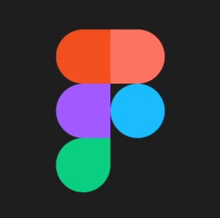
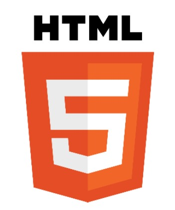

# Capítulo V: Product Implementation, Validation & Deployment.

## 5.1. Software Configuration Management.

### 5.1.1. Software Development Environment Configuration.

- **UXPRESSIA:** UXPressia es una plataforma especializada en la creación de herramientas visuales orientadas al diseño centrado en el usuario. Permite desarrollar mapas de experiencia del cliente, diagramas de flujo, mapas de sitio y otros recursos clave para entender y optimizar la interacción entre los usuarios y un producto o servicio. En nuestro proyecto, utilizaremos UXPressia para mapear la experiencia de los diferentes usuarios que interactúan con la plataforma, identificando sus necesidades, puntos de dolor y oportunidades de mejora.
  

- **Figma:** Figma es una herramienta de diseño colaborativo basada en la web, enfocada en la creación de interfaces gráficas y experiencias de usuario (UI/UX). Su entorno en línea permite que múltiples diseñadores trabajen simultáneamente en un mismo archivo, lo que mejora la colaboración en tiempo real. En el contexto de nuestro proyecto, usaremos Figma para diseñar las pantallas, los prototipos interactivos y la interfaz visual del producto, asegurando que cumpla con criterios de usabilidad y estética.

  
- **Miro:**  Miro es un tablero digital colaborativo que facilita la organización visual de ideas, flujos de trabajo, mapas mentales y diagramas. Se utiliza comúnmente en sesiones de brainstorming, planificación ágil, workshops y diseño de productos. Para nuestro proyecto, emplearemos Miro en las etapas iniciales para conceptualizar la estructura general, visualizar procesos, y organizar ideas clave entre los miembros del equipo. También lo usaremos para documentar decisiones importantes a lo largo del desarrollo.

#### Software Development

- **(IDE)s**

**Visuals Studio Code:** Se trata de un editor de texto multiplataforma y de código abierto creado por Microsoft, ampliamente utilizado en la comunidad de desarrollo. Soporta múltiples lenguajes de programación y cuenta con una gran cantidad de extensiones que facilitan y enriquecen el entorno de trabajo del programador. En el proyecto, utilizamos esta herramienta tanto para construir la landing page como para redactar la documentación en archivos con formato “.md”.

**WebStorm:** Es un entorno de desarrollo integrado (IDE) desarrollado por JetBrains, especialmente orientado al desarrollo frontend. Ofrece herramientas potentes y características inteligentes para trabajar eficientemente con tecnologías web como HTML, CSS y JavaScript, lo que facilita la creación y mantenimiento de interfaces dinámicas y modernas.

- **HTML5:** Es la quinta y más actualizada versión del lenguaje de marcado utilizado para estructurar el contenido en la web. Introduce nuevas etiquetas semánticas, soporte multimedia nativo y mejoras en la interoperabilidad con otras tecnologías web. Estas características lo convierten en una herramienta esencial para el desarrollo de sitios web modernos y responsivos.

- **CSS3:** Es la última evolución del lenguaje de hojas de estilo en cascada (Cascading Style Sheets), empleado para definir la apariencia visual de los sitios web. Incorpora funcionalidades avanzadas como animaciones, transiciones, gradientes y media queries, lo que permite crear interfaces más atractivas, dinámicas y adaptables a diferentes dispositivos. Es una pieza clave en el desarrollo de experiencias web modernas.

- **AngularJS:** Es un framework de desarrollo web basado en JavaScript y mantenido por Google, diseñado para facilitar la creación de aplicaciones de una sola página (SPA). Proporciona una arquitectura robusta que permite gestionar componentes reutilizables, el enrutamiento entre vistas, y la integración con servicios backend. Gracias a su enfoque modular y su sistema de enlace de datos, es ampliamente utilizado para construir interfaces interactivas y escalables.

- **JS:** JavaScript es un lenguaje de programación esencial en el desarrollo web, utilizado para dotar de interactividad y dinamismo a sitios y aplicaciones en línea. Permite manipular el contenido de la página en tiempo real, responder a acciones del usuario, validar formularios, y mucho más. Su versatilidad lo convierte en una herramienta clave tanto en el frontend como en el backend de aplicaciones modernas.

### 5.1.2. Source Code Management.

Creamos una organización en Github con todos los miembros del grupo, y dentro de esta creamos un repositorio para cada parte del proyecto, siendo:

| **Segmento** | **URL** |
|-----------|-----------| 
| Organización | https://github.com/UPC-PRE-SI729-2510-4341-G2-CloseSource| 
|Report|https://github.com/UPC-PRE-SI729-2510-4341-G2-CloseSource/Report| 
| Repositorio Landing Page| https://github.com/UPC-PRE-SI729-2510-4341-G2-CloseSource/Landing-Page | 
| Backend | https://github.com/UPC-PRE-SI729-2510-4341-G2-CloseSource/Backend |
| Frontend | https://github.com/UPC-PRE-SI729-2510-4341-G2-CloseSource/Frontend |

**GitFlow Implementation:**

GitFlow es una estrategia estructurada para el control de versiones en Git, que establece un flujo de trabajo claro mediante la organización de ramas. Bajo este modelo, la rama develop sirve como base para integrar nuevas funcionalidades en desarrollo, mientras que la rama main almacena la versión estable del proyecto, lista para ser desplegada, en este caso, a través de GitHub Pages. Además, se crean ramas específicas para cada funcionalidad o tarea (feature), lo cual permite trabajar de forma paralela y controlada, facilitando la colaboración y el mantenimiento del código. Por ello, lo convierte en la herramienta perfecta para que nosotros podamos gestionar y administrar el desarrollo de nuestro proyecto sin problemas.

**Feature Branches:**

Cada nueva característica se desarrolla en una rama separada, que se crea a partir de la rama develop. Estas ramas permiten mantener el trabajo en curso aislado, lo que facilita la integración de nuevas funcionalidades sin interrumpir el flujo principal de desarrollo.

**Release Branches:**

Las ramas release se utilizan para preparar una versión estable del proyecto que está próxima a desplegarse. Se crean desde la rama develop una vez que se ha completado y probado un conjunto significativo de funcionalidades. Su uso permite estabilizar la versión, hacer pruebas finales, documentar y realizar pequeñas correcciones sin interrumpir el desarrollo de nuevas funcionalidades en curso.

Convención de nombres: release/vX.Y.Z, aplicando Semantic Versioning:

    X = versión mayor (cambios incompatibles)

    Y = versión menor (nuevas funcionalidades compatibles)

    Z = parche (correcciones menores)

Solo se permiten tareas como:

  - Correcciones de bugs

  - Ajustes menores en la interfaz

  - Revisión de documentación

Una vez que la rama release está lista, se fusiona en main (para despliegue) y en develop (para mantener actualizada la base de desarrollo). Por ejemplo, una rama release/v1.1.0 indicaría que se está preparando la segunda versión menor del sistema con mejoras sobre una versión previamente estable.

**Hotfix Branches:**

Utilizaremos las ramas hotfix cuando sea necesario resolver un error crítico que afecta a la versión en producción y requiere una solución inmediata, sin esperar al próximo ciclo de desarrollo. Estas ramas son creadas directamente desde main y su objetivo es implementar una solución rápida, pero controlada.

Convención de nombres: hotfix/fix-descripcion-breve, por ejemplo:

  - hotfix/fix-login-error

  - hotfix/fix-css-navbar

Se aplican para:

  - Fallos críticos en producción

  - Correcciones urgentes de seguridad

  - Errores funcionales graves

Una vez corregido el problema, la rama hotfix se fusiona tanto en main como en develop, para que el arreglo forme parte del historial del proyecto en ambas líneas. Además, se actualiza el número de versión siguiendo Semantic Versioning, generalmente con un incremento en el parche (por ejemplo, de v1.1.0 a v1.1.1).

