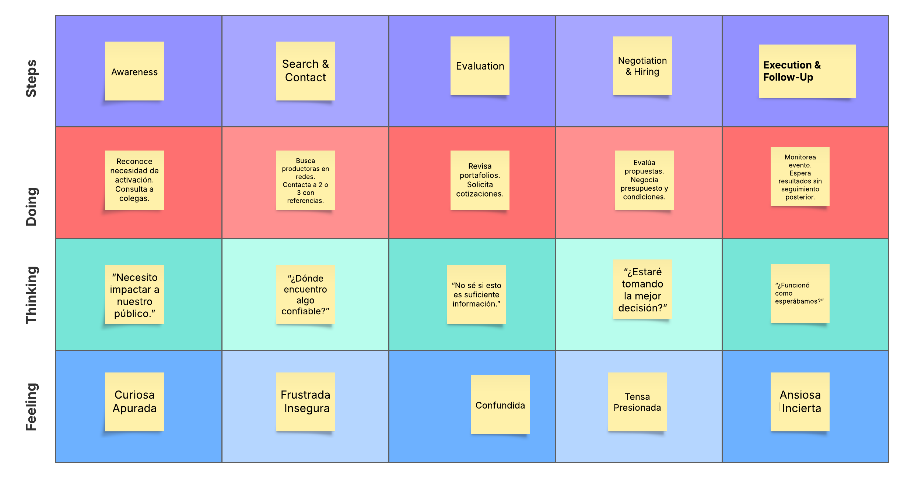
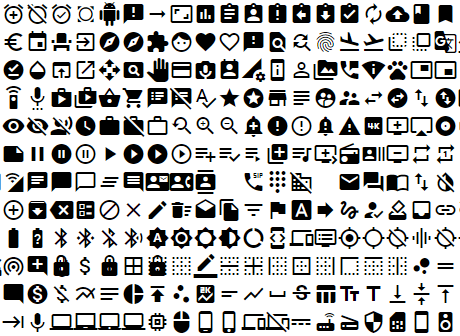

<h2 style="text-align:center;">Universidad Peruana de Ciencias Aplicadas</h2>
<h2 style="text-align:center;">Ingeniería de Software</h2>
<h2 style="text-align:center;">Ciclo 2025 - 1 </h2>
<p align="center">
  
</p>
<h2 style="text-align:center;">1ASI0729 - Desarrollo de Aplicaciones Open Source</h2>
<h2 style="text-align:center;">Sección - 4341</h2>
<h2 style="text-align:center;">Docente: Juan Antonio Flores Moroco</h2>
<h2 style="text-align:center;">"Informe de Trabajo Final"</h2>
<h2 style="text-align:center;">Startup: CloseSource</h2>
<h2 style="text-align:center;">Producto: MatchEvent</h2>
<h2 style="text-align:center;">Integrantes:</h2>
<h3 style="text-align:center;">Aaron Alexander Avila Palacios</h3>
<h3 style="text-align:center;">Gabriel Anthony Braithuaite Toledo</h3>
<h3 style="text-align:center;">Kevin Alexander Castañeda Llanos</h3>
<h3 style="text-align:center;">Ivan Jeanpierre La Madrid Lozano</h3>
<h3 style="text-align:center;">Max Anthony Paitan Pumacahua</h3>
<h2 style="text-align:center;">2025</h2>

## Registro de Versiones del Informe
| Versión | Fecha    | Autor                      | Descripción de modificación |
|---------|----------|----------------------------|-----------------------------|
| 1.0     | 2025-04-16 | Gabriel Braithuaite Toledo| Desarollo del punto 3.1 al 3.4                    |
| 1.0     | 2025-04-20 | Aaron Avila Palacios       | Desarrollo del punto 2.3.2 al 2.4|
| 1.0     | 2025-04-20 | Kevin Castañeda Llanos     | Desarrollo del punto 1.2.2.2 al 1.3, 4.2.2 al 4.2.5 y del 4.8|
| 1.0     | 2025-04-20 | Ivan La Madrid Lozano      | Desarrollo del 2.1 al 2.3.1.                    |
| 1.0     | 2025-04-20 | Max Paitan Pumacahua       | Desarrollo del punto 1.1.al 1.2.2.1., 4.1. al4.2.1., y del 5.1. al 5.2.1.8 |
| 2.0     | 2025-05-12 | Gabriel Braithuaite Toledo| Corrección del report y avance del sprint 2                    |
| 2.0     | 2025-05-12 | Aaron Avila Palacios       | Corrección del report y avance del sprint 2|
| 2.0     | 2025-05-12 | Kevin Castañeda Llanos     | Corrección del report y avance del sprint 2|
| 2.0     | 2025-05-12 | Ivan La Madrid Lozano      | Corrección del report y avance del sprint 2                    |
| 2.0     | 2025-05-12 | Max Paitan Pumacahua       | Corrección del report y avance del sprint 2 |
| 3.0     | 2025-06-23 | Aaron Avila Palacios         | Corrección del report y avance del Sprint 3                                       |
| 3.0     | 2025-06-23 | Kevin Castañeda Llanos       | Corrección del report y avance del Sprint 3                                       |
| 3.0     | 2025-06-23 | Ivan La Madrid Lozano        | Corrección del report y avance del Sprint 3                                       |
| 3.0     | 2025-06-23 | Max Paitan Pumacahua         | Corrección del report y avance del Sprint 3                                       |


## Project Report Collaboration Insights
URL del repositorio de la Organizacion: https://github.com/UPC-PRE-SI729-2510-4341-G2-CloseSource
## Contenido
### Tabla de Contenido
- [Capítulo 1: Introducción](#capítulo-1-introducción)
  - [**1.1. Startup Profile**](#11-startup-profile)
    - [**1.1.1. Descripción de la Startup**](#111-descripción-de-la-startup)
      - [**Descripción de la empresa:**](#descripción-de-la-empresa)
        - [**Misión:**](#misión)
        - [**Visión:**](#visión)
    - [**1.1.2. Perfiles de integrantes del equipo**](#112-perfiles-de-integrantes-del-equipo)
      - [Nombre: Avila Palacios, Aaron Alexander | U201823654](#nombre-avila-palacios-aaron-alexander--u201823654)
      - [Nombre: Braithuaite Toledo, Gabriel Anthony | U20201e889](#nombre-braithuaite-toledo-gabriel-anthony--u20201e889)
      - [Nombre: Castañeda Llanos, Kevin Alexander | U202318814](#nombre-castañeda-llanos-kevin-alexander--u202318814)
      - [Nombre: La Madrid Lozano, Ivan Jeanpierre | UU202113432](#nombre-la-madrid-lozano-ivan-jeanpierre--uu202113432)
      - [Nombre: Paitan Pumacahua, Max Anthony | U201314454](#nombre-paitan-pumacahua-max-anthony--u201314454)
  - [**1.2. Solution Profile**](#12-solution-profile)
    - [**1.2.1 Antecedentes y problemática**](#121-antecedentes-y-problemática)
    - [**1.2.2 Lean UX Process.**](#122-lean-ux-process)
      - [**1.2.2.1. Lean UX Problem Statements.**](#1221-lean-ux-problem-statements)
    - [1.2.2.2. Lean UX Assumptions.](#1222-lean-ux-assumptions)
    - [1.2.2.3. Lean UX Hypothesis Statements.](#1223-lean-ux-hypothesis-statements)
    - [1.2.2.4. Lean UX Canvas.](#1224-lean-ux-canvas)
    - [1.3. Segmentos objetivo.](#13-segmentos-objetivo)
  - [Capítulo II: Requirements Elicitation \& Analysis](#capítulo-ii-requirements-elicitation--analysis)
    - [2.1. Competidores.](#21-competidores)
    - [2.1.1. Análisis competitivo](#211-análisis-competitivo)
    - [2.1.2. Estrategias y tácticas frente a competidores.](#212-estrategias-y-tácticas-frente-a-competidores)
    - [2.2. Entrevistas.](#22-entrevistas)
    - [2.2.1. Diseño de entrevistas.](#221-diseño-de-entrevistas)
      - [Objetivos de la entrevista](#objetivos-de-la-entrevista)
      - [Perfil de entrevistados](#perfil-de-entrevistados)
      - [Guía de preguntas para empresas/marcas](#guía-de-preguntas-para-empresasmarcas)
      - [Guía de preguntas para productoras](#guía-de-preguntas-para-productoras)
      - [Formato y duración](#formato-y-duración)
    - [2.2.1. Diseño de entrevistas.](#221-diseño-de-entrevistas-1)
      - [Objetivos de la entrevista](#objetivos-de-la-entrevista-1)
      - [Perfil de entrevistados](#perfil-de-entrevistados-1)
      - [Guía de preguntas para empresas/marcas](#guía-de-preguntas-para-empresasmarcas-1)
      - [Guía de preguntas para productoras](#guía-de-preguntas-para-productoras-1)
      - [Formato y duración](#formato-y-duración-1)
    - [2.2.2. Registro de entrevistas.](#222-registro-de-entrevistas)
    - [2.2.3. Análisis de entrevistas.](#223-análisis-de-entrevistas)
    - [2.3. Needfinding.](#23-needfinding)
    - [2.3.1. User Personas.](#231-user-personas)
    - [2.3.2. User Task Matrix.](#232-user-task-matrix)
    - [2.3.3. User Journey Mapping.](#233-user-journey-mapping)
    - [2.3.4. Empathy Mapping.](#234-empathy-mapping)
    - [2.3.5. As-is Scenario Mapping.](#235-as-is-scenario-mapping)
    - [2.4. Ubiquitous Language.](#24-ubiquitous-language)
  - [Capítulo III: Requirements Specification](#capítulo-iii-requirements-specification)
    - [3.1. To-Be Scenario Mapping.](#31-to-be-scenario-mapping)
    - [3.2. User Stories.](#32-user-stories)
    - [3.3. Impact Mapping.](#33-impact-mapping)
    - [3.4. Product Backlog.](#34-product-backlog)
    - [3.4. Product Backlog](#34-product-backlog-1)
- [**Capítulo IV: Product Design**](#capítulo-iv-product-design)
  - [**4.1. Style Guidelines.**](#41-style-guidelines)
    - [**4.1.1. General Style Guidelines.**](#411-general-style-guidelines)
    - [**4.1.2. Web Style Guidelines.**](#412-web-style-guidelines)
  - [**4.2. Information Architecture.**](#42-information-architecture)
    - [**4.2.1. Organization Systems.**](#421-organization-systems)
    - [**4.2.2. Labeling Systems.**](#422-labeling-systems)
    - [4.2.3. SEO Tags and Meta Tags](#423-seo-tags-and-meta-tags)
    - [4.2.4. Searching Systems.](#424-searching-systems)
    - [4.2.5. Navigation Systems.](#425-navigation-systems)
  - [**4.3. Landing Page UI Design.**](#43-landing-page-ui-design)
    - [4.3.1. Landing Page Wireframe](#431-landing-page-wireframe)
    - [4.3.2. Landing Page Mock-up](#432-landing-page-mock-up)
  - [4.4. Web Applications UX/UI Design.](#44-web-applications-uxui-design)
    - [4.4.1. Web Applications – Wireframes](#441-web-applications--wireframes)
    - [4.4.2. Web Applications Wireflow Diagrams.](#442-web-applications-wireflow-diagrams)
    - [4.4.3. Web Applications Mock-ups](#443-web-applications-mock-ups)
    - [4.4.3. Web Applications User Flow Diagrams.](#443-web-applications-user-flow-diagrams)
  - [4.5. Web Applications Prototyping.](#45-web-applications-prototyping)
  - [4.6. Domain-Driven Software Architecture.](#46-domain-driven-software-architecture)
    - [4.6.1. Software Architecture Context Diagram.](#461-software-architecture-context-diagram)
    - [4.6.2. Software Architecture Container Diagrams.](#462-software-architecture-container-diagrams)
    - [4.6.3. Software Architecture Components Diagrams.](#463-software-architecture-components-diagrams)
  - [4.7. Software Object-Oriented Design.](#47-software-object-oriented-design)
      - [4.7.1. Class Diagrams.](#471-class-diagrams)
      - [4.7.2. Class Dictionary](#472-class-dictionary)
    - [4.8. Database Design](#48-database-design)
      - [4.8.1 Database Diagram](#481-database-diagram)
- [Capítulo V: Product Implementation, Validation \& Deployment.](#capítulo-v-product-implementation-validation--deployment)
  - [5.1. Software Configuration Management.](#51-software-configuration-management)
    - [5.1.1. Software Development Environment Configuration.](#511-software-development-environment-configuration)
      - [Software Development](#software-development)
      - [Software Deployment](#software-deployment)
    - [5.1.2. Source Code Management.](#512-source-code-management)
    - [5.1.3. Source Code Style Guide \& Conventions.](#513-source-code-style-guide--conventions)
      - [Git \& Github](#git--github)
      - [HTML](#html)
      - [CSS](#css)
      - [JavaScript](#javascript)
      - [Typescript](#typescript)
      - [Java](#java)
    - [5.1.4. Software Deployment Configuration.](#514-software-deployment-configuration)
        - [Consideraciones antes del despliegue](#consideraciones-antes-del-despliegue)
        - [Requisitos para el despliegue](#requisitos-para-el-despliegue)
        - [Pasos para desplegar la landing page](#pasos-para-desplegar-la-landing-page)
  - [**5.2. Landing Page, Services \& Applications Implementation**](#52-landing-page-services--applications-implementation)
    - [**5.2.1. Sprint 1**](#521-sprint-1)
      - [**5.2.1.1. Sprint Planning 1**](#5211-sprint-planning-1)
      - [**5.2.1.2. Aspect Leaders and Collaborators**](#5212-aspect-leaders-and-collaborators)
      - [**5.2.1.3. Sprint Backlog 1**](#5213-sprint-backlog-1)
    - [Sprint Backlog - Sprint 1](#sprint-backlog---sprint-1)
      - [**5.2.1.4. Development Evidence for Sprint Review**](#5214-development-evidence-for-sprint-review)
      - [**5.2.1.5. Execution Evidence for Sprint Review**](#5215-execution-evidence-for-sprint-review)
      - [**5.2.1.6. Services Documentation Evidence for Sprint Review**](#5216-services-documentation-evidence-for-sprint-review)
      - [**5.2.1.7. Software Deployment Evidence for Sprint Review.**](#5217-software-deployment-evidence-for-sprint-review)
      - [**5.2.1.8. Team Collaboration Insights during Sprint.**](#5218-team-collaboration-insights-during-sprint)
    - [**5.2.2. Sprint 2**](#522-sprint-2)
      - [**5.2.2.1. Sprint Planning 2**](#5221-sprint-planning-2)
      - [**5.2.1.2. Aspect Leaders and Collaborators**](#5212-aspect-leaders-and-collaborators-1)
      - [**5.2.2.3. Sprint Backlog 2**](#5223-sprint-backlog-2)
    - [Sprint Backlog - Sprint 2](#sprint-backlog---sprint-2)
      - [**5.2.2.4. Development Evidence for Sprint Review**](#5224-development-evidence-for-sprint-review)
      - [**5.2.2.5. Execution Evidence for Sprint Review**](#5225-execution-evidence-for-sprint-review)
      - [**5.2.2.6. Services Documentation Evidence for Sprint Review**](#5226-services-documentation-evidence-for-sprint-review)
      - [**5.2.2.7. Software Deployment Evidence for Sprint Review**](#5227-software-deployment-evidence-for-sprint-review)
      - [**5.2.2.8. Team Collaboration Insights during Sprint.**](#5228-team-collaboration-insights-during-sprint)
    - [**5.2.3. Sprint 3**](#523-sprint-3)
      - [**5.2.3.1. Sprint Planning 3**](#5231-sprint-planning-3)
      - [**5.2.3.2. Aspect Leaders and Collaborators**](#5232-aspect-leaders-and-collaborators)
      - [**5.2.3.3. Sprint Backlog 3**](#5233-sprint-backlog-3)
    - [Sprint Backlog - Sprint 3](#sprint-backlog---sprint-3)
      - [**5.2.3.4. Development Evidence for Sprint Review**](#5234-development-evidence-for-sprint-review)
      - [**5.2.3.5. Execution Evidence for Sprint Review**](#5235-execution-evidence-for-sprint-review)
      - [**5.2.3.6. Services Documentation Evidence for Sprint Review**](#5236-services-documentation-evidence-for-sprint-review)
      - [**5.2.3.7. Software Deployment Evidence for Sprint Review**](#5237-software-deployment-evidence-for-sprint-review)
      - [**5.2.3.8. Team Collaboration Insights during Sprint**](#5238-team-collaboration-insights-during-sprint)
    - [5.3. Validation Interviews](#53-validation-interviews)
      - [5.3.1. Diseño de Entrevistas](#531-diseño-de-entrevistas)
      - [5.3.2. Registro de Entrevistas](#532-registro-de-entrevistas)
        - [Entrevista 1 - Segmento Empresa](#entrevista-1---segmento-empresa)
        - [Entrevista 2 - Segmento Productora](#entrevista-2---segmento-productora)
        - [Entrevista 3 - Segmento Productora](#entrevista-3---segmento-productora)
        - [Entrevista 4 - Segmento Empresa](#entrevista-4---segmento-empresa)
      - [5.3.3. Evaluaciones según heurísticas](#533-evaluaciones-según-heurísticas)
    - [5.4. Video About-the-Product](#54-video-about-the-product)
    - [5.5. Video About-the-Team](#55-video-about-the-team)
- [Conclusiones](#conclusiones)
- [Recomendaciones](#recomendaciones)
- [Bibliografía:](#bibliografía)
- [Anexos](#anexos)

## Student Outcome


| Criterio Específico | Acciones Realizadas | Conclusiones |
|---------------------|---------------------|--------------|
|Comunica oralmente con efectividad a diferentes rangos de audiencia.| Gabriel Braithuaite - TB1 <br> Comunicó ideas y decisiones con el equipo para la elaboración del To-Be Scenario Mapping, User Stories, Impact Mapping, Product Backlog, entre otros. <br> Kevin Castañeda - TB1 <br> Comunicó y compartió sus ideas con el equipo, para poder completar el trabajo con el aporte de todos. <br> Aaron Avila - TB1 <br> Se coordinó con el equipo el desarrollo del informe y la asignación de las tareas. <br> Max Paitan - TB1 <br> Coordinó con el equipo para la repartición y desarrollo del report, así como gestionó la colaboración grupal para el desarrollo de tareas complejas. <br> Ivan La Madrid - TB1 <br> Participó en las discusiones iniciales para la identificación de segmentos y necesidades. <br><br> **TP** <br> Gabriel Braithwaite - TP <br> Este avance se logró de manera colaborativa, a través de reuniones donde todos plantearon su punto de vista, para acabar el sprint 2 y hacer mejoras en el reporte. <br> Kevin Castañeda - TP <br> Este avance se logró de manera colaborativa, a través de reuniones donde todos plantearon su punto de vista, para acabar el sprint 2 y hacer mejoras en el reporte. <br> Aaron Avila - TP <br> Este avance se logró de manera colaborativa, a través de reuniones donde todos plantearon su punto de vista, para acabar el sprint 2 y hacer mejoras en el reporte. <br> Max Paitan - TP <br> Este avance se logró de manera colaborativa, a través de reuniones donde todos plantearon su punto de vista, para acabar el sprint 2 y hacer mejoras en el reporte. <br> Ivan La Madrid - TP <br> Este avance se logró de manera colaborativa, a través de reuniones donde todos plantearon su punto de vista, para acabar el sprint 2 y hacer mejoras en el reporte. <br><br> **TB2** <br> Kevin Castañeda - TB2 <br> Explicó oralmente el funcionamiento del backend del contexto de propuestas, incluyendo sus endpoints y validaciones. <br> Aaron Avila - TB2 <br> Detalló la lógica del sistema de calificaciones implementado en backend y frontend, destacando su utilidad para los usuarios. <br> Max Paitan - TB2 <br> Comunicó en el video grabado del Sprint 3 la estructura de endpoints REST del contexto `request`, la lógica de autenticación y uso de MatSnackBar. <br> Ivan La Madrid - TB2 <br> Presentó ante cámara la arquitectura del contexto IAM, diferenciando los roles y el flujo de login/logout. | **TP:** <br> El equipo demostró habilidades de comunicación oral al presentar y discutir avances técnicos, decisiones estratégicas y conceptos funcionales del proyecto con claridad y coherencia. Se adaptó el lenguaje en función del público, facilitando el diálogo entre desarrolladores, docentes y posibles usuarios. Esta capacidad permitió resolver dudas, alinear expectativas y fortalecer la toma de decisiones colaborativas. <br><br> **TB2:** <br> El equipo demostró habilidades de comunicación oral al presentar y discutir avances técnicos, decisiones estratégicas y conceptos funcionales del proyecto con claridad y coherencia. Se adaptó el lenguaje en función del público, facilitando el diálogo entre desarrolladores, docentes y posibles usuarios. Esta capacidad permitió resolver dudas, alinear expectativas y fortalecer la toma de decisiones colaborativas. |  
|Comunica por escrito con efectividad a diferentes rangos de audiencia.| Gabriel Braithuaite - TB1 <br> Redactó ideas en el brainstorming, el Scenario Mapping y user stories para ambos segmentos objetivos y user personas. <br> Kevin Castañeda - TB1 <br> Apoyó con los UX assumptions, los segmentos objetivos, así como los labeling systems y los navigations systems. <br> Aaron Avila - TB1 <br> Presentó el desarrollo de User Task Matrix, User Journey Mapping, Empathy Mapping, As-is Scenario Mapping, Ubiquitous Language. <br> Max Paitan - TB1 <br> Redactó parte del capítulo 1, donde están la descripción de la empresa, el solution profile y el Lean UX Problem Statements. También avanzó parte del capítulo 4, con los General Style Guidelines. Finalmente, avanzó con lo correspondiente al capítulo 5 para esta entrega. <br> Ivan La Madrid - TB1 <br> Colaboró con los competidores, así como los user personas. <br><br> **TP** <br> Gabriel Braithuaite - TP <br> Avanzamos colaborativamente con el frontend del app web, específicamente en los CRUDs de los bounded context que tenemos. Además, corregimos imágenes y contenido del reporte. <br> Kevin Castañeda - TP <br> Avanzamos colaborativamente con el frontend del app web, específicamente en los CRUDs de los bounded context que tenemos. Además, corregimos imágenes y contenido del reporte. <br> Aaron Avila - TP <br> Avanzamos colaborativamente con el frontend del app web, específicamente en los CRUDs de los bounded context que tenemos. Además, corregimos imágenes y contenido del reporte. <br> Max Paitan - TP <br> Avanzamos colaborativamente con el frontend del app web, específicamente en los CRUDs de los bounded context que tenemos. Además, corregimos imágenes y contenido del reporte. <br> Ivan La Madrid - TP <br> Avanzamos colaborativamente con el frontend del app web, específicamente en los CRUDs de los bounded context que tenemos. Además, corregimos imágenes y contenido del reporte. <br><br> **TB2** <br> Kevin Castañeda - TB2 <br> Documentó entidades, validaciones de backend y endpoints de propuestas. <br> Aaron Avila - TB2 <br> Documentó API Ratings, realizó pruebas en Postman y agregó ejemplos en Swagger. <br> Max Paitan - TB2 <br> Redactó los endpoints del contexto `request`, incluyendo errores comunes, validaciones y respuestas esperadas. <br> Ivan La Madrid - TB2 <br> Especificó rutas de endpoints para IAM, reglas de validación y respuestas esperadas. | **TP:** <br> A través de documentos como el Impact Mapping, las User Stories y el Product Backlog, el equipo comunicó por escrito de manera clara y estructurada los aspectos clave del desarrollo. El uso de formatos comprensibles, lenguaje accesible y herramientas visuales como UXPressia permitió transmitir información técnica a distintos públicos, asegurando una comprensión común de los objetivos, funcionalidades y valor del proyecto. <br><br> **TB2:** <br> A través de documentos como el Impact Mapping, las User Stories y el Product Backlog, el equipo comunicó por escrito de manera clara y estructurada los aspectos clave del desarrollo. El uso de formatos comprensibles, lenguaje accesible y herramientas visuales como Swagger y documentación API permitió transmitir información técnica a distintos públicos, asegurando una comprensión común de los objetivos, funcionalidades y valor del proyecto. Además, cada integrante desarrolló exitosamente el backend correspondiente a su Bounded Context. |


 


# Capítulo 1: Introducción

## **1.1. Startup Profile**

El concepto de startup hace referencia a pequeñas o medianas empresas emergentes que ingresan al mercado impulsadas por propuestas tecnológicas, con un alto potencial de crecimiento. Estas empresas se caracterizan por su capacidad de escalar rápidamente y expandirse de manera eficiente. Además, suelen originarse con el objetivo de ofrecer soluciones claras, creativas y sencillas a problemas sociales relevantes.

### **1.1.1. Descripción de la Startup**

#### **Descripción de la empresa:**

Somos un grupo de estudiantes de la Universidad Peruana de Ciencias Aplicadas (UPC) los que formamos CloseSource, una organización que apuesta por el desarrollo de soluciones tecnológicas enfocadas en resolver problemas concretos del mercado. Como parte de este enfoque, se ha planteado el diseño y desarrollo de un aplicativo web orientado al sector del marketing experiencial.

El producto, denominado MatchEvent, busca explorar una problemática latente: la dificultad que enfrentan muchas marcas al intentar organizar activaciones de marketing efectivas. Las activaciones requieren coordinación, creatividad, logística y, sobre todo, proveedores confiables. Sin embargo, el proceso actual suele depender de contactos informales, referencias dispersas y gestiones manuales que pueden comprometer la calidad del resultado final.

A su vez, muchas productoras —especializadas en ejecutar eventos y activaciones— cuentan con la capacidad técnica y creativa para asumir estos retos, pero no siempre tienen acceso a nuevas oportunidades de negocio ni a canales digitales donde puedan mostrar su trabajo, recibir solicitudes o hacer propuestas de manera eficiente. Por ello, MatchEvent se concibe como una plataforma que intermedie entre estos dos actores. 

##### **Misión:**

Facilitar y hacer más eficiente el proceso de búsqueda, contacto y contratación de servicios de activación de marca, mediante una plataforma digital que conecte a empresas con productoras especializadas, promoviendo la transparencia, la calidad y la innovación en cada colaboración.

##### **Visión:**

Convertirnos en la plataforma líder en Perú para la gestión de activaciones de marca, siendo reconocidos por impulsar conexiones estratégicas entre empresas y productoras, y por contribuir al desarrollo del sector marketing a través del uso de soluciones tecnológicas innovadoras. 

### **1.1.2. Perfiles de integrantes del equipo**

####  Nombre: Avila Palacios, Aaron Alexander | U201823654
  
> Soy estudiante de Ingeniería de software y estoy cursando el quinto ciclo de la carrera. Tengo 23 años. Tengo conocimientos en programación orientada a objetos en lenguaje de programación C++, también en diseño de prototipos de aplicaciones, diseño gráfico, diseño e implementación de páginas web. Todas estas habilidades ayudan al desarrollo del proyecto, dado que son de vital importancia en este curso y en nuestra carrera. Soy capaz de desarrollar de manera eficaz cualquier tarea que se me asigne.
#### Nombre: Braithuaite Toledo, Gabriel Anthony | U20201e889
  
> Mi nombre es Gabriel Anthony Braithuaite Toledo, soy estudiante de la carrera de Ingeniería de Software. apasionado por la tecnología. Soy una persona disciplinada y organizada.
####  Nombre: Castañeda Llanos, Kevin Alexander | U202318814
  
> Soy un estudiante de la carrera de ingeniería de software, tengo 19 años y estoy en el 5to ciclo, actualmente me encuentro interesado en el desarrollo de aplicaciones, IA y ciberseguridad
####  Nombre: La Madrid Lozano, Ivan Jeanpierre | UU202113432
  
> Soy un estudiante de ingenieria de software de 21 años apasionado por el mundo de la programación y desarrollo web. Colaborativo y entusiasta en el mundo tecnologico.
####  Nombre: Paitan Pumacahua, Max Anthony | U201314454
  
> Soy Max Anthony y tengo 27 años. Estoy retomando Ingeniería de Software como segunda carrera, ya que siempre tuvo ello como objetivo; en la actualidad, me encuentro cursando el séptimo ciclo.
> Entre mis habilidades están: Ágil capacidad de análisis -tanto individual como también en colectivo-, empático en un contexto determinado -tomando decisiones de manera sensata-, y puedo ser tanto gestor como un participante activo dentro de un grupo de trabajo.

## **1.2. Solution Profile**

### **1.2.1 Antecedentes y problemática**

El marketing experiencial ha evolucionado como una estrategia clave para conectar emocionalmente con los consumidores, ofreciendo experiencias memorables que van más allá de la simple transacción comercial. Según Moser (2012), las estrategias de marketing experiencial aplicadas en espacios de retail buscan transformar la experiencia de compra en algo placentero y estimulante, generando un valor añadido para las marcas en un entorno altamente competitivo. ​

En el contexto peruano, Bardales y Herrera (2017) proponen un modelo de gestión basado en el marketing experiencial para fortalecer el valor de marca (Brand Equity). Su estudio destaca la importancia de generar experiencias únicas que permitan a las marcas construir relaciones sostenibles con los consumidores, especialmente en un mercado tan competitivo como el peruano. ​

Asimismo, Verhelst Moreno (2020) analiza la evolución del marketing experiencial desde sus principales exponentes, destacando cómo las experiencias sensoriales, emocionales y cognitivas influyen en la percepción y lealtad hacia una marca. Este enfoque resalta la necesidad de diseñar estrategias que involucren activamente al consumidor, creando vínculos más profundos y duraderos.

En el siguiente punto, vamos a realizar la investigación a detalle el problema. 

**What?**

* ¿Qué problema hay?
  
  Muchas empresas enfrentan dificultades para encontrar proveedores confiables para ejecutar activaciones de marca. Este proceso depende en gran medida de contactos informales, recomendaciones poco verificables y una gestión manual que genera ineficiencias, demoras y falta de transparencia. Por otro lado, las productoras que sí están capacitadas para ejecutar estos eventos no cuentan con canales claros ni estructurados para acceder a nuevas oportunidades comerciales, lo que limita su alcance en el mercado.

**When?**

* ¿Cuándo sucede el problema?
  
  Este problema surge cada vez que una empresa inicia la planificación de una activación de marca, especialmente en momentos clave como campañas estacionales, lanzamientos de productos o eventos masivos. Las dificultades se hacen más evidentes en los primeros pasos del proceso, cuando se necesita filtrar opciones, solicitar cotizaciones y comparar propuestas de manera eficiente.


**Where?**

* ¿Dónde sucede el problema?
  
  El problema se presenta principalmente en contextos urbanos con alta concentración de marcas y productoras, como Lima y otras grandes ciudades. Las limitaciones se evidencian tanto en oficinas corporativas al buscar proveedores como en agencias de producción que intentan posicionarse sin herramientas digitales adecuadas.

**Why?**

* ¿Por qué existe este problema?
  
  El problema existe porque no hay un sistema estructurado, confiable y centralizado que conecte la demanda empresarial con la oferta especializada de servicios para activaciones de marca. Esto genera un entorno fragmentado, donde se pierde tiempo, oportunidades y se corre el riesgo de contratar proveedores sin experiencia comprobada. Además, la falta de digitalización dificulta la comparación objetiva y la toma de decisiones informadas.

**Who?**

* ¿A quién afecta el problema?
  
  **Empresas y marcas:** Pierden tiempo y recursos buscando proveedores adecuados y enfrentan incertidumbre al no contar con referencias claras.

  **Productoras especializadas:** Tienen dificultades para visibilizar su trabajo, acceder a nuevas oportunidades y competir en igualdad de condiciones.

  **Agencias de marketing:** También enfrentan desafíos al coordinar proveedores confiables dentro de sus campañas integradas.

**How?**

* ¿Cómo se manifiesta el problema?
  
  El problema se manifiesta a través de:

  - Búsqueda ineficiente de proveedores (vía WhatsApp, recomendaciones informales, correos dispersos).

  - Procesos manuales para comparar cotizaciones y propuestas.

  - Dificultad para validar experiencia previa de las productoras.

  - Falta de trazabilidad, historial o retroalimentación sobre experiencias pasadas.

**How much?**

* ¿Cuánto puede costar el problema generado?
  
  Si bien no se puede cuantificar el posible costo, este problema si que puede generar gastos ocultos importantes, los cuales pueden afectar a los involucrados. Estos costos podrían darse por:

  - Pérdida de tiempo en procesos de selección.

  - Retrasos en campañas por mala planificación o contrataciones fallidas.

  - Costos financieros por contratar proveedores inadecuados.

  - Daño reputacional en casos de ejecución deficiente del evento.

  - Oportunidades comerciales perdidas por no conectar con el proveedor adecuado a tiempo.

### **1.2.2 Lean UX Process.**  
      
#### **1.2.2.1. Lean UX Problem Statements.**  
      
**Problem Statement 1: Empresas que necesitan realizar activaciones de marca**

**Problema:**  

Las empresas que buscan ejecutar activaciones de marca enfrentan múltiples barreras durante la búsqueda de proveedores adecuados. Este proceso suele ser informal, fragmentado y poco estructurado. Las decisiones de contratación se basan en recomendaciones no verificadas, lo que incrementa el riesgo de contratar a proveedores con poca experiencia o sin respaldo comprobable. Además, las empresas tienen dificultades para comparar propuestas de manera objetiva, lo que deriva en retrasos en la planificación, mayores costos operativos y posibles fallos en la ejecución del evento.

**Pregunta central:**  

¿Cómo podríamos entender y abordar las dificultades que enfrentan las empresas al intentar encontrar y evaluar proveedores para activaciones de marca en un entorno informal y poco transparente?

**Problem Statement 2: Productoras de activaciones y eventos**

**Problema:**  
Las productoras especializadas en activaciones enfrentan serias limitaciones para acceder a nuevos clientes fuera de su red de contactos habitual. Su visibilidad en el mercado es baja, y muchas veces dependen exclusivamente del boca a boca o de conexiones personales para obtener oportunidades laborales. Además, carecen de herramientas adecuadas para mostrar su experiencia, organizar sus propuestas comerciales o recibir solicitudes de manera estructurada. Esto reduce su competitividad y limita su potencial de crecimiento en un mercado exigente.

**Pregunta central:**  
¿Cómo podríamos comprender mejor las barreras que impiden a las productoras visibilizar su experiencia y acceder a oportunidades de negocio más allá de sus contactos directos?

### 1.2.2.2. Lean UX Assumptions.
- *Asumimos que* las empresas no tienen procesos claros para encontrar productoras confiables para activaciones de marca. *Sabremos* que esto es cierto cuando al menos el 60% de las empresas afirme haber buscado proveedores por referencias informales o redes sociales.

- *Asumimos que* las productoras desean un canal digital para captar nuevos clientes. *Sabremo* que esto es cierto cuando más del 70% de las productoras registradas complete su perfil dentro de los primeros 3 días.

- *Asumimos que* las empresas necesitan comparar fácilmente múltiples propuestas antes de tomar decisiones. *Sabremos* que esto es cierto cuando al menos el 80% revise más de una propuesta antes de adjudicar un proyecto.

- *Asumimos que* las productoras quieren destacar su experiencia previa mediante un portafolio visual. *Sabremos* que esto es cierto cuando al menos el 75% suba contenido multimedia a su perfil.

- *Asumimos que* las empresas valoran la reputación basada en calificaciones y comentarios. *Sabremos* que esto es cierto cuando más del 50% consulte reseñas antes de contactar a una productora.

- *Asumimos que* las productoras están dispuestas a postular a proyectos incluso si no conocen al cliente. *Sabremos* que esto es cierto cuando se registren postulaciones a solicitudes de empresas nuevas en la plataforma.

- *Asumimos que* las empresas necesitan poder comunicarse directamente con productoras interesadas. *Sabremos* que esto es cierto cuando más del 60% de las interacciones entre empresas y productoras usen el chat interno.

- *Asumimos que* las empresas tienen dificultades para estimar el costo de una activación. *Sabremos* que esto es cierto cuando más del 40% consulte precios de propuestas sin aún haber publicado un requerimiento.

- *Asumimos que* las productoras prefieren recibir notificaciones cuando se publique un proyecto alineado a sus servicios. *Sabremos* que esto es cierto cuando más del 50% active las notificaciones automáticas de oportunidades.

- *Asumimos que* tanto empresas como productoras valoran tener un historial de contrataciones. *Sabremos* que esto es cierto cuando más del 70% consulte el historial antes de tomar decisiones.

- *Asumimos que* las productoras quieren recibir retroalimentación sobre sus propuestas. *Sabremos* que esto es cierto cuando más del 60% solicite comentarios tras no ganar un proyecto.

- *Asumimos que* las empresas quieren poder guardar o marcar productoras favoritas. *Sabremos* que esto es cierto cuando al menos el 50% utilice esta función si se habilita.

- *Asumimos que* muchas activaciones se planifican en períodos cortos de tiempo. *Sabremos* que esto es cierto cuando más del 40% de las solicitudes tengan plazos de ejecución menores a un mes.

- *Asumimos que* las productoras buscan diferenciarse con propuestas creativas y personalizadas. *Sabremos* que esto es cierto cuando al menos el 60% redacte propuestas únicas en lugar de usar plantillas.
  
### 1.2.2.3. Lean UX Hypothesis Statements.

- *Creemos que* las empresas necesitan un canal centralizado para encontrar productoras confiables. *Sabremos* que tenemos razón si al menos el 70% de usuarios nuevos publica un requerimiento en su primera semana.

- *Creemos que* las productoras valoran una plataforma donde puedan mostrar su trabajo. *Sabremos* que tenemos razón si el 75% de productoras completan su portafolio en los primeros 3 días.

- *Creemos que* las empresas quieren ver múltiples propuestas antes de contratar. *Sabremos* que tenemos razón si el 80% de las solicitudes recibe al menos 2 propuestas.

- *Creemos que* las calificaciones de clientes influyen en la decisión de contratación. *Sabremos* que tenemos razón si más del 60% de empresas menciona la reputación como factor clave en encuestas.

- *Creemos que* las productoras quieren recibir notificaciones automáticas de nuevos proyectos. *Sabremos* que tenemos razón si más del 50% activa esta opción.

- *Creemos que* las empresas se comunican más con productoras cuando existe un canal directo dentro de la plataforma. *Sabremos* que tenemos razón si más del 60% de los mensajes se envían vía el sistema interno.

- *Creemos que* las empresas quieren tener un historial organizado de sus contrataciones. *Sabremos* que tenemos razón si al menos el 70% consulta el historial antes de repetir una contratación.

- *Creemos que* las productoras necesitan datos claros sobre las solicitudes (presupuesto, fecha, lugar). *Sabremos* que tenemos razón si las solicitudes incompletas reciben menos del 30% de postulaciones.

- *Creemos que* una interfaz sencilla aumentará el número de requerimientos publicados. *Sabremos* que tenemos razón si los formularios se completan en menos de 3 minutos en el 80% de los casos.

- *Creemos que* las empresas valoran recibir propuestas en menos de 48 horas. *Sabremos* que tenemos razón si el 75% considera el tiempo de respuesta como factor clave en encuestas.

- *Creemos que* las productoras participarán más si pueden recibir métricas sobre su desempeño. *Sabremos* que tenemos razón si más del 50% revisa su tasa de propuestas ganadas.

- *Creemos que* la posibilidad de crear plantillas de propuestas agilizará el proceso para las productoras. *Sabremos* que tenemos razón si más del 60% usa esta función repetidamente.

- *Creemos que* las empresas necesitan asistencia para redactar correctamente sus requerimientos. *Sabremos* que tenemos razón si al menos el 40% utiliza ayudas o plantillas disponibles en la plataforma.

- *Creemos que* la reputación positiva dentro de la plataforma influirá en la fidelización de empresas. *Sabremos* que tenemos razón si más del 50% de contrataciones repetidas se hacen con productoras bien calificadas.

### 1.2.2.4. Lean UX Canvas.
| **1. Business Problem** | **2. Business Outcomes** | **5. Solutions** |
|------------------------|--------------------------|------------------|
| Varias marcas enfrentan la dificultad de intentar organizar activaciones de marketing efectivas. Los eventos requieren coordinación, creatividad, logística y, sobre todo, proveedores confiables. Sin embargo, el proceso actual suele depender de contactos informales, referencias dispersas y gestiones no muy efectivas que comprometen la calidad del resultado final. | - Mejorar la calidad de los eventos de las marcas y empresas.  <br> - Las productoras puedan ofrecer fácilmente sus servicios a otros clientes. <br> - Las empresas y marcas puedan conseguir contactos confiables. <br> - Conectar empresas y productoras de manera efectiva y rápida. | - Desarrollar una aplicación en donde las empresas y marcas puedan buscar productoras para sus eventos o que las mismas productoras brinden sus servicios a marcas. <br> - Que las empresas busquen sus servicios mediante filtros para que se alineen según sus objetivos en el evento que se desea realizar. |

| **3. Users** | **4. User Benefits** |
|--------------|-----------------------|
| - **Marcas y empresas (clientes):** Empresas que necesiten de un productor para sus activaciones. <br> - **Productoras (proveedores):** Personas o productoras que cuenten con la capacidad técnica y creativa para realizar los eventos o activaciones de las empresas. | - **Empresas y marcas:** Poder encontrar rápidamente un productor que se encargue de gestionar sus eventos de manera productiva. <br> - **Productoras:** Encontrar una aplicación que les proporcione las herramientas necesarias para brindar sus servicios relacionados a la gestión de eventos. |

| **6. Hypothesis** | **7. What’s the most important thing we need to learn first?** | **8. What’s the least amount of work we need to do to learn the next most important thing?** |
|------------------|-------------------------------------------------------------|-----------------------------------------------------------------------------------------------|
| - Creemos que las empresas se encontrarán satisfechas con la búsqueda de productoras para la creación de sus eventos y programas. <br> - Sabremos que esta afirmación es cierta cuando la mayoría de productoras cuenten con reseñas y comentarios positivos. | Necesitamos corroborar que las empresas se sientan cómodas con los servicios que puedan brindar los productores. Además, debemos verificar que las productoras cuenten con las herramientas adecuadas para ofrecer sus servicios. | Lanzar una versión de prueba con las funcionalidades más importantes de la aplicación para ver si la misión y el objetivo de la startup se cumplirán. |


### 1.3. Segmentos objetivo.
Hemos decidido dividir nuestros segmentos objetivo en dos usuarios objetivos. Estos son las empresas y marcas que demanden servicios de alguien para poder realizar sus eventos y las productas que se encargarán de brindar sus servicios a las empresas.

- **Empresas y marcas:** Usuarios que buscan realizar activaciones de marca y necesitan contactar productoras para recibir propuestas, cotizaciones o contratar servicios de producción de evento.
- **Productoras especializadas:** Empresas o equipos de producción que ofrecen servicios relacionados a la ejecución de activaciones y eventos de marca, y que desean expandir su base de clientes o mejorar su visibilidad en el mercado.


## Capítulo II: Requirements Elicitation & Analysis
### 2.1. Competidores.
### 2.1.1. Análisis competitivo

A continuación se presenta el cuadro del **Competitive Analysis Landscape**, donde se comparan los principales competidores directos e indirectos con nuestra propuesta MatchEvent:

| **Aspecto**              | **MatchEvent**                                                                  | **Eventtia**                                                  | **Eventbrite**                                       | **Crosalia**                                                     |
|--------------------------|----------------------------------------------------------------------------------|----------------------------------------------------------------|------------------------------------------------------|------------------------------------------------------------------|
| **Overview**             | Plataforma que conecta empresas con productoras especializadas en activaciones de marca. | Solución integral para eventos híbridos.                      | Venta de entradas y eventos abiertos.               | Marketplace de servicios para eventos.                           |
| **Ventaja competitiva**  | Especialización en activaciones, sistema de reputación y acompañamiento personalizado. | Amplia personalización y analítica.                          | Alcance masivo y fácil uso.                         | Variedad de servicios en la nube.                                |
| **Mercado objetivo**     | Empresas con necesidades de activación de marca, productoras especializadas.    | Organizadores de eventos corporativos y educativos.            | Usuarios generales y organizadores independientes.   | Personas naturales y empresas pequeñas que organizan eventos.    |
| **Canales principales**  | Web App y contacto directo con ONG / redes sociales.                           | Plataforma web, correos corporativos.                         | App móvil, redes sociales y correo.                 | Plataforma web y campañas de Google Ads.                         |
| **Relación con el cliente** | Registro y seguimiento personalizado vía la plataforma.                       | Soporte 24/7, onboarding digital.                             | Autoservicio y centro de ayuda.                     | Asesoría directa y contacto a demanda.                           |


### 2.1.2. Estrategias y tácticas frente a competidores.

Para posicionarse de manera efectiva, se plantean las siguientes estrategias diferenciadoras:

1. **Especialización del servicio**  
   Focalizarse en conectar empresas con productoras especializadas en tipos específicos de eventos, como activaciones de marca o lanzamientos corporativos.

2. **Sistema de reputación transparente**  
   Incorporar un sistema de calificaciones y reseñas verificadas que fomente la confianza y facilite la toma de decisiones de los usuarios.

3. **Acompañamiento personalizado**  
   Brindar orientación directa a empresas con poca experiencia en producción de eventos, destacando el valor consultivo de la plataforma.

4. **Filtros avanzados y búsqueda inteligente**  
   Desarrollar funcionalidades que permitan segmentar resultados según necesidades específicas (tipo de evento, presupuesto, experiencia, etc.).

5. **Modelo freemium**  
   Ofrecer acceso gratuito a funcionalidades básicas, reservando herramientas avanzadas para usuarios suscritos, incentivando así la adopción progresiva.

6. **Promoción interna para productoras**  
   Integrar herramientas de visibilidad dentro de la plataforma, como destacación de servicios, portafolio y campañas promocionales internas.

7. **Alianzas estratégicas**  
   Establecer convenios con entidades del sector, agencias o plataformas complementarias para potenciar la red de usuarios y aumentar la credibilidad del producto.
### 2.2. Entrevistas.

### 2.2.1. Diseño de entrevistas.

El diseño de entrevistas tiene como objetivo validar los supuestos clave del proyecto, entender las necesidades reales de los usuarios y recopilar información cualitativa que permita orientar el desarrollo de la plataforma. Se proponen dos perfiles principales a entrevistar: **empresas/marcas** que requieren servicios de producción de eventos y **productoras** que ofrecen dichos servicios.

#### Objetivos de la entrevista

- Identificar las principales dificultades que enfrentan las empresas al organizar eventos.
- Validar el interés en una plataforma centralizada para conectar con productoras.
- Comprender cómo las productoras gestionan actualmente la captación de clientes.
- Evaluar la disposición de ambos perfiles a utilizar una solución tecnológica para este fin.
- Identificar las funcionalidades más valoradas por cada tipo de usuario.

#### Perfil de entrevistados

- **Empresas y marcas**:
  - Responsables de marketing, comunicación o eventos.
  - Empresas que hayan organizado al menos un evento en el último año.
  - Empresas sin experiencia previa pero con intención de realizar eventos en el corto plazo.

- **Productoras**:
  - Empresas o freelancers dedicados a la producción de eventos o activaciones de marca.
  - Productoras con experiencia en diversos tipos de eventos (corporativos, BTL, culturales, etc.).
  - Interesados en aumentar su visibilidad o ampliar su cartera de clientes.

#### Guía de preguntas para empresas/marcas

1. ¿Qué tipo de eventos organiza su empresa y con qué frecuencia?
2. ¿Cómo suele encontrar proveedores para la producción de eventos?
3. ¿Qué dificultades ha tenido al contratar una productora?
4. ¿Qué valoraría más en una plataforma para encontrar productoras?
5. ¿Qué criterios utiliza para seleccionar una productora?
6. ¿Ha tenido experiencias negativas en la organización de eventos? ¿Por qué?
7. ¿Le interesaría una plataforma donde pueda ver reseñas y comparar ofertas?
8. ¿Qué información le gustaría ver en el perfil de una productora?
9. ¿Estaría dispuesto a interactuar directamente por la plataforma con los proveedores?

#### Guía de preguntas para productoras

1. ¿Qué tipo de eventos realiza su productora con mayor frecuencia?
2. ¿Cómo consigue actualmente nuevos clientes?
3. ¿Cuáles son los mayores retos al promocionar sus servicios?
4. ¿Qué canales utiliza para mostrar su portafolio o experiencia?
5. ¿Le interesaría una plataforma donde pudiera conectarse directamente con empresas interesadas?
6. ¿Qué herramientas considera necesarias dentro de una plataforma de este tipo?
7. ¿Cómo influye la reputación o las reseñas en la captación de nuevos clientes?
8. ¿Estaría dispuesto a especializarse en un tipo de evento dentro de la plataforma?
9. ¿Qué espera de una plataforma que busca profesionalizar la conexión entre marcas y productoras?

#### Formato y duración

- Entrevistas semiestructuradas de 30 a 45 minutos.
- Modalidad virtual o presencial según disponibilidad.
- Registro de respuestas mediante notas o grabaciones con consentimiento previo.

### 2.2.1. Diseño de entrevistas.

El diseño de entrevistas tiene como objetivo validar los supuestos clave del proyecto, entender las necesidades reales de los usuarios y recopilar información cualitativa que permita orientar el desarrollo de la plataforma. Se proponen dos perfiles principales a entrevistar: **empresas/marcas** que requieren servicios de producción de eventos y **productoras** que ofrecen dichos servicios.

#### Objetivos de la entrevista

- Identificar las principales dificultades que enfrentan las empresas al organizar eventos.
- Validar el interés en una plataforma centralizada para conectar con productoras.
- Comprender cómo las productoras gestionan actualmente la captación de clientes.
- Evaluar la disposición de ambos perfiles a utilizar una solución tecnológica para este fin.
- Identificar las funcionalidades más valoradas por cada tipo de usuario.

#### Perfil de entrevistados

- **Empresas y marcas**:
  - Responsables de marketing, comunicación o eventos.
  - Empresas que hayan organizado al menos un evento en el último año.
  - Empresas sin experiencia previa pero con intención de realizar eventos en el corto plazo.

- **Productoras**:
  - Empresas o freelancers dedicados a la producción de eventos o activaciones de marca.
  - Productoras con experiencia en diversos tipos de eventos (corporativos, BTL, culturales, etc.).
  - Interesados en aumentar su visibilidad o ampliar su cartera de clientes.

#### Guía de preguntas para empresas/marcas

1. ¿Qué tipo de eventos organiza su empresa y con qué frecuencia?
2. ¿Cómo suele encontrar proveedores para la producción de eventos?
3. ¿Qué dificultades ha tenido al contratar una productora?
4. ¿Qué valoraría más en una plataforma para encontrar productoras?
5. ¿Qué criterios utiliza para seleccionar una productora?
6. ¿Ha tenido experiencias negativas en la organización de eventos? ¿Por qué?
7. ¿Le interesaría una plataforma donde pueda ver reseñas y comparar ofertas?
8. ¿Qué información le gustaría ver en el perfil de una productora?
9. ¿Estaría dispuesto a interactuar directamente por la plataforma con los proveedores?

#### Guía de preguntas para productoras

1. ¿Qué tipo de eventos realiza su productora con mayor frecuencia?
2. ¿Cómo consigue actualmente nuevos clientes?
3. ¿Cuáles son los mayores retos al promocionar sus servicios?
4. ¿Qué canales utiliza para mostrar su portafolio o experiencia?
5. ¿Le interesaría una plataforma donde pudiera conectarse directamente con empresas interesadas?
6. ¿Qué herramientas considera necesarias dentro de una plataforma de este tipo?
7. ¿Cómo influye la reputación o las reseñas en la captación de nuevos clientes?
8. ¿Estaría dispuesto a especializarse en un tipo de evento dentro de la plataforma?
9. ¿Qué espera de una plataforma que busca profesionalizar la conexión entre marcas y productoras?

#### Formato y duración

- Entrevistas semiestructuradas de 30 a 45 minutos.
- Modalidad virtual o presencial según disponibilidad.
- Registro de respuestas mediante notas o grabaciones con consentimiento previo.

### 2.2.2. Registro de entrevistas.

A continuación, se presenta un cuadro con los enlaces a los videos de las entrevistas realizadas a representantes de los dos segmentos objetivo: empresas/marcas y productoras de eventos. Cada enlace lleva a una entrevista individual realizada como parte del proceso de validación de necesidades.

| Nº | Segmento objetivo         | Link de video                                               |
|----|---------------------------|--------------------------------------------------------------|
| 1  | Empresa o marca           | [Entrevista 1](https://www.youtube.com/watch?v=X76bS3vwYbI) |
| 2  | Productora de eventos     | [Entrevista 2](https://www.youtube.com/watch?v=g6iUemJmMIA) |
| 3  | Empresa o marca           | [Entrevista 3](https://www.youtube.com/watch?v=fKm5kj0AMhY) |
| 4  | Productora de eventos     | [Entrevista 4](https://upcedupe-my.sharepoint.com/:v:/g/personal/u20201e889_upc_edu_pe/EcmRlg9SH7hMgicVmwNKdlMBPwKH_j_3IHvtCxIKPzyZkg?nav=eyJyZWZlcnJhbEluZm8iOnsicmVmZXJyYWxBcHAiOiJTdHJlYW1XZWJBcHAiLCJyZWZlcnJhbFZpZXciOiJTaGFyZURpYWxvZy1MaW5rIiwicmVmZXJyYWxBcHBQbGF0Zm9ybSI6IldlYiIsInJlZmVycmFsTW9kZSI6InZpZXcifX0%3D&e=aS1JAw) |

---

### 2.2.3. Análisis de entrevistas.

**Entrevista 1 – Empresa o marca**  
En esta entrevista, se identificó al entrevistado como representante del segmento objetivo de empresas o marcas, confirmando su rol al hablar sobre la organización de eventos como lanzamientos de productos y aniversarios. A lo largo de la conversación, se evidenciaron diversas necesidades clave: dificultad para encontrar proveedores confiables, poca transparencia al evaluar experiencias previas y falta de canales centralizados para comparar propuestas. Asimismo, valoró la posibilidad de contar con una plataforma que permita visualizar portafolios, leer testimonios y comunicarse directamente con las productoras. Esta información valida de manera directa los supuestos planteados en el diseño de MatchEvent y respalda funcionalidades esenciales como la comparación de propuestas, el sistema de calificaciones y la mensajería integrada.

**Entrevista 2 – Productora de eventos**  
En esta entrevista, la participante representa al segmento de productoras de eventos, especializadas en activaciones de marca y eventos corporativos. Actualmente consigue clientes por recomendaciones y redes sociales, pero identifica como reto la falta de visibilidad y diferenciación en un mercado competitivo. Señala la necesidad de una plataforma que permita mostrar un portafolio completo, recibir reseñas, contactar directamente con empresas y filtrar proyectos por tipo de evento. Además, valora que la plataforma funcione como una comunidad confiable, donde se priorice la calidad y se generen oportunidades reales. Sus respuestas validan las funcionalidades clave de MatchEvent enfocadas en reputación, especialización y conexión directa.

**Entrevista 3 – Empresa o marca**  
En esta entrevista, el gerente Henry, representante de la empresa Tutus, forma parte del segmento objetivo de empresas o marcas. Su empresa organiza activaciones de marca y lanzamientos de productos de forma recurrente, especialmente en campañas clave. Identifica como principales dificultades la falta de referencias confiables, problemas de puntualidad y presupuestos poco claros al contratar productoras. Valora especialmente una plataforma que permita comparar opciones, ver opiniones de clientes, revisar portafolios y precios estimados, además de facilitar la comunicación directa. También comparte una experiencia negativa relacionada con subcontratación sin aviso, lo que refuerza la necesidad de transparencia. Su interés en interactuar directamente con proveedores y contar con reseñas valida funcionalidades clave de MatchEvent, como perfiles detallados, filtros de búsqueda y mensajería integrada.

**Entrevista 4 – Productora de eventos**  
La entrevistada representa a una joven productora de eventos con conocimientos tecnológicos básicos, lo que sugiere que la plataforma debe ser accesible y compatible con sistemas comunes como Windows, Android y Google Chrome. Su principal desafío es la baja visibilidad frente a competidores, a pesar de usar redes sociales como Instagram y WhatsApp. Destaca la necesidad de una herramienta que le permita presentar su portafolio de forma profesional. Además, depende del boca a boca para captar clientes, por lo que valora un sistema de reseñas. Está dispuesta a especializarse en un tipo de evento si eso mejora su posicionamiento, lo cual respalda la inclusión de filtros por nicho. Finalmente, espera que la plataforma sea transparente, útil y que facilite la gestión de su trabajo, reforzando la importancia de crear una solución práctica y orientada al valor profesional.

**Entrevista 5 – Empresa o marca**  
Lorem ipsum dolor sit amet, consectetur adipiscing elit. Fusce dapibus, elit vel fermentum tincidunt, ligula libero ultrices diam, et pretium lectus erat id urna. Duis sagittis nec sapien ac dapibus. Sed tristique sem sed sem ultrices, ac finibus nunc eleifend.

**Entrevista 6 – Productora de eventos**  
Lorem ipsum dolor sit amet, consectetur adipiscing elit. Vestibulum sed sapien ac diam imperdiet lacinia. Sed luctus justo non lorem pharetra, in finibus magna pulvinar. Vivamus convallis purus ac velit tincidunt, ac dictum justo convallis.

### 2.3. Needfinding.
### 2.3.1. User Personas.


### 2.3.2. User Task Matrix.

- Empresas o Marcas:
  
| Nº  | Actividad                                                                 | Frecuencia  | Importancia |
|-----|---------------------------------------------------------------------------|-------------|-------------|
| 1   | Buscar proveedores para eventos                                           | Mensual     | Alta        |
| 2   | Comparar presupuestos y propuestas                                        | Mensual     | Alta        |
| 3   | Revisar portafolios y referencias                                         | Mensual     | Alta        |
| 4   | Publicar requerimientos para activaciones                                 | Mensual     | Alta        |
| 5   | Comunicarse con potenciales proveedores                                   | Mensual     | Alta        |
| 6   | Negociar condiciones (presupuesto, plazos, servicios)                     | Mensual     | Alta        |
| 7   | Calificar o dejar feedback tras un evento                                 | Mensual     | Media       |
| 8   | Gestionar propuestas comerciales de manera organizada                     | Quincenal   | Alta        |
| 9   | Encontrar soluciones rápidas sin depender de contactos informales        | Siempre     | Alta        |
| 10  | Evaluar calidad antes de contratar                                        | Simepre     | Alta        |


- Productoras Especializadas:
  
| Nº  | Actividad                                                                                     | Frecuencia | Importancia |
|-----|-----------------------------------------------------------------------------------------------|------------|-------------|
| 1   | Revisar portafolios y referencias                                                             | Mensual    | Alta        |
| 2   | Comunicarse con potenciales clientes                                                          | Mensual    | Alta        |
| 3   | Negociar condiciones (presupuesto, plazos, servicios)                                         | Mensual    | Alta        |
| 4   | Calificar o dejar feedback tras un evento                                                     | Mensual    | Alta        |
| 5   | Difundir portafolio o servicios de producción                                                 | Mensual    | Alta        |
| 6   | Captar nuevos clientes fuera de su red de contactos                                           | Mensual    | Alta        |
| 7   | Gestionar propuestas comerciales de manera organizada                                         | Mensual    | Alta        |
| 8   | Asegurar visibilidad en canales digitales formales                                            | Mensual    | Alta        |
| 9   | Posicionarse como experto en un nicho de eventos                                              | Mensual    | Alta        |
| 10  | Evitar pérdida de tiempo con clientes no alineados a su especialidad                          | Mensual    | Alta        |


**Tareas con mayor frecuencia e importancia:**

-Ambas partes coinciden en que comunicarse, negociar condiciones y revisar referencias o portafolios son tareas de alta frecuencia e importancia. Estas acciones forman parte esencial del proceso previo a la contratación.

-Para las empresas, destacan las tareas de buscar proveedores y publicar requerimientos, esenciales para iniciar la gestión de activaciones.

-Para las productoras, resultan críticas las tareas de difundir su portafolio, captar nuevos clientes y asegurar visibilidad digital, todas con alta importancia, aunque con frecuencias variables dependiendo de sus recursos actuales.

**Principales diferencias:**

-Las empresas priorizan encontrar y seleccionar proveedores adecuados, mientras que las productoras se enfocan más en ser encontradas y mostrarse de forma profesional.

-La gestión de propuestas comerciales y la visibilidad en canales digitales tiene una importancia mayor para las productoras, ya que les permite ampliar su alcance y mejorar sus oportunidades comerciales.

**Coincidencias relevantes:**

-Ambas partes valoran la calidad del contacto y la comunicación directa, así como la posibilidad de revisar y comparar propuestas de manera clara y estructurada.

-También existe coincidencia en la importancia de calificar el trabajo recibido o realizado, lo que refuerza la necesidad de sistemas de reputación y feedback dentro de la plataforma.

### 2.3.3. User Journey Mapping.

**Introducción:**   
A continuación se ilustra el recorrido típico que realiza un usuario del segmento “Empresa” desde el ingreso a la plataforma hasta la aceptación de una propuesta de activación. El journey refleja tanto la experiencia emocional como los puntos de contacto con el sistema.

A continuación, el **recorrido end-to-end** que la plataforma MatchEvent busca transformar:

1. **AWARE** –  
   - *Empresa*: Detecta la necesidad de una activación para campaña o lanzamiento.  
   - *Productora*: Percibe una posible oportunidad de negocio.  
   Ambos se mueven en canales informales y comparten la frustración de no saber a quién acudir.

2. **JOIN** –  
   - *Empresa*: Contacta varios proveedores sin criterio estandarizado.  
   - *Productora*: Se presenta con información básica, sin garantía de ser escuchada.  
   La validación de experiencia y calidad es el principal dolor.

3. **USE** –  
   - Intercambio de propuestas, revisión de portafolios y negociación.  
   La comunicación dispersa (WhatsApp, e-mail) provoca ciclos lentos y confusión, aunque crece la expectativa de concretar el proyecto.

4. **LEAVE** –  
   - Ejecución del evento y cierre.  
   - Empresa mide impacto de forma manual; productora espera testimonios y reputación.  
   Falta un sistema post-evento de métricas y calificaciones que capture el valor generado.

La curva emocional del mapeo muestra un ascenso desde la incertidumbre inicial hasta la satisfacción final, evidenciando cuatro *insights* claves que MatchEvent atenderá:

* Centralizar proveedores con filtros especializados.  
* Portafolios y propuestas estructuradas y verificadas.  
* Comunicación y seguimiento dentro de la misma aplicación.  
* Métricas post-evento y reputación bilateral.

---

- Carla Ramírez – Empresa / Marca:
  
  Carla comienza su recorrido cuando surge una nueva campaña que requiere una activación de marca. En ese momento, inicia una búsqueda informal de proveedores, se comunica con algunos recomendados, y solicita cotizaciones que evalúa con incertidumbre. Tras negociar, 
  contrata una productora con la esperanza de obtener buenos resultados, aunque el proceso fue largo y poco claro. Al finalizar el evento, Carla recibe resultados, pero sin métricas claras ni seguimiento profesional.
  
  
  
  

- Andrés Gutiérrez – Productora Especializada:
  
  Andrés inicia su recorrido al identificar posibles oportunidades de trabajo, normalmente por referencias o publicaciones informales. Se contacta directamente con empresas enviando propuestas, muchas veces sin obtener respuesta. Cuando logra negociar, enfrenta un
  proceso complejo para cerrar el trato. Luego ejecuta el evento con dedicación, pero sin recibir siempre retroalimentación ni lograr una relación sostenida con el cliente, sintiendo que su trabajo no se valoró del todo.
  
 
  
### 2.3.4. Empathy Mapping.

- Empresas o Marcas:

  

- Productoras Especializadas:

  
  
### 2.3.5. As-is Scenario Mapping.

El As-Is Scenario Mapping es una herramienta para identificar los pensamientos que tendrán los usuarios
a la hora de utilizar la aplicación actual.

- Empresas o Marcas:

  

- Productoras Especializadas:
  
   
  
### 2.4. Ubiquitous Language.
Según Domain Driven Design (2019), The ubiquitous language es la descripción de conceptos y términos dentro del negocio para construir un lenguaje en 
común entre todos los implicados dentro del contexto del negocio. A continuación, se han identificado los siguientes conceptos que ayudarán a crear 
un nexo entre los usuarios y los desarrolladores:


 | Term (English)       | Término (Español)        | Definition (Spanish)                                                                                      |
|----------------------|--------------------------|-----------------------------------------------------------------------------------------------------------|
| Brand Activation     | Activación de Marca      | Conjunto de acciones que buscan generar una experiencia memorable para el consumidor y conectar emocionalmente con la marca. |
| Experiential Marketing | Marketing Experiencial | Estrategia de marketing que busca involucrar activamente a los consumidores a través de experiencias sensoriales, emocionales o interactivas. |
| Production Company   | Productora               | Empresa o equipo especializado en la ejecución técnica y creativa de eventos y activaciones de marca.     |
| Proposal             | Propuesta                | Documento o presentación donde una productora describe su solución creativa y operativa para un requerimiento de activación. |
| Client Brief         | Brief del Cliente        | Documento inicial proporcionado por la empresa donde se detallan los objetivos, público objetivo, presupuesto y expectativas del evento. |
| Quote                | Cotización               | Estimación económica que presenta una productora para ejecutar un evento, basada en los requerimientos del cliente. |
| Portfolio            | Portafolio               | Conjunto de trabajos anteriores que muestra la experiencia, estilo y capacidades de una productora.        |
| Lead                 | Cliente Potencial        | Empresa o persona interesada en contratar servicios para una activación o evento, que aún no ha concretado una contratación. |
| Engagement           | Interacción / Compromiso | Grado de conexión emocional o participación que un consumidor muestra hacia una marca durante una experiencia. |
| Event Staffing       | Personal de Evento       | Equipo de trabajo contratado para ejecutar tareas específicas en un evento (anfitriones, promotores, técnicos, etc.). |

## Capítulo III: Requirements Specification

### 3.1. To-Be Scenario Mapping.

**Etapa de Preparación.**

En esta fase nos enfocamos en definir claramente el objetivo de la herramienta y comprender los perfiles clave de
usuario para guiar la construcción del To-Be Scenario Mapping.

**Objetivo de la plataforma.**

Facilitar la conexión entre empresas productoras y marcas que requieren servicios de activación o eventos,
centralizando el proceso de búsqueda, evaluación, contratación y gestión en un solo entorno.

**Identificación de usuarios clave:**

1. Gerente de Marketing: Publica solicitudes de eventos y contrata productoras.
   
2. Coordinador Comercial: Publica su portafolio y envía propuestas a solicitudes.

**Brainstorming inicial:**
Cada miembro del equipo propuso ideas desde la perspectiva de uno de los usuarios. Luego, se recogieron las, se
analizaron y se seleccionaron las más relevantes para construir el To-Be Scenario Mapping.

**Brainstorming con perspectiva del Gerente de Marketing:**

Figura 1: Brainstorming con perspectiva del Gerente de Marketing


En esta figura el equipo realizó un brainstorming desde la perspectiva del Gerente de Marketing, identificando las
necesidades y expectativas al utilizar la plataforma. Se discutieron aspectos como la facilidad de búsqueda de
productoras, la evaluación de propuestas y la gestión de solicitudes.

**Brainstorming con perspectiva del Coordinador Comercial:**

Figura 2: Brainstorming con perspectiva del Coordinador Comercial


En esta figura el equipo realizó un brainstorming desde la perspectiva del Coordinador Comercial, identificando las
necesidades y expectativas al utilizar la plataforma. Se discutieron aspectos como la publicación de su portafolio, el
envío de propuestas y la gestión de solicitudes.

**Construcción del To-Be Scenario Mapping:**
<br>Con base en los resultados del brainstorming, se construyó el To-Be Scenario Mapping, que representa la experiencia
ideal de los usuarios al interactuar con la plataforma.

**Figura 3: To-Be Scenario Mapping Gerente de Marketing**


En esta figura, se observa el flujo de acciones del Gerente de Marketing al utilizar la plataforma. Se destacan las
etapas de búsqueda de productoras, evaluación de propuestas y contratación.

**Figura 4: To-Be Scenario Mapping Coordinador Comercial**


En esta figura, se observa el flujo de acciones del Coordinador Comercial al utilizar la plataforma. Se destacan las
etapas de publicación de portafolio, envío de propuestas y gestión de solicitudes.

### 3.2. User Stories.

**User Stories y Requisitos**

A continuación, se presentan los Epics y User Stories que cubren los requisitos funcionales clave del sistema,
incluyendo también historias dirigidas al sitio web estático (Landing Page). Las historias están agrupadas por Epic y
relacionadas con funcionalidades principales para los distintos tipos de usuario: visitantes, gerentes de marketing y
coordinadores comerciales de empresas productoras.

| Epic / Story ID | Título                                                    | Descripción                                                                                                                                                                                 | Criterios de Aceptación                                                                                                                                                                                                                                                                                                                                                                                                   | Relacionado con (Epic ID) |
|-----------------|-----------------------------------------------------------|---------------------------------------------------------------------------------------------------------------------------------------------------------------------------------------------|---------------------------------------------------------------------------------------------------------------------------------------------------------------------------------------------------------------------------------------------------------------------------------------------------------------------------------------------------------------------------------------------------------------------------|---------------------------|
| EP001           | Gestión de solicitudes de activación                      | Como Empresa o marca, quiero gestionar mis solicitudes de activación, para publicar, modificar y revisar solicitudes que permitan recibir propuestas de productoras especializadas.         |                                                                                                                                                                                                                                                                                                                                                                                                                           | —                         |
| US001           | Registrar solicitud de activación                         | Como Empresa o marca, quiero registrar una solicitud de activación con los datos del evento, para que las productoras puedan conocer mis necesidades.                                       | - Given que accedo a la sección de solicitudes, When ingreso los datos requeridos y confirmo, Then la solicitud se registra como “pendiente”. - Given que la solicitud fue registrada correctamente, When las productoras acceden a sus vistas, Then pueden visualizarla en el listado de oportunidades.                                                                                                                  | EP001                     |
| US002           | Editar solicitud de activación                            | Como Empresa o marca, quiero editar una solicitud publicada, para actualizar la información del evento si es necesario.                                                                     | - Given que tengo una solicitud activa, When accedo a su detalle, Then puedo editar la información. <br> - Given que edito la solicitud, When guardo los cambios, Then se refleja la versión más reciente para las productoras.                                                                                                                                                                                           | EP001                     |
| US003           | Eliminar solicitud de activación                          | Como Empresa o marca, quiero eliminar una solicitud publicada, para que no esté visible para las productoras.                                                                               | - Given que tengo una solicitud activa, When accedo a su detalle, Then puedo eliminarla. <br> - Given que elimino la solicitud, When guardo los cambios, Then ya no es visible para las productoras.                                                                                                                                                                                                                      | EP001                     |
| US004           | Ver solicitudes publicadas                                | Como Empresa o marca, quiero ver mis solicitudes activas, para hacer seguimiento y gestionar mis eventos.                                                                                   | - Given que tengo solicitudes activas, When accedo a “Mis solicitudes”, Then puedo ver un listado con el nombre del evento, la fecha y el estado (pendiente, en curso, finalizado).                                                                                                                                                                                                                                       | EP001                     |
| US005           | Ver detalle de solicitud publicada                        | Como Empresa o marca, quiero ver el detalle de una solicitud que he creado,para revisar la información y verificar su contenido.                                                            | Given que tengo solicitudes creadas, When accedo al detalle de una, Then veo toda la información ingresada, el estado y la fecha de publicación. <br> - Given que tengo solicitudes creadas, When accedo al detalle de una, Then veo toda la información ingresada, el estado y la fecha de publicación.                                                                                                                  | EP001                     |
| EP002           | Gestión de portafolios de servicios                       | Como Productora especializada, quiero registrar y gestionar los servicios que ofrecemos, para mostrar nuestra oferta comercial a empresas que buscan activaciones.                          |                                                                                                                                                                                                                                                                                                                                                                                                                           | —                         |
| US006           | Registrar servicios ofrecidos                             | Como Productora especializada, quiero registrar los servicios que ofrece mi empresa, para mantener actualizada nuestra propuesta de valor.                                                  | - Given que la productora accede a la sección de portafolio, When ingreso un nuevo servicio, Then este se agrega a mi lista de servicios publicados.                                                                                                                                                                                                                                                                      | EP002                     |
| US007           | Editar servicios ofrecidos                                | Como Productora especializada, quiero editar los servicios que ofrezco, para actualizar la información de mi portafolio.                                                                    | - Given que tengo servicios registrados, When accedo a su detalle, Then puedo editar la información. <br> - Given que edito un servicio, When guardo los cambios, Then se refleja la versión más reciente en mi portafolio.                                                                                                                                                                                               | EP002                     |
| US008           | Eliminar servicios registrados                            | Como Productora especializada, quiero eliminar un servicio registrado,para evitar mostrar servicios que ya no ofrezco.                                                                      | - Given que tengo un servicio activo, When selecciono la opción eliminar, Then el servicio desaparece de mi listado.                                                                                                                                                                                                                                                                                                      | EP002                     |
| US009           | Visualizar lista de servicios registrados                 | Como Productora especializada, quiero ver una lista de todos los servicios que he registrado, para verificar qué está disponible para mostrar a las empresas.                               | - Given que tengo servicios registrados, When accedo a “Mis servicios”, Then puedo ver un listado con el nombre y la descripción de cada uno.                                                                                                                                                                                                                                                                             | EP002                     |
| EP003           | Gestión del portafolio visual de trabajos realizados      | Como Productora especializada, quiero mostrar un portafolio con imágenes y descripciones de eventos pasados, para que las empresas puedan conocer nuestra experiencia y calidad de trabajo. |                                                                                                                                                                                                                                                                                                                                                                                                                           | —                         |
| US010           | Registrar trabajo previo en el portafolio                 | Como Productora especializada, quiero registrar un trabajo previo con imágenes y descripciones, para mostrar la calidad y variedad de nuestros servicios realizados.                        | Given que accedo a la sección de portafolio, When agrego imágenes y descripciones, Then se genera un nuevo ítem en mi portafolio visible para empresas.                                                                                                                                                                                                                                                                   | EP003                     |
| US011           | Editar trabajo previo en el portafolio                    | Como Productora especializada, quiero editar un trabajo registrado, para corregir o actualizar la información mostrada a las empresas.                                                      | - Given que tengo trabajos registrados, When accedo a su detalle, Then puedo editar la información. <br> - Given que edito un trabajo, When guardo los cambios, Then se refleja la versión más reciente en mi portafolio.                                                                                                                                                                                                 | EP003                     |
| US012           | Eliminar trabajo previo en el portafolio                  | Como Productora especializada, quiero eliminar un trabajo registrado, para evitar mostrar trabajos que ya no son relevantes.                                                                | - Given que tengo un trabajo activo, When selecciono la opción eliminar, Then el trabajo desaparece de mi portafolio.                                                                                                                                                                                                                                                                                                     | EP003                     |
| US013           | Visualizar portafolio de trabajos realizados              | Como Productora especializada, quiero ver un portafolio con todos los trabajos que he registrado, para verificar qué está disponible para mostrar a las empresas.                           | - Given que tengo trabajos registrados, When accedo a mi portafolio, Then puedo ver un listado con el nombre y la descripción de cada uno.                                                                                                                                                                                                                                                                                | EP003                     |
| EP004           | Landing Page informativa                                  | Como visitante, quiero ver una página con información clara sobre la plataforma, para saber si me conviene registrarme.                                                                     |                                                                                                                                                                                                                                                                                                                                                                                                                           | —                         |
| US014           | Sección “Cómo funciona”                                   | Como visitante, quiero entender el funcionamiento general de la plataforma desde la landing page.                                                                                           | - Given que estoy en la landing page, When veo la sección “Cómo funciona”, Then comprendo el flujo entre empresas y productoras.                                                                                                                                                                                                                                                                                          | EP003                     |
| US015           | Sección de beneficios para empresas productoras           | Como visitante del segmento Productoras especializada, quiero leer los beneficios de unirme a la plataforma.                                                                                | - Given que ingreso como visitante, When navego a la sección de beneficios para productoras, Then entiendo las ventajas de registrarme como proveedor de servicios de activación.                                                                                                                                                                                                                                         | EP003                     |
| US016           | Sección de beneficios para marcas                         | Como visitante del segmento Empresa o marca, quiero conocer los beneficios de publicar mis necesidades en la plataforma.                                                                    | - Given que soy un visitante interesado en contratar servicios, When leo la sección dirigida a empresas o marcas, Then comprendo por qué la plataforma me ayuda a encontrar proveedores confiables.                                                                                                                                                                                                                       | EP003                     |
| US017           | Sección de pie de página (footer)                         | Como visitante, quiero acceder desde el footer a información adicional como contacto, redes sociales y políticas.                                                                           | - Given que estoy navegando por la landing page, When llego al pie de página, Then puedo acceder a enlaces útiles como contacto, redes sociales y términos legales.                                                                                                                                                                                                                                                       | EP003                     |
| US018           | Sección “¿Quiénes somos?”                                 | Como visitante, quiero conocer quién está detrás de la plataforma, para confiar en su propuesta.                                                                                            | - Given que soy un visitante, When visualizo la sección “¿Quiénes somos?”, Then entiendo el propósito, visión y respaldo de la plataforma.                                                                                                                                                                                                                                                                                | EP003                     |
| US019           | Llamado a la acción (Call to Action)                      | Como visitante, quiero ver un botón claro que me invite a acceder a la app web.                                                                                                             | - Given que estoy explorando la landing page, When veo el botón de llamado a la acción, Then puedo ir directamente al registro o login de la plataforma.                                                                                                                                                                                                                                                                  | EP003                     |
| EP005           | Personalización según rol del usuario                     | Como usuario de la plataforma, quiero que la experiencia se adapte a mi rol, para acceder solo a funcionalidades relevantes para mí.                                                        |                                                                                                                                                                                                                                                                                                                                                                                                                           | —                         |
| US020           | Selección de tipo de perfil al registrarse                | Como nuevo usuario, quiero seleccionar si soy una Empresa o marca o una Productora especializada.                                                                                           | - Given que soy un usuario nuevo, When completo mi registro, Then debo seleccionar mi tipo de cuenta antes de continuar.                                                                                                                                                                                                                                                                                                  | EP005                     |
| US021           | Vista principal para productoras                          | Como Productora especializada, quiero ver al iniciar sesión una lista de solicitudes de activación.                                                                                         | - Given que soy una productora autenticada, When accedo a la plataforma, Then visualizo solicitudes activas de empresas.                                                                                                                                                                                                                                                                                                  | EP005                     |
| US022           | Vista principal para empresas                             | Como Empresa o marca, quiero ver al iniciar sesión perfiles de productoras, para explorar y seleccionar posibles proveedores.                                                               | - Given que soy una empresa autenticada, When accedo a la plataforma, Then visualizo perfiles de productoras especializadas disponibles.                                                                                                                                                                                                                                                                                  | EP005                     |
| EP007           | Contacto y negociación entre usuarios                     | Como usuario autenticado, quiero iniciar contacto con otras empresas o productoras dentro de la plataforma, para coordinar propuestas y negociar detalles de las activaciones.              |                                                                                                                                                                                                                                                                                                                                                                                                                           |                           |
| US024           | Contactar a productora desde su perfil                    | Como Empresa o marca, quiero contactar a una productora desde su perfil, para coordinar los detalles de una posible contratación.                                                           | - Given que soy una empresa autenticada, When visualizo el perfil de una productora, Then puedo acceder a una opción para iniciar contacto. - Given que inicio un contacto, When la productora recibe la solicitud, Then ambas partes podemos iniciar una negociación.                                                                                                                                                    | EP007                     |
| US025           | Contactar a empresa desde una solicitud                   | Como Productora especializada, quiero contactar a una empresa desde su solicitud de activación, para ofrecer mis servicios y obtener más detalles.                                          | - Given que soy una productora autenticada, When visualizo una solicitud publicada, Then puedo acceder a una opción para iniciar contacto con la empresa. <br> - Given que inicio un contacto, When la empresa recibe la solicitud, Then ambas partes podemos iniciar una negociación.                                                                                                                                    | EP007                     |
| US034           | Aceptar propuesta para formalizar activación              | Como Empresa o marca, quiero contratar a una productora desde su propuesta, para formalizar la activación.                                                                                  | - Given que reviso las propuestas de una solicitud, When selecciono una, Then accedo al formulario de pago. <br> - Given que completo el formulario de pago, When la transacción es exitosa, Then la activación cambia su estado a “en curso”.                                                                                                                                                                            | EP006                     |
| EP008           | Sistema de mensajería interna                             | Como usuario autenticado, quiero contar con un sistema de mensajería dentro de la plataforma, para comunicarme con otros usuarios durante el proceso de activación.                         |                                                                                                                                                                                                                                                                                                                                                                                                                           |                           |
| US026           | Iniciar conversación con otro usuario                     | Como usuario autenticado, quiero iniciar una conversación con otro usuario desde una solicitud o perfil, para comenzar una comunicación dentro de la plataforma.                            | Given que visualizo una solicitud o perfil, When hago clic en "contactar", Then se crea una conversación inicial si no existe previamente.                                                                                                                                                                                                                                                                                | EP008                     |
| US027           | Ver listado de conversaciones                             | Como usuario autenticado, quiero ver una lista de mis conversaciones, para acceder rápidamente a mi historial de comunicación.                                                              | - Given que soy un usuario autenticado, When accedo a "Mensajes", Then puedo ver un listado con el nombre de la otra parte y la fecha del último mensaje. <br> - Given que tengo conversaciones, When accedo a una, Then puedo ver el historial completo de mensajes.                                                                                                                                                     | EP008                     |
| US028           | Leer y escribir mensajes en una conversación              | Como usuario autenticado, quiero entrar a una conversación, para leer los mensajes y enviar nuevos.                                                                                         | - Given que tengo conversaciones, When accedo a una, Then puedo ver el historial completo de mensajes. <br> - Given que tengo conversaciones, When escribo un nuevo mensaje y lo envío, Then queda registrado en la conversación.                                                                                                                                                                                         | EP008                     |
| EP009           | Gestión de notificaciones del sistema                     | Como usuario autenticado, quiero recibir notificaciones relevantes dentro de la plataforma, para estar informado de eventos importantes como respuestas, contrataciones o mensajes nuevos.  |                                                                                                                                                                                                                                                                                                                                                                                                                           |                           |
| US029           | Notificaciones de solicitudes                             | Como Empresa o marca, quiero recibir notificaciones cuando una productora responda a mi solicitud, para estar al tanto de las propuestas.                                                   | - Given que soy una empresa autenticada, When una productora responde a mi solicitud, Then recibo una notificación en la plataforma y por correo electrónico.                                                                                                                                                                                                                                                             | EP009                     |
| US030           | Notificaciones de contratación                            | Como Productora especializada, quiero recibir alertas cuando soy contratada para un evento, para estar al tanto de mis compromisos.                                                         | - Given que soy una productora autenticada, When una empresa me contrata, Then recibo una notificación en la plataforma. <br> - Given que tengo habilitado el correo, When soy contratada, Then también llega una notificación por email.                                                                                                                                                                                 | EP009                     |
| US031           | Notificaciones de mensajes                                | Como usuario autenticado, quiero recibir notificaciones cuando recibo un mensaje, para no perderme ninguna conversación importante.                                                         | - Given que soy un usuario autenticado, When recibo un nuevo mensaje, Then recibo una notificación en la plataforma. <br> Given que tengo habilitado el correo, When recibo un mensaje, Then también llega una notificación por email.                                                                                                                                                                                    | EP009                     |
| US032           | Notificaciones de calificaciones                          | Como usuario autenticado, quiero recibir notificaciones cuando recibo una calificación, para estar al tanto de mi reputación.                                                               | - Given que soy un usuario autenticado, When recibo una nueva calificación, Then recibo una notificación en la plataforma y por correo electrónico.                                                                                                                                                                                                                                                                       | EP009                     |
| EP006           | Gestión de activaciones contratadas                       | Como Empresa o marca, quiero gestionar las activaciones contratadas, para hacer seguimiento y coordinar detalles con la productora.                                                         |                                                                                                                                                                                                                                                                                                                                                                                                                           |                           |
| US033           | Ver detalles de una activación contratada                 | Como Empresa o marca, quiero ver los detalles de una activación contratada, para hacer seguimiento y coordinar con la productora.                                                           | - Given que soy una empresa autenticada, When accedo a “Eventos”, Then puedo ver un listado con el nombre de la productora, el evento y el estado (en curso, finalizado). <br> - Given que tengo un evento en curso, When accedo a su detalle, Then puedo ver información relevante.                                                                                                                                      | EP006                     |
| US035           | Ver activaciones en curso y finalizadas                   | Como Empresa o marca, quiero ver las activaciones en curso y finalizadas, para darles seguimiento y gestionar mi historial.                                                                 | - Given que soy una empresa autenticada, When accedo a “Eventos”, Then puedo ver un listado con el nombre de la productora, el evento y sus opciones. <br> - Given que tengo un evento en curso, When accedo a su detalle, Then puedo ver información relevante.                                                                                                                                                          | EP006                     |
| US036           | Marcar activación como finalizada                         | Como Empresa o marca, quiero marcar una activación como finalizada, para gestionar mi historial de eventos.                                                                                 | - Given que soy una empresa autenticada, When accedo a “Eventos”, Then puedo ver un listado con el nombre de la productora, el evento y la opción para marcar como finalizado. <br> - Given que tengo un evento finalizado, When accedo a su detalle, Then puedo ver información relevante.                                                                                                                               | EP006                     |
| US037           | Seguimiento de eventos contratados                        | Como Productora especializada, quiero acceder a una sección con las activaciones en las que estoy trabajando.                                                                               | - Given que fui contratada para eventos, When accedo a “Mis activaciones”, Then visualizo los detalles de cada evento.                                                                                                                                                                                                                                                                                                    | EP006                     |
| EP009           | Gestión de propuestas de activación                       | Como Productora especializada, quiero gestionar mis solicitudes de activación, para ofrecer mis servicios y negociar con empresas.                                                          |                                                                                                                                                                                                                                                                                                                                                                                                                           | —                         |
| US038           | Enviar propuesta a solicitud de activación                | Como Productora especializada, quiero enviar una propuesta a una solicitud de activación, para ofrecer mis servicios y negociar con la empresa.                                             | - Given que soy una productora autenticada, When accedo al detalle de una solicitud, Then puedo enviar una propuesta detallada. <br> - Given que completo la propuesta, When la envío, Then queda registrada con estado “enviada”.                                                                                                                                                                                        | EP009                     |
| US039           | Ver propuestas enviadas                                   | Como Productora especializada, quiero ver las propuestas que he enviado a solicitudes de activación, para hacer seguimiento.                                                                | - Given que soy una productora autenticada, When accedo a “Mis propuestas”, Then puedo ver un listado con el nombre de la empresa, la solicitud y el estado (pendiente, aceptada, rechazada).                                                                                                                                                                                                                             | EP009                     |
| EP010           | Gestión de propuestas recibidas                           | Como Empresa o marca, quiero gestionar las propuestas que recibo en respuesta a mis solicitudes de activación, para evaluar, aceptar o rechazar proveedores potenciales.                    |                                                                                                                                                                                                                                                                                                                                                                                                                           |                           |
| US040           | Ver propuestas recibidas                                  | Como Empresa o marca, quiero ver las propuestas que he recibido de productoras, para evaluar y seleccionar la más adecuada.                                                                 | - Given que soy una empresa autenticada, When accedo a “Mis solicitudes”, Then puedo ver un listado con el nombre de la productora, la solicitud y el estado (pendiente, aceptada, rechazada).                                                                                                                                                                                                                            | EP010                     |
| US041           | Ver detalles de una propuesta recibida                    | Como Empresa o marca, quiero ver los detalles de una propuesta que he recibido, para evaluar y seleccionar la más adecuada.                                                                 | - Given selecciono una propuesta, When accedo a su detalle, Then puedo ver de forma detallada la propuesta que realizó la productora a mi solicitud. <br> - Given que tengo una propuesta recibida, When accedo a su detalle, Then puedo ver información relevante.                                                                                                                                                       | EP010                     |
| US042           | Aceptar o rechazar propuesta                              | Como Empresa o marca, quiero aceptar o rechazar propuestas recibidas, para tomar decisiones según mis necesidades y avanzar en la contratación.                                             | - Given que reviso una propuesta, When la rechazo, Then la productora recibe una notificación y se actualiza su estado a “rechazada”. <br> - Given que reviso una propuesta, When la acepto, Then la productora recibe una notificación y se actualiza su estado a “aceptada”.                                                                                                                                            | EP010                     |
| EP011           | Calificación y retroalimentación                          | Como usuario, quiero dejar y revisar calificaciones después de una activación, para mejorar la reputación, el servicio y la experiencia futura dentro de la plataforma.                     |                                                                                                                                                                                                                                                                                                                                                                                                                           | —                         |
| US43            | Registrar calificación al finalizar evento                | Como usuario, quiero calificar a la otra parte al finalizar un evento, para evaluar la experiencia recibida.                                                                                | Given que el evento está finalizado, When accedo a su detalle, Then puedo registrar una evaluación con comentario. <br> Given que envío la evaluación, When se registra correctamente, Then queda asociada al perfil de la otra parte.                                                                                                                                                                                    | EP011                     |
| US44            | Visualizar calificaciones de otros usuarios               | Como usuario, quiero ver las calificaciones y comentarios recibidos por otros usuarios, para decidir con quién trabajar.                                                                    | - Given que accedo al perfil de otro usuario, When tiene calificaciones, Then puedo ver su historial público. <br> - Given que veo una calificación, When es registrada, Then queda visible para otros usuarios.                                                                                                                                                                                                          | EP011                     |
| US45            | Visualizar mis calificaciones recibidas                   | Como usuario, quiero ver las calificaciones y comentarios que he recibido, para conocer mi reputación.                                                                                      | - Given que soy un usuario autenticado, When accedo a mi perfil, Then puedo ver las calificaciones y comentarios recibidos. <br> - Given que veo una calificación, When es registrada, Then queda visible para otros usuarios.                                                                                                                                                                                            | EP011                     |
| EP012           | Gestión de Hitos de Activación    | Como usuario de la plataforma, quiero crear, administrar y dar seguimiento a los hitos (milestones) de las activaciones contratadas para asegurar una ejecución efectiva y exitosa de los eventos, mantener a todas las partes informadas sobre el progreso, y garantizar el cumplimiento de los plazos establecidos en la planificación de las activaciones de marca.                      |                                                                                                                                                                                                                                                                                                                                                                                                                           |                           |
| US46            | Crear y asignar hitos a activaciones                   | Como Productora, quiero crear y asignar hitos con fechas límite a las activaciones contratadas para planificar y organizar mejor el trabajo.                                                                                      | -Given que soy una Productora con una activación contratada, When accedo a la sección de hitos y completo el formulario con título, descripción y fecha límite, Then se crea un nuevo hito asociado a esa activación. <br> -Given que intento crear un hito sin completar los campos obligatorios, Then el sistema muestra un mensaje de error indicando los campos faltantes. <br> -Given que tengo varios hitos creados, When visualizo la lista de hitos, Then puedo ver todos organizados por fecha límite.                                                                                                                                                                                            | EP012                     |
| US47            | Actualizar estado de hitos de activación                   | Como Productora o Empresa, quiero actualizar el estado de los hitos (pendiente, en progreso, completado) y registrar la fecha de finalización para mantener un seguimiento del avance de la activación.                                                                                      | -Given que existe un hito en estado "pendiente", When cambio su estado a "en progreso", Then el sistema actualiza el estado sin requerir fecha de finalización. <br> -Given que existe un hito en cualquier estado, When cambio su estado a "completado", Then el sistema registra automáticamente la fecha actual como fecha de finalización. <br> -Given que un hito está marcado como "completado", When intento cambiar su estado a otro diferente, Then el sistema solicita confirmación antes de eliminar la fecha de finalización.                                                                                                                                                                                            | EP012                     |
| US48            | Visualizar hitos de una activación                   | Como Productora o Empresa, quiero ver todos los hitos asociados a una activación específica para tener una visión clara del progreso del proyecto.                                                                                      | -Given que accedo a los detalles de una activación, When selecciono la pestaña de hitos, Then puedo ver todos los hitos ordenados cronológicamente. <br> -Given que estoy viendo la lista de hitos, Then puedo identificar claramente el estado de cada hito mediante códigos de color o etiquetas. <br> -Given que hay hitos con fechas límite próximas o vencidas, Then estos se destacan visualmente para llamar la atención.                                                                                                                                                                                            | EP012                     |
| US49            | Eliminar hitos de una activación                   | Como Productora, quiero eliminar hitos que ya no son relevantes para mantener organizado el plan de trabajo de la activación.                                                                                      | -Given que soy una Productora y selecciono un hito, When hago clic en "Eliminar", Then el sistema solicita confirmación antes de eliminarlo. <br> -Given que confirmo la eliminación de un hito, Then este desaparece de la lista y se registra la acción. <br> -Given que intento eliminar un hito ya completado, Then el sistema muestra una advertencia especial antes de permitir la eliminación.                                                                                                                                                                                            | EP012                     |
| EP013           | Implementación técnica del backend RESTful API            | Como Developer, quiero desarrollar y documentar los servicios REST del sistema, para garantizar que cada funcionalidad esté correctamente disponible para el frontend.                      |                                                                                                                                                                                                                                                                                                                                                                                                                           |                           |
| US50            | Crear endpoint para registrar una solicitud de activación | Como Developer, quiero crear un endpoint POST para registrar solicitudes de activación, para que las empresas puedan enviar sus requerimientos desde el frontend.                           | -Given que se realiza una solicitud HTTP POST al endpoint /api/activation-requests, When el cuerpo contiene datos válidos, Then se registra una nueva solicitud en la base de datos y se retorna un status 201 con el ID generado. <br> - Given que los datos son inválidos, When se valida la entrada, Then se retorna un error 400 con detalles del fallo.                                                              | EP013                     |
| US51            | Crear endpoint para enviar propuestas de activación       | Como Developer, quiero implementar un endpoint POST para que las productoras envíen propuestas, para que puedan responder solicitudes de las empresas.                                      | -Given que se realiza una solicitud POST a /api/activation-proposals, When el cuerpo contiene datos válidos de propuesta, Then se guarda en la base de datos y se retorna 201 Created. <br> -Given que falta información obligatoria, Then el sistema retorna un código 400 con mensaje de error.                                                                                                                         | EP013                     |
| US52            | Crear endpoint para obtener propuestas por solicitud      | Como Developer, quiero implementar un endpoint GET que retorne todas las propuestas ligadas a una solicitud de activación, para que las empresas puedan revisar opciones recibidas.         | -Given que se realiza un GET a /api/activation-requests/{id}/proposals, When el ID existe, Then el sistema retorna un array JSON con todas las propuestas asociadas. <br> -Given que el ID no existe, Then el sistema retorna 404 Not Found.                                                                                                                                                                              | EP013                     |
| US53            | Crear endpoints para la autenticación de usuarios         | Como Developer, quiero implementar endpoints de login y registro, para autenticar usuarios y otorgar acceso basado en roles.                                                                | -Given que un usuario envía credenciales correctas al endpoint /api/auth/login, Then el sistema retorna un token JWT válido. <br> -Given que se intenta registrar un usuario en /api/auth/register, When los datos son válidos, Then se registra el usuario correctamente y se retorna 201 Created. <br> -Given que el usuario ya existe o los datos son inválidos, Then se retorna un error 400 con el mensaje adecuado. | EP013                     |
| US54            | Crear endpoint para calificaciones                        | Como Developer, quiero crear un endpoint para que los usuarios registren calificaciones, para que puedan evaluar su experiencia.                                                            | -Given que un usuario autenticado envía una evaluación a /api/ratings, When los datos son válidos, Then la calificación es almacenada y se retorna 201 Created. <br> -Given que el ID de evento no corresponde a una activación finalizada, Then el sistema retorna un error 403 Forbidden.                                                                                                                               | EP013                     |
| US55            | Crear endpoint para los hitos/milestones                        | Como Developer, quiero crear un endpoint para que los usuarios puedan visualizar y gestionar los hitos desarrollados para su activación.                                                            | -Given que un usuario autenticado envía el registro de un nuevo hito en el desarrollo de la activación, When los datos son válidos, Then los datos del hito son almacenados y se retorna 201 Created. <br> -Given que el ID de hito no corresponde a una ID válida, Then el sistema retorna un error 403 Forbidden.                                                                                                                               | EP013                     |

### 3.3. Impact Mapping.

En esta sección se presenta el Impact Mapping realizado para nuestros dos user personas previamente definidos: el
Gerente de Marketing de una empresa o marca, y el Coordinador Comercial de una empresa productora de eventos.

**Figura 5: Impact Mapping**


Esta figura muestra el Impact Mapping en el cual se definieron tres Business Goals SMART: (1) alcanzar 600 usuarios
registrados en 8 meses, (2) lograr que el 50% de las empresas publiquen una solicitud dentro de los primeros 10 días,
y (3) conseguir que el 60% de las productoras activas generen al menos un contrato en los primeros 4 meses. Además, se
identificaron las acciones que deben realizar para alcanzar estos objetivos.

### 3.4. Product Backlog.

En esta sección se presenta el Product Backlog, que incluye las historias de usuario priorizadas y sus respectivas
estimaciones de esfuerzo. El backlog está organizado por User Stories, y cada historia tiene asignada una estimación en
puntos de historia para facilitar la planificación de sprints.

### 3.4. Product Backlog

En esta sección se presenta el Product Backlog actualizado, priorizado según el valor para el negocio y con Story Points corregidos para reflejar el esfuerzo estimado por historia. Se ha realizado el análisis a partir de una User Storie intermedia a la que se puso 3 en Story Points (bajo análisis y concenso del grupo), y de ahí se fue organizando los demás:  
| Orden | User Story ID | Título                                          | Descripción                                                                                                          | Story Points |
|-------|---------------|--------------------------------------------------|----------------------------------------------------------------------------------------------------------------------|--------------|
| 1     | US001         | Registrar solicitud de activación               | Como Empresa, quiero registrar una solicitud de activación.                                                         | 5            |
| 2     | US038         | Enviar propuesta a solicitud de activación      | Como Productora, quiero enviar una propuesta a una solicitud de activación.                                          | 5            |
| 3     | US034         | Aceptar propuesta para formalizar activación    | Como Empresa, quiero contratar a una productora desde su propuesta.                                                 | 5            |
| 4     | US043         | Registrar calificación al finalizar evento      | Como usuario, quiero calificar a la otra parte al finalizar un evento.                                              | 3            |
| 5     | US033         | Ver detalles de una activación contratada       | Como Empresa, quiero ver los detalles de una activación contratada.                                                 | 3            |
| 6     | US036         | Marcar activación como finalizada               | Como Empresa, quiero marcar una activación como finalizada.                                                         | 2            |
| 7     | US004         | Ver solicitudes publicadas                      | Como Empresa, quiero ver mis solicitudes activas.                                                                   | 2            |
| 8     | US005         | Ver detalle de solicitud publicada              | Como Empresa, quiero ver el detalle de una solicitud que he creado.                                                 | 2            |
| 9     | US002         | Editar solicitud de activación                  | Como Empresa, quiero editar una solicitud publicada.                                                                | 3            |
| 10    | US003         | Eliminar solicitud de activación                | Como Empresa, quiero eliminar una solicitud publicada.                                                              | 2            |
| 11    | US040         | Ver propuestas recibidas                        | Como Empresa, quiero ver las propuestas que he recibido.                                                            | 3            |
| 12    | US041         | Ver detalles de una propuesta recibida          | Como Empresa, quiero ver los detalles de una propuesta que he recibido.                                             | 3            |
| 13    | US042         | Aceptar o rechazar propuesta                    | Como Empresa, quiero aceptar o rechazar propuestas recibidas.                                                       | 3            |
| 14    | US039         | Ver propuestas enviadas                         | Como Productora, quiero ver las propuestas que he enviado.                                                          | 2            |
| 15    | US037         | Seguimiento de eventos contratados              | Como Productora, quiero acceder a las activaciones en las que estoy trabajando.                                     | 2            |
| 16    | US006         | Registrar servicios ofrecidos                   | Como Productora, quiero registrar los servicios que ofrece mi empresa.                                              | 3            |
| 17    | US007         | Editar servicios ofrecidos                      | Como Productora, quiero editar los servicios que ofrezco.                                                           | 2            |
| 18    | US008         | Eliminar servicios registrados                  | Como Productora, quiero eliminar un servicio registrado.                                                            | 2            |
| 19    | US009         | Visualizar lista de servicios registrados       | Como Productora, quiero ver una lista de todos los servicios registrados.                                           | 2            |
| 20    | US010         | Registrar trabajo previo en el portafolio       | Como Productora, quiero registrar un trabajo previo con imágenes y descripciones.                                   | 3            |
| 21    | US011         | Editar trabajo previo en el portafolio          | Como Productora, quiero editar un trabajo registrado.                                                               | 2            |
| 22    | US012         | Eliminar trabajo previo en el portafolio        | Como Productora, quiero eliminar un trabajo registrado.                                                             | 2            |
| 23    | US013         | Visualizar portafolio de trabajos realizados    | Como Productora, quiero ver un portafolio con todos los trabajos registrados.                                       | 1            |
| 24    | US014         | Sección “Cómo funciona”                         | Como visitante, quiero entender el funcionamiento general de la plataforma desde la landing page.                   | 1            |
| 25    | US015         | Sección de beneficios para productoras          | Como visitante Productora, quiero leer los beneficios de unirme a la plataforma.                                    | 1            |
| 26    | US016         | Sección de beneficios para marcas               | Como visitante Empresa, quiero conocer los beneficios de publicar necesidades en la plataforma.                     | 1            |
| 27    | US017         | Sección de pie de página (footer)               | Como visitante, quiero acceder desde el footer a información adicional.                                             | 1            |
| 28    | US018         | Sección “¿Quiénes somos?”                       | Como visitante, quiero conocer quién está detrás de la plataforma.                                                  | 1            |
| 29    | US019         | Llamado a la acción (Call to Action)            | Como visitante, quiero ver un botón claro que me invite a acceder a la app web.                                     | 1            |
| 30    | US020         | Selección de tipo de perfil al registrarse      | Como nuevo usuario, quiero seleccionar si soy Empresa o Productora.                                                 | 1            |
| 31    | US021         | Vista principal para productoras                | Como Productora, quiero ver solicitudes de activación al iniciar sesión.                                            | 1            |
| 32    | US022         | Vista principal para empresas                   | Como Empresa, quiero ver perfiles de productoras al iniciar sesión.                                                 | 1            |
| 33    | US026         | Iniciar conversación con otro usuario           | Como usuario, quiero iniciar conversación desde una solicitud o perfil.                                             | 2            |
| 34    | US027         | Ver listado de conversaciones                   | Como usuario, quiero ver una lista de mis conversaciones.                                                           | 2            |
| 35    | US028         | Leer y escribir mensajes                        | Como usuario, quiero entrar a una conversación, leer mensajes y enviar nuevos.                                      | 2            |
| 36    | US029         | Notificaciones de solicitudes                   | Como Empresa, quiero recibir notificaciones cuando una productora responde.                                         | 2            |
| 37    | US030         | Notificaciones de contratación                  | Como Productora, quiero recibir alertas cuando soy contratada.                                                      | 2            |
| 38    | US031         | Notificaciones de mensajes                      | Como usuario, quiero recibir notificaciones al recibir un mensaje.                                                  | 2            |
| 39    | US032         | Notificaciones de calificaciones                | Como usuario, quiero recibir notificaciones cuando recibo una calificación.                                         | 2            |
| 40    | US024         | Contactar a productora desde su perfil          | Como Empresa, quiero contactar a una productora desde su perfil.                                                    | 2            |
| 41    | US025         | Contactar a empresa desde una solicitud         | Como Productora, quiero contactar a una empresa desde una solicitud.                                                | 2            |
| 42    | US044         | Visualizar calificaciones de otros usuarios     | Como usuario, quiero ver calificaciones y comentarios de otros usuarios.                                            | 1            |
| 43    | US045         | Visualizar mis calificaciones recibidas         | Como usuario, quiero ver las calificaciones y comentarios que he recibido.                                          | 1            |

**Link del Product Backlog en Trello:** https://trello.com/b/XIu3pRLo/matchevent


# **Capítulo IV: Product Design**

## **4.1. Style Guidelines.**

### **4.1.1. General Style Guidelines.**

**Branding:**

Para el diseño del logotipo, se utilizaron los colores base de la paleta principal, buscando transmitir profesionalismo y confianza. Se incorporó un ícono relacionado con la organización de eventos para reforzar visualmente la esencia del servicio. La tipografía fue elegida por su legibilidad y estilo moderno, alineándose con la identidad tecnológica y formal del proyecto.

 

 

 

Hemos considerado diseñar el logotipo tanto para el modo claro y el modo oscuro, los cuales cuentan con los colores principales de cada modo.

**Colors:**

Dado que el proyecto está orientado a conectar empresas con productoras especializadas en activaciones de marca, se seleccionó una paleta de colores que refleje profesionalismo, dinamismo y confianza. Los tonos fueron elegidos cuidadosamente para mantener una estética formal, moderna y funcional tanto en modo claro como en modo oscuro, asegurando una experiencia visual agradable y coherente en el aplicativo web.


En el modo claro, predominan tonos suaves como el gris muy claro (#F5F7FA) y el blanco (#FFFFFF) para los fondos, lo que genera una sensación de limpieza y claridad. El azul profundo (#1D3557), como color primario, representa tecnología y seriedad, mientras que el mostaza suave (#E8B24A) aporta un toque moderno y distintivo sin saturar visualmente. Los acentos en celeste tenue (#457B9D) refuerzan la interacción del usuario, guiándolo sin ser invasivos.

Por otro lado, en el modo oscuro se utilizaron colores que brindan descanso visual, como el azul gris oscuro (#1B1E2B) para el fondo y el gris claro (#E0E0E0) para los textos. El azul suave (#A8DADC) conserva el enfoque tecnológico, pero adaptado a un entorno nocturno, y el mostaza apagado (#D4A62F) mantiene el equilibrio entre sobriedad y acento visual. Estos colores buscan asegurar una experiencia accesible, elegante y funcional en cualquier contexto de uso.

  
Además tenemos a los colores de estado, los cuales nos permiten comunicar situaciones clave dentro del sistema de forma visual e intuitiva. El rojo se utiliza para errores o alertas críticas, el verde indica acciones exitosas, el amarillo señala advertencias o validaciones pendientes, y el azul (opcional) puede emplearse para mensajes informativos.
Acompañan estos, los colores neutros como el blanco, el negro y los grises, que aportan equilibrio visual y ayudan a jerarquizar los contenidos sin distraer la atención del usuario
 

**Spacing:**

Se ha adoptado un sistema de espaciado modular basado en múltiplos de 4 píxeles (4px, 8px, 12px, 16px, 32px, etc.) con el fin de mantener una estructura visual limpia, ordenada y coherente en toda la interfaz. Esta decisión facilita la alineación precisa entre elementos, mejora la legibilidad del contenido y refuerza la jerarquía visual, permitiendo que la información fluya de forma natural. Al aplicar estas unidades de manera sistemática, se optimiza también la escalabilidad del diseño, haciendo que la interfaz pueda adaptarse fácilmente a diferentes tamaños de pantalla sin perder equilibrio ni armonía visual.

  

**Dimensions:**

Para las dimensiones dentro del proyecto, se ha definido un enfoque que prioriza tanto la accesibilidad como la experiencia de usuario. Los elementos interactivos clave, como botones o campos de formulario, cuentan con dimensiones generosas que facilitan su interacción, especialmente en dispositivos táctiles. Se busca que todos los componentes sean fácilmente identificables y utilizables, reduciendo errores y mejorando la eficiencia al navegar.

El diseño es completamente responsivo, lo que permite que los elementos se ajusten automáticamente al tamaño de pantalla del dispositivo utilizado, ya sea móvil, tablet o escritorio. Imágenes y contenedores mantienen proporciones flexibles para asegurar una correcta visualización sin distorsión. Además, se emplean puntos de quiebre estratégicos (breakpoints) que adaptan las dimensiones de la interfaz para mantener un equilibrio visual y funcional en todo momento.

**Typography:**

Para este proyecto se ha elegido la tipografía Roboto, una fuente sans-serif moderna, versátil y altamente legible que se adapta muy bien a entornos digitales. Su diseño limpio y neutral permite una lectura fluida tanto en pantallas grandes como en dispositivos móviles, lo que la convierte en una excelente opción para interfaces enfocadas en la usabilidad.

Se emplean distintos pesos tipográficos (regular, medium y bold) para jerarquizar correctamente la información y guiar la atención del usuario de forma clara y coherente. Los títulos utilizan un peso más fuerte y tamaños mayores para destacar las secciones importantes, mientras que los textos secundarios y descriptivos mantienen un peso ligero para evitar la sobrecarga visual.

Además, se ha cuidado el interlineado y el espaciado entre caracteres para asegurar una buena legibilidad, especialmente en bloques de texto extensos o formularios. La elección de Roboto no solo responde a una cuestión estética, sino también funcional: mejora la accesibilidad, es compatible con múltiples navegadores y dispositivos, y aporta una sensación profesional y contemporánea a toda la interfaz. 


### **4.1.2. Web Style Guidelines.**

**Buttons:** 

En el desarrollo del proyecto se utilizarán componentes de Angular Material para la implementación de los botones, lo que garantiza consistencia, accesibilidad y buenas prácticas en diseño UI. Los botones adoptarán un estilo con bordes ligeramente redondeados para transmitir una apariencia moderna y amigable, alineada con la estética general de la plataforma.

La paleta de colores personalizada se aplicará a los distintos estados y jerarquías de los botones: el color primario se usará para las acciones principales, mientras que el color secundario servirá de soporte en acciones complementarias. Además, se incluirán efectos de hover y focus con tonos suaves derivados de la paleta, mejorando la retroalimentación visual durante la interacción.

Se mantendrá una proporción adecuada entre tamaño de texto, padding y altura de los botones para asegurar que sean fácilmente clickeables, tanto en pantallas grandes como en dispositivos móviles. Este enfoque busca facilitar la navegación, guiar la acción del usuario y mantener la coherencia visual en toda la interfaz.

  

**Icons:** 

En el desarrollo de la plataforma se emplearán íconos del sistema Material Icons, integrados mediante Angular Material, lo que garantiza compatibilidad, accesibilidad y consistencia visual en toda la interfaz. Estos íconos siguen un estilo sencillo y geométrico, ideal para complementar un diseño limpio, moderno y funcional.

Se priorizará el uso de íconos que refuercen el significado de botones y acciones clave dentro de la aplicación, permitiendo al usuario identificar funcionalidades de forma intuitiva. Además, se adaptarán a la paleta de colores del sistema para mantener una coherencia estética, evitando distracciones o rupturas visuales dentro del flujo de navegación.

Su aplicación estará presente en áreas como navegación, formularios, estados del sistema y acciones secundarias, buscando siempre que los elementos visuales aporten valor informativo sin recargar la interfaz. Esto permitirá mejorar la experiencia de usuario mediante una comunicación visual clara y efectiva.

 


## **4.2. Information Architecture.**

### **4.2.1. Organization Systems.**  
Considerando que somos estudiantes, decidimos adoptar un formato jerárquico estándar, parecido al enfoque organizativo que podemos encontrar en gran cantidad de páginas web. Esto aplica para:

**Landing page**: Donde se presenta las principales características que tiene el aplicativo web, orientado a los dos segmentos objetivos. Este contará con una sección de inicio, Features, About us y Contact Us.

 - Visual Herarchy: El contenido se organiza de forma clara, destacando los elementos más importantes en la parte superior, como el nombre de la app, la navegación y el botón de llamada a la acción (CTA). Las secciones están organizadas de arriba hacia abajo, priorizando información clave como características, acerca de y beneficios.
  - Categorización de contenido:
    - Por público objetivo: La información de la Landing Page se dividirá por temas, en donde se se mostrará información tanto de empresas y productoras (beneficios, características, etc) al ser dos usuarios distintos, por lo que se agruparían por secciones.

**Web Application**: Donde se brinda acceso a los dos segmentos objetivos, para que puedan buscar y generar contactos entre ambos, para el desarrollo de sus eventos/activaciones.

  - Visual Herarchy: La aplicación tiene un diseño de menú de navegación claro, donde las funciones más importantes están destacadas (dashboard, búsqueda, perfil). Los elementos interactivos están priorizados visualmente.
  - Step-by-Step to Accomplish: En funciones específicas, como el registro del tipo de usuario, la configuración del perfil o creación de un nuevo evento por parte de las empresas, se sigue un flujo paso a paso para guiar al usuario de manera intuitiva.
  - Matricial: Para funcionalidades avanzadas, como un sistema de búsqueda o un panel de control, se puede utilizar una organización matricial, permitiendo al usuario visualizar múltiples opciones al mismo tiempo (filtros, categorías, resultados).
  - Categorización del contenido:
    - Por función: Las secciones de la aplicación, variarán dependiendo de las funciones principales. *Ejemplo: La sección de "Crear Propuesta" presentará la función de que las productoras de eventos formen una propuesta para la gestión de un evento*.
    - Por rol de usuario: La interfaz del usuario variará dependiendo del **tipo de cuenta**, es decir, la interfaz no será igual para productoras y empresas ya que los objetivos de cada uno son distintos.
      

### **4.2.2. Labeling Systems.**
En esta sección se explicará como se representará la información de la Landing Page de nuestra startup con una organización clara y concisa.

**Principios de etiquetado:**
 - Simplicidad: Buscaremos que las etiquetas tengan nombres entendibles y cortos para que se entienda claramente la información de cada una.
 - Claridad: El nombre de las etiquetas deben ser claras y fácil de entender, para que transmitan rápidamente la función de la etiqueta.
**Etiquetas y asociaciones**
 - Header: Será el encabezado de la página que contendrá el logo de nuestra startup y el sistema de navegación de la landing page como por ejemplo "Contacto" o "Planes".
 - Secciones: Habrán secciones para cada tipo de información, como por ejemplo la sección relacionada a la información de la startup, la sección de contacto, planes y características.
 - Call to Action:
   - Botones: Algunos botones llevarán a otras partes de la Landing Page, como por ejemplo un botón de "Descubre más" que lleve a la sección de Contactos.
   - Links: La Landing Page tendra links entre secciones del menu de navegación para que al dar clicks a esas opciones, nos lleve a ciertas partes. Por ejemplo, que al darle click a la opción "Sobre     nosotros", te lleve a la sección de información de la startup. También, se puede crear links a redes sociales a través de un SVG o PNG de cada red social.
 - Footer: El pie de página se encargará de contener información como algunas redes sociales de la startup, preguntas frecuentes, número de contacto, etc.
### 4.2.3. SEO Tags and Meta Tags
Los SEO Tags y Meta Tags son sumamente importantes para la aplicación y landing page ya que hará que resalte ante otras páginas a la hora de realizar búsquedas a través de los browser.

 - **Title tag:** 
   - Valor: "MatchEvent - Conecta Marcas con Productoras de Eventos"
   - Descripción: Un título corto que describe la funcionalidad de la página.
     
 - **Meta tag:**
   - Valor: "MatchEvent es una aplicación que ayuda a que productoras de eventos puedan brindar sus servicios a empresas y marcas. Además, esetas empresas pueden contactar con las productoras en caso requieran mayor información."
   - Descripción: Proporciona una mayor descripción al Title Tag, especificando un poco más las características de la startup y como puede influir positivamente.
     
 - **Meta keywords:**
   -Valor: "Gestionar eventos, servicio para empresas, activaciones de marka, marketing, productoras de eventos, organización de eventos."
   -Descripción: Algunas palabras claves que dan a entender las funcionalidades o lo que desea cumplir la aplicación.
  
 - **Meta author:**
   - Valor: "CloseSource"
   - Descripción: El nombre del autor, en este caso, el autor detrás de MatchEvent que es CloseSource.
     
 - **Meta robots:**
   - Valor: "index, follow"
   - Descripción: Son importantes para decirle a los motores de búsqueda cómo deben indexar o no indexar tu página y si deben seguir los enlaces que hay en ella.
### 4.2.4. Searching Systems.

En esta sección se explica qué medios de ayuda se brindará al usuario para la búsqueda de datos dentro del producto digital. En este caso, nos centraremos en la Landing Page.

  - **Sistema de búsqueda de la Landing Page:**
  
    - Menú de navegación: La Landing Page contará con un menu de navegación en el header o encabezado que mostrará cada sección que se mostrará en la pagina web. Al darle click a cada link, este te llevará a su respectiva sección.
    
    - Enlaces internos: Habrán enlaces internos tanto en el header como en el footer, que se encargarán de llevar al usuario a diversas partes de la landing page o a lugares externos, como por ejemplo, un link a la red social de la startup.
    
    - Palabras destacadas: Algunas palabras estarán resaltadas en negrita o con un tamaño de letra más grande, que resaltará palabras clave.

### 4.2.5. Navigation Systems.
En esta sección se explicará cuáles serán las acciones y técnicas que guiarán a los usuarios a través del Landing Page y las aplicaciones, permitiéndoles cumplir sus metas e interactuar de forma satisfactoria con el producto.
  - **Sistemas de navegación para la Landing Page**
    - Menu de navegación: El menú de navegación que se encontrará al inicio de la página permitirá ver que secciones tendrá la Landing Page, cada sección tendra un link que hará que el usuario pueda ir a cada una de estas unicamente dando click.
    - Botones: Se utilizarán botones destacados de llamados a la acción (CTA's) para algunas acciones, como por ejemplo, habrá un botón de "Registrate" el cual llevará al usuario a un formulario el cual le permitira iniciar sesión o registrarse.
    - Diseño por secciones: La Landing Page se dividirá en secciones la cual cada una se encargará de proporcionar un tipo de información. Por ejemplo, en una sección se mostrará toda la información acerca de la startup, otra sobre las características, planes, contacto, etc.
  - **Sistemas de navegación para la aplicación web**
    - Barra de navegación: La aplicación contará con una barra de navegación para que las empresas o usuarios busquen a el productor que ellos deseen y que se adapte más a sus necesidades. Además, los productores también podrán buscar empresas y marcas que necesiten de un servicio para así poder enviar su solicitud para brindar su servicio.
    - Navegación basada en tipo de usuario: Dependiendo de la clase de usuario que se desee ser (empresa o productora), las funciones de la aplicación variarán ya que cada uno de los segmentos objetivos demandan un objetivo diferente.
    - Ayuda contextual: Se presentará un mini tutorial sobre el uso de la aplicación web para ayudar al usuario a poder entender el funcionamiento de la app.

## **4.3. Landing Page UI Design.**
### 4.3.1. Landing Page Wireframe  


> **Descripción del wireframe**  
> El bosquejo en baja fidelidad define **la estructura jerárquica** sin distracciones visuales.  
>
> | Sección | Objetivo | Componentes claves |
> |---------|----------|--------------------|
> | **Header** | Navegación principal | Logo, menú de 5 enlaces y botón CTA destacado |
> | **Hero (faja en Z-pattern)** | Mensaje de valor + acción inmediata | Título triple-línea, copy breve, 2 CTAs paralelos |
> | **Bloque “Para Empresas”** | Beneficios dirigidos al segmento demandante | Cuadro de título + 4 tarjetas de ícono/beneficio |
> | **Bloque “Para Productoras”** | Beneficios al segmento proveedor | Estructura gemela al bloque anterior |
> | **Proceso Paso-a-Paso** | Explicar flujo MatchEvent | Columna izquierda “Para Empresas” vs. derecha “Para Productoras” con bullet-steps y check-icons |
> | **Sobre Nosotros** | Presentar al equipo | Avatares circulares y nombres debajo |
> | **Footer CTA** | Conversión final | Copy de cierre + botones Registro / Iniciar Sesión + footer legal oscuro |

---

### 4.3.2. Landing Page Mock-up  


> **Descripción del mock-up**  
> La maqueta en alta fidelidad aplica los estilos definidos (paleta azul-mostaza, Roboto, patrón Z) y valida **tono visual y jerarquía de contenidos** antes del prototipo interactivo.  
>
> - **Header**: logo minimalista + navegación en texto gris y CTA “Iniciar Sesión” en mostaza para contraste.  
> - **Hero**: fondo azul medio con pattern, headline centrado (“Conecta con las mejores productoras…”), subcopy y CTAs diferenciados por rol (“Buscar Productora” vs. “Registrarme como Productora”).  
> - **Secciones de beneficio**: tarjetas con bordes suaves y placeholder de imagen, manteniendo consistencia cromática.  
> - **Proceso**: dos tarjetas blancas con sombra sutil; bullets azules y numeración clara para reforzar facilidad de uso.  
> - **Sobre Nosotros**: avatares gris claro listos para foto real; nombres en gris oscuro bajo cada círculo.  
> - **Footer**: banda azul oscuro replicando el hero; CTA final doble y créditos en gris claro sobre fondo casi negro para completar el patrón Z y reforzar contraste.

## 4.4. Web Applications UX/UI Design.
### 4.4.1. Web Applications – Wireframes  

> Los wireframes a continuación muestran la navegación núcleo de la aplicación web antes de aplicar estilos finales. Se enumeran en el mismo orden en que un usuario típico (empresa o productora) los encontraría.

| # | Pantalla (wireframe) | Propósito y componentes principales |
|---|----------------------|-------------------------------------|
| 1 |  | **Home feed** tras iniciar sesión: hero contextual, buscador rápido y carrusel de tarjetas con oportunidades destacadas. |
| 2 |  | **Directorio de productoras** / solicitudes: filtros superiores y tarjetas con mini-portafolio, rating y CTA “Conectar”. |
| 3 |  | **Dashboard de productora**: KPIs (propuestas enviadas, contratos, rating) y lista de solicitudes pendientes. |
| 4 |  | **Edición de perfil** (empresa o productora): avatar, datos de contacto y servicios ofrecidos. |
| 5 |  | **Wizard de publicación de solicitud** (paso a paso, 3 steps): selección de tipo de evento, fechas y presupuesto. |
| 6 |  | **Lista de conversaciones / propuestas**: búsqueda, pestañas por estado y paginado inferior. |
| 7 |  | **Login simple** con correo y contraseña; enlace a registro y recuperación. |
| 8 |  | **Registro**: selector de tipo de cuenta, datos básicos y doble contraseña. |
| 9 |  | **Pantalla de verificación de correo** con CTA para volver al login. |
|10 |  | **Formulario completo de solicitud de activación**: detalles del evento, servicios requeridos y fechas. |

Cada wireframe se diseñó en **blanco y negro** para concentrarse en la disposición de elementos, jerarquía visual y flujos de usuario antes de aplicar color, tipografía y componentes definitivos de UI.

### 4.4.2. Web Applications Wireflow Diagrams.
Se ha realizado esta parte con Figma, obteniendo el correspondiente wireflow de nuestra web app:


### 4.4.3. Web Applications Mock-ups  

| # | Mock-up | Pantalla / flujo representado | Resumen funcional |
|---|---------|------------------------------|-------------------|
| 1 |  | **Directorio – vista Empresas** | Tarjetas con mini-portafolio, rating y CTA *Ver perfil*; buscador + filtros por categoría/intereses. |
| 2 |  | **Dashboard – vista Productoras** | KPIs (solicitudes recibidas, contratos, rating), tabs por estado y botón *Enviar propuesta*. |
| 3 |  | **Perfil de empresa editable** | Sidebar con métricas + formulario con datos, intereses y seguridad. |
| 4 |  | **Wizard paso 1 – Nueva solicitud** | Selección de tipo de servicio en pasos progresivos (1/3). |
| 5 |  | **Wizard paso 2–3** | Datos logísticos y confirmación antes de publicar la solicitud. |
| 6 |  | **Historial de solicitudes** | Listado paginado con filtros (todos/en revisión) y CTA *Ver detalle* / *Cancelar*. |
| 7 |  | **Inicio de sesión** | Logotipo, campos de credenciales y enlaces a registro / recuperación. |
| 8 |  | **Confirmación de correo** | Mensaje de éxito con CTA para volver al login. |
| 9 |  | **Publicar solicitud (formulario completo)** | Campos de información general, logística y presupuesto con validaciones obligatorias. |
| 10 |  | **Gestión de portafolio – Productoras** | Alta de nuevos servicios: nombre, categoría, precio, disponibilidad y upload de imagen. |

Cada mock-up aplica la **paleta azul–mostaza y la tipografía Roboto** definida en las *Style Guides*, ilustrando la experiencia final tras la fase de prototipado.

### 4.4.3. Web Applications User Flow Diagrams.
## 4.5. Web Applications Prototyping.
Se ha realizado el prototipado del Application Web en figma:


Se encuentra en el siguiente link: https://www.figma.com/proto/eQz3TmfElqfpnzNsrfy33q/MATCH-EVENT?node-id=230-491&p=f&t=f4j2gBCitfGDL2L6-1&scaling=min-zoom&content-scaling=fixed&page-id=227%3A2&starting-point-node-id=230%3A491

## 4.6. Domain-Driven Software Architecture.

Domain-Driven software architecture es un enfoque de diseño de software que se centra en la creación de un modelo
conceptual del dominio del problema, permitiendo una mejor comprensión y comunicación entre los desarrolladores y los
expertos en el dominio. Este enfoque ayuda a alinear el diseño del software con las necesidades del negocio y a crear
una arquitectura más flexible y mantenible.
MatchEvent es un ejemplo de una aplicación web que utiliza este enfoque, permitiendo a las empresas y productoras
gestionar sus eventos de manera eficiente.

### 4.6.1. Software Architecture Context Diagram.

Elementos en el diagrama de contexto:

- MatchEvent: Aplicación web que conecta empresas y productoras.
- Visitor: Usuario no autenticado que navega por la landing page.
- Customer: Empresa o marca que publica solicitudes de activación o compañía productora que publica su portafolio.

**Figura 6: Software Architecture Context Diagram**


### 4.6.2. Software Architecture Container Diagrams.

Elementos en el diagrama de contenedores:

- Web Application: Aplicación web que permite a los usuarios interactuar con la plataforma.
- Database: Base de datos que almacena la información de los usuarios, solicitudes y servicios.
- Backend API: API que gestiona la lógica de negocio y la comunicación entre la aplicación web y la base de datos.
- Landing Page: Página de inicio que proporciona información sobre la plataforma y permite a los usuarios registrarse o
  iniciar sesión.
- Developer: Desarrollador que trabaja en la implementación y mantenimiento de la aplicación.
- Visitor: Usuario no autenticado que navega por la landing page.
- Empresa o marca: Segmento objetivo que publica solicitudes de activación 
- Productoras Especializadas: Compañía productora que publica su portafolio.

**Figura 7: Software Architecture Container Diagrams**


### 4.6.3. Software Architecture Components Diagrams.

**Bounded Context Identity and Access:**

Elementos en el diagrama de componentes:

- Web Application: Aplicación web que permite a los usuarios interactuar con la plataforma.
- User Controller: Controlador que gestiona las solicitudes de los usuarios y la autenticación.
- User Service: Servicio que maneja la lógica de negocio relacionada con los usuarios.
- User Repository: Repositorio que interactúa con la base de datos para almacenar y recuperar información de los
  usuarios.
- Database: Base de datos que almacena la información de los usuarios, solicitudes y servicios.

**Figura 8: Bounded Context Identity and Access**


**Bounded Context Activation Request**

Responsabilidad:

- Creación de solicitudes de activación
- Edición o eliminación
- Listado de solicitudes
- Visualización de detalles de una solicitud

**Figura 9: Bounded Activation Request**


**Bounded Context Activation Quotes**

Responsabilidad:

- Permitir a una productora enviar una propuesta para una solicitud publicada.
- Listar propuestas enviadas por cada productora.
- Posible relación con estados: "enviada", "aceptada", "rechazada".

**Figura 10: Bounded Context Activation Quotes**


**Bounded Context Activation Management**

Responsabilidad:

- Ver el historial de activaciones (mis activaciones)
- Ver detalles de cada activación.
- Cambiar estado: "en curso", "finalizada", "cancelada".

**Figura 11: Bounded Context Activation Management**


**Bounded Context Portafolio Management**

Responsabilidad:

- Permitir a una productora registrar y editar su portafolio de servicios.
- Cada servicio podría tener: nombre, descripción, categoría, precio, etc.
- Mostrar estos servicios como parte del perfil público de la productora.

**Figura 12: Bounded Context Portafolio Management**


**Bounded Context Providers**

Responsabilidad:

- Buscar productoras por nombre, categoría, tags, ubicación, etc.
- Visualizar perfil público de una productora
- Filtros

**Figura 13: Bounded Context Providers**


## 4.7. Software Object-Oriented Design.

#### 4.7.1. Class Diagrams.


dada la poca visibilidad del diagrama, compartimos el link para su visualización:
https://www.mermaidchart.com/raw/014a32de-9057-478f-80b2-f98d8b7fdc4a?theme=light&version=v0.1&format=svg

#### 4.7.2. Class Dictionary

A continuación, se presenta el diccionario de clases correspondiente al modelo de datos de la aplicación MatchEvent. Esta sección describe cada clase identificada en el diagrama de clases, incluyendo sus atributos y relaciones con otras entidades.

---

 👤 Usuario
- **Descripción**: Representa a un usuario del sistema, que puede ser tanto una empresa solicitante como una productora de eventos.
- **Atributos**:
  - `user_id: int` – Identificador único del usuario.
  - `name: varchar` – Nombre del usuario.
  - `email: varchar` – Dirección de correo electrónico del usuario.
  - `password: varchar` – Contraseña del usuario (debería ser almacenada de forma segura).
  - `user_type: varchar` – Tipo de usuario (ej., 'company', 'producer').
- **Métodos**:
  - `register()`: Permite registrar un nuevo usuario en el sistema.
  - `login()`: Permite al usuario iniciar sesión en el sistema.
  - `updateProfile()`: Permite al usuario actualizar su información de perfil.
- **Relaciones**:
  - Puede estar asociado a una o más `Empresa` (si es un usuario de tipo empresa).
  - Puede estar asociado a una o más `Productora` (si es un usuario de tipo productora).
  - Puede enviar y recibir múltiples `Mensaje`.
  - Puede emitir y recibir múltiples `Rating`.

---

 🏢 Empresa
- **Descripción**: Representa a una marca o compañía que solicita servicios de activación de eventos.
- **Atributos**:
  - `company_id: int` – Identificador único de la empresa.
  - `contact_id: int` – Identificador del contacto principal de la empresa.
  - `company_name: varchar` – Nombre legal de la empresa.
  - `business_name: varchar` – Nombre comercial de la empresa.
  - `tax_id: varchar` – Registro Único de Contribuyente.
- **Métodos**:
  - `registerCompany()`: Permite registrar una nueva empresa en el sistema.
  - `updateCompanyInfo()`: Permite actualizar la información de la empresa.
- **Relaciones**:
  - Tiene múltiples `Contacto` asociados.
  - Crea múltiples `Solicitud de Activación`.
  - Firma múltiples `Contrato`.

---

 🎬 Productora
- **Descripción**: Empresa o equipo encargado de ofrecer servicios de producción de eventos.
- **Atributos**:
  - `producer_id: int` – Identificador único de la productora.
  - `contact_id: int` – Identificador del contacto principal de la productora.
  - `commercial_name: varchar` – Nombre comercial de la productora.
  - `specialty: varchar` – Tipo de eventos en los que se especializa.
  - `user_id: int` – Identificador del `Usuario` asociado a la productora.
- **Métodos**:
  - `registerProducer()`: Permite registrar una nueva productora en el sistema.
  - `updateProducerInfo()`: Permite actualizar la información de la productora.
  - `viewProposals()`: Permite a la productora ver las propuestas que ha enviado.
- **Relaciones**:
  - Tiene múltiples `Contacto` asociados.
  - Ofrece múltiples `Servicio`.
  - Envía múltiples `Propuesta`.
  - Firma múltiples `Contrato`.
  - Tiene un `Portafolio` de trabajos.

---

 📞 Contacto
- **Descripción**: Representa la relación de contacto entre una empresa y una productora.
- **Atributos**:
  - `contact_id: int` – Identificador único del contacto.
  - `producer_id: int` – Identificador de la `Productora` asociada (puede ser nulo).
  - `company_id: int` – Identificador de la `Empresa` asociada (puede ser nulo).
  - `start_date: date` – Fecha en que se inició el contacto.
  - `contact_status: boolean` – Estado del contacto (ej., activo, inactivo).
- **Métodos**:
  - `createContact()`: Permite crear un nuevo registro de contacto.
  - `updateContactStatus()`: Permite actualizar el estado del contacto.
- **Relaciones**:
  - Puede estar asociado a una `Empresa`.
  - Puede estar asociado a una `Productora`.
  - Puede tener múltiples `Mensaje` asociados.

---

 💬 Mensaje
- **Descripción**: Representa un mensaje intercambiado entre usuarios a través del sistema.
- **Atributos**:
  - `message_id: int` – Identificador único del mensaje.
  - `contact_id: int` – Identificador del `Contacto` al que pertenece el mensaje.
  - `sender_id: int` – Identificador del `Usuario` que envió el mensaje.
  - `content: text` – Contenido del mensaje.
  - `send_date: datetime` – Fecha y hora en que se envió el mensaje.
  - `is_read: boolean` – Indica si el mensaje ha sido leído.
- **Métodos**:
  - `sendMessage()`: Permite enviar un nuevo mensaje.
  - `viewMessages()`: Permite ver los mensajes asociados a un contacto.
  - `markAsRead()`: Permite marcar un mensaje como leído.
- **Relaciones**:
  - Pertenece a un `Contacto`.
  - Fue enviado por un `Usuario`.

---

 📝 Solicitud de Activación
- **Descripción**: Representa una solicitud publicada por una empresa para la realización de una activación de marca o evento.
- **Atributos**:
  - `request_id: int` – Identificador único de la solicitud.
  - `company_id: int` – Identificador de la `Empresa` que creó la solicitud.
  - `event_title: varchar` – Título descriptivo del evento.
  - `event_description: text` – Descripción detallada del evento requerido.
  - `location: varchar` – Ubicación deseada para el evento.
  - `start_date: date` – Fecha de inicio deseada para el evento.
  - `end_date: date` – Fecha de fin deseada para el evento.
  - `status: varchar` – Estado de la solicitud (ej., 'abierta', 'cerrada', 'en progreso').
- **Métodos**:
  - `createRequest()`: Permite crear una nueva solicitud de activación.
  - `updateRequest()`: Permite actualizar los detalles de una solicitud.
  - `viewProposals()`: Permite ver las propuestas recibidas para esta solicitud.
- **Relaciones**:
  - Fue creada por una `Empresa`.
  - Puede tener múltiples `Propuesta` asociadas.
  - Puede tener múltiples `Filtro de Evento` aplicados.

---

 📄 Propuesta
- **Descripción**: Representa una oferta enviada por una productora en respuesta a una solicitud de activación.
- **Atributos**:
  - `proposal_id: int` – Identificador único de la propuesta.
  - `request_id: int` – Identificador de la `Solicitud de Activación` a la que responde.
  - `producer_id: int` – Identificador de la `Productora` que envió la propuesta.
  - `service_id: int` – Identificador del `Servicio` ofrecido en la propuesta.
  - `offered_price: decimal` – Precio ofrecido en la propuesta.
  - `submission_date: datetime` – Fecha y hora en que se envió la propuesta.
  - `proposal_status: varchar` – Estado de la propuesta (ej., 'enviada', 'aceptada', 'rechazada').
- **Métodos**:
  - `submitProposal()`: Permite a una productora enviar una nueva propuesta.
  - `updateProposalStatus()`: Permite actualizar el estado de la propuesta.
- **Relaciones**:
  - Responde a una `Solicitud de Activación`.
  - Fue enviada por una `Productora`.
  - Incluye un `Servicio` ofrecido.
  - Puede dar lugar a un `Evento`.

---

 🛠️ Servicio
- **Descripción**: Representa un servicio específico ofrecido por una productora.
- **Atributos**:
  - `service_id: int` – Identificador único del servicio.
  - `producer_id: int` – Identificador de la `Productora` que ofrece el servicio.
  - `name: varchar` – Nombre del servicio.
  - `description: text` – Descripción del servicio.
  - `price: decimal` – Precio base del servicio.
- **Métodos**:
  - `addService()`: Permite a una productora agregar un nuevo servicio.
  - `updateService()`: Permite a una productora actualizar la información de un servicio.
- **Relaciones**:
  - Es ofrecido por una `Productora`.
  - Puede ser incluido en múltiples `Propuesta`.

---

 🗓️ Evento
- **Descripción**: Representa un evento de activación que se llevará a cabo, resultado de la aceptación de una propuesta.
- **Atributos**:
  - `event_id: int` – Identificador único del evento.
  - `proposal_id: int` – Identificador de la `Propuesta` que dio origen al evento.
  - `start_date: datetime` – Fecha y hora de inicio del evento.
  - `end_date: datetime` – Fecha y hora de fin del evento.
  - `location: varchar` – Ubicación del evento.
  - `status: varchar` – Estado del evento (ej., 'planificado', 'en curso', 'finalizado').
  - `rating: varchar` – Calificación general del evento (puede ser calculado a partir de las `Rating`).
- **Métodos**:
  - `createEvent()`: Permite crear un nuevo evento a partir de una propuesta aceptada.
  - `updateEventStatus()`: Permite actualizar el estado del evento.
- **Relaciones**:
  - Proviene de una `Propuesta`.
  - Da lugar a un `Contrato`.
  - Puede tener múltiples `Rating` asociados.
  - Puede tener múltiples imágenes en la `Galería`.
  - Es gestionado por `Gestión de Activación`.

---

🤝 Contrato
- **Descripción**: Representa el acuerdo formal entre una empresa y una productora para la realización de un evento.
- **Atributos**:
  - `contract_id: int` – Identificador único del contrato.
  - `company_id: int` – Identificador de la `Empresa` contratante.
  - `event_id: int` – Identificador del `Evento` asociado al contrato.
  - `producer_id: int` – Identificador de la `Productora` contratada.
  - `start_date: date` – Fecha de inicio del contrato.
  - `end_date: date` – Fecha de fin del contrato.
- **Métodos**:
  - `createContract()`: Permite crear un nuevo contrato para un evento.
  - `viewContractDetails()`: Permite ver los detalles del contrato.
- **Relaciones**:
  - Involucra a una `Empresa`.
  - Involucra a una `Productora`.
  - Está asociado a un `Evento`.
  - Puede tener múltiples `Pago` asociados.

---

 💰 Pago
- **Descripción**: Representa un pago realizado en el marco de un contrato.
- **Atributos**:
  - `payment_id: int` – Identificador único del pago.
  - `contract_id: int` – Identificador del `Contrato` al que pertenece el pago.
  - `amount: decimal` – Monto del pago.
  - `payment_date: datetime` – Fecha en que se realizó el pago.
  - `payment_method: varchar` – Método de pago utilizado.
- **Métodos**:
  - `recordPayment()`: Permite registrar un nuevo pago.
  - `viewPaymentDetails()`: Permite ver los detalles de un pago.
- **Relaciones**:
  - Pertenece a un `Contrato`.

---

 ⭐ Calificación
- **Descripción**: Representa una evaluación o reseña que un usuario realiza sobre otro (empresa califica a productora o viceversa) con respecto a un evento.
- **Atributos**:
  - `rating_id: int` – Identificador único de la calificación.
  - `event_id: int` – Identificador del `Evento` al que se refiere la calificación.
  - `issuer_id: int` – Identificador del `Usuario` que emitió la calificación.
  - `receiver_id: int` – Identificador del `Usuario` que recibió la calificación.
  - `score: decimal` – Puntuación otorgada.
  - `comment: text` – Comentario o reseña opcional.
- **Métodos**:
  - `submitRating()`: Permite a un usuario enviar una calificación.
  - `viewRatings()`: Permite ver las calificaciones de un usuario o evento.
- **Relaciones**:
  - Está asociada a un `Evento`.
  - Fue emitida por un `Usuario`.
  - Fue recibida por un `Usuario`.

---

 ⚙️ Filtro de Evento
- **Descripción**: Representa un filtro que se puede aplicar a las solicitudes de activación para facilitar la búsqueda.
- **Atributos**:
  - `filter_id: int` – Identificador único del filtro.
  - `request_id: int` – Identificador de la `Solicitud de Activación` a la que se aplica el filtro.
  - `filter_type: varchar` – Tipo de filtro (ej., 'ubicación', 'fecha').
  - `filter_name: varchar` – Valor específico del filtro.
- **Métodos**:
  - `applyFilter()`: Permite aplicar el filtro a las solicitudes de activación.
- **Relaciones**:
  - Se aplica a una `Solicitud de Activación`.

---

 🖼️ Portafolio
- **Descripción**: Representa un proyecto o trabajo anterior realizado por una productora, utilizado para mostrar su experiencia.
- **Atributos**:
  - `portfolio_id: int` – Identificador único del proyecto del portafolio.
  - `producer_id: int` – Identificador de la `Productora` dueña del portafolio.
  - `portfolio_title: varchar` – Título del proyecto.
  - `portfolio_description: text` – Descripción del proyecto.
  - `project_location: varchar` – Ubicación del proyecto.
  - `project_date: date` – Fecha del proyecto.
- **Métodos**:
  - `addProject()`: Permite a una productora agregar un nuevo proyecto a su portafolio.
  - `viewPortfolio()`: Permite ver el portafolio de una productora.
- **Relaciones**:
  - Pertenece a una `Productora`.

---

 🏞️ Galería
- **Descripción**: Representa una imagen o archivo multimedia asociado a un evento específico.
- **Atributos**:
  - `gallery_id: int` – Identificador único de la imagen en la galería.
  - `event_id: int` – Identificador del `Evento` al que pertenece la imagen.
  - `image_url: text` – URL o ruta del archivo de la imagen.
  - `description: text` – Descripción de la imagen (opcional).
- **Métodos**:
  - `uploadImage()`: Permite subir una nueva imagen a la galería de un evento.
  - `viewGallery()`: Permite ver las imágenes de la galería de un evento.
- **Relaciones**:
  - Pertenece a un `Evento`.

---

 🚦 Gestión de Activación
- **Descripción**: Gestiona el estado y los hitos de la activación de un evento específico.
- **Atributos**:
  - `activation_id: int` – Identificador único de la activación.
  - `event_id: int` – Identificador del `Evento` que se está gestionando.
  - `status: varchar` – Estado actual de la activación (ej., 'planificación', 'en progreso', 'finalizada').
- **Métodos**:
  - `startActivation()`: Permite iniciar la gestión de la activación de un evento.
  - `updateActivationStatus()`: Permite actualizar el estado general de la activación.
  - `getMilestones()`: Permite obtener la lista de hitos asociados a la activación.
  - `addMilestone(milestone: Milestone)`: Permite agregar un nuevo hito a la activación.
- **Relaciones**:
  - Gestiona un `Evento`.
  - Contiene múltiples `Hito`.

---

 🎯 Hito
- **Descripción**: Representa un punto clave o tarea dentro del proceso de activación de un evento.
- **Atributos**:
  - `milestone_id: int` – Identificador único del hito.
  - `activation_id: int` – Identificador de la `Gestión de Activación` al que pertenece el hito.
  - `title: varchar` – Título del hito.
  - `description: text` – Descripción del hito.
  - `due_date: date` – Fecha límite para la finalización del hito.
  - `completion_date: date` – Fecha en que se completó el hito (puede ser nulo).
  - `status: varchar` – Estado del hito (ej., 'pendiente', 'en progreso', 'completado').
- **Métodos**:
  - `updateStatus()`: Permite actualizar el estado del hito.
- **Relaciones**:
  - Pertenece a una `Gestión de Activación`.

---

### 4.8. Database Design

#### 4.8.1 Database Diagram
Este es nuestro diagrama de base de datos, donde encontramos toda la información a trabajar en nuestra base de datos, incluyendo a todas las entidades y sus correspondientes relaciones.


# Capítulo V: Product Implementation, Validation & Deployment.

## 5.1. Software Configuration Management.

### 5.1.1. Software Development Environment Configuration.

- **UXPRESSIA:** UXPressia es una plataforma especializada en la creación de herramientas visuales orientadas al diseño centrado en el usuario. Permite desarrollar mapas de experiencia del cliente, diagramas de flujo, mapas de sitio y otros recursos clave para entender y optimizar la interacción entre los usuarios y un producto o servicio. En nuestro proyecto, utilizaremos UXPressia para mapear la experiencia de los diferentes usuarios que interactúan con la plataforma, identificando sus necesidades, puntos de dolor y oportunidades de mejora.
  


- **Figma:** Figma es una herramienta de diseño colaborativo basada en la web, enfocada en la creación de interfaces gráficas y experiencias de usuario (UI/UX). Su entorno en línea permite que múltiples diseñadores trabajen simultáneamente en un mismo archivo, lo que mejora la colaboración en tiempo real. En el contexto de nuestro proyecto, usaremos Figma para diseñar las pantallas, los prototipos interactivos y la interfaz visual del producto, asegurando que cumpla con criterios de usabilidad y estética.


  
- **Miro:**  Miro es un tablero digital colaborativo que facilita la organización visual de ideas, flujos de trabajo, mapas mentales y diagramas. Se utiliza comúnmente en sesiones de brainstorming, planificación ágil, workshops y diseño de productos. Para nuestro proyecto, emplearemos Miro en las etapas iniciales para conceptualizar la estructura general, visualizar procesos, y organizar ideas clave entre los miembros del equipo. También lo usaremos para documentar decisiones importantes a lo largo del desarrollo.


#### Software Development

- **(IDE)s**

**Visuals Studio Code:** Se trata de un editor de texto multiplataforma y de código abierto creado por Microsoft, ampliamente utilizado en la comunidad de desarrollo. Soporta múltiples lenguajes de programación y cuenta con una gran cantidad de extensiones que facilitan y enriquecen el entorno de trabajo del programador. En el proyecto, utilizamos esta herramienta tanto para construir la landing page como para redactar la documentación en archivos con formato “.md”.


**WebStorm:** Es un entorno de desarrollo integrado (IDE) desarrollado por JetBrains, especialmente orientado al desarrollo frontend. Ofrece herramientas potentes y características inteligentes para trabajar eficientemente con tecnologías web como HTML, CSS y JavaScript, lo que facilita la creación y mantenimiento de interfaces dinámicas y modernas.


- **HTML5:** Es la quinta y más actualizada versión del lenguaje de marcado utilizado para estructurar el contenido en la web. Introduce nuevas etiquetas semánticas, soporte multimedia nativo y mejoras en la interoperabilidad con otras tecnologías web. Estas características lo convierten en una herramienta esencial para el desarrollo de sitios web modernos y responsivos.


- **CSS3:** Es la última evolución del lenguaje de hojas de estilo en cascada (Cascading Style Sheets), empleado para definir la apariencia visual de los sitios web. Incorpora funcionalidades avanzadas como animaciones, transiciones, gradientes y media queries, lo que permite crear interfaces más atractivas, dinámicas y adaptables a diferentes dispositivos. Es una pieza clave en el desarrollo de experiencias web modernas.


- **AngularJS:** Es un framework de desarrollo web basado en JavaScript y mantenido por Google, diseñado para facilitar la creación de aplicaciones de una sola página (SPA). Proporciona una arquitectura robusta que permite gestionar componentes reutilizables, el enrutamiento entre vistas, y la integración con servicios backend. Gracias a su enfoque modular y su sistema de enlace de datos, es ampliamente utilizado para construir interfaces interactivas y escalables.


- **JS:** JavaScript es un lenguaje de programación esencial en el desarrollo web, utilizado para dotar de interactividad y dinamismo a sitios y aplicaciones en línea. Permite manipular el contenido de la página en tiempo real, responder a acciones del usuario, validar formularios, y mucho más. Su versatilidad lo convierte en una herramienta clave tanto en el frontend como en el backend de aplicaciones modernas.


#### Software Deployment

- **Firebase:** Firebase es una plataforma desarrollada por Google que proporciona una variedad de servicios para el desarrollo y despliegue de aplicaciones web y móviles. En nuestro proyecto, utilizamos Firebase Hosting para desplegar el frontend desarrollado en Angular, permitiendo así compartir una versión funcional del producto con usuarios y docentes de forma rápida y segura. Este servicio facilita el acceso público a las vistas implementadas y respalda las pruebas de usabilidad y validación.


- **Swagger:** Swagger es una herramienta de documentación de APIs que facilita la visualización, prueba y mantenimiento de servicios RESTful. En el proyecto MatchEvent, se integró Swagger mediante la dependencia `springdoc-openapi` en Spring Boot, lo que permite generar automáticamente una interfaz interactiva para explorar los endpoints del backend. Esto garantiza la transparencia del servicio, acelera las pruebas y sirve como guía para el consumo de las APIs desde el frontend.


### 5.1.2. Source Code Management.

Creamos una organización en Github con todos los miembros del grupo, y dentro de esta creamos un repositorio para cada parte del proyecto, siendo:

| **Segmento** | **URL** |
|-----------|-----------| 
| Organización | https://github.com/UPC-PRE-SI729-2510-4341-G2-CloseSource| 
|Report|https://github.com/UPC-PRE-SI729-2510-4341-G2-CloseSource/Report| 
| Repositorio Landing Page| https://github.com/UPC-PRE-SI729-2510-4341-G2-CloseSource/Landing-Page | 
| Backend | https://github.com/UPC-PRE-SI729-2510-4341-G2-CloseSource/Backend |
| Frontend | https://github.com/UPC-PRE-SI729-2510-4341-G2-CloseSource/Frontend |


**GitFlow Implementation:**

GitFlow es una estrategia estructurada para el control de versiones en Git, que establece un flujo de trabajo claro mediante la organización de ramas. Bajo este modelo, la rama develop sirve como base para integrar nuevas funcionalidades en desarrollo, mientras que la rama main almacena la versión estable del proyecto, lista para ser desplegada, en este caso, a través de GitHub Pages. Además, se crean ramas específicas para cada funcionalidad o tarea (feature), lo cual permite trabajar de forma paralela y controlada, facilitando la colaboración y el mantenimiento del código. Por ello, lo convierte en la herramienta perfecta para que nosotros podamos gestionar y administrar el desarrollo de nuestro proyecto sin problemas.


**Feature Branches:**

Cada nueva característica se desarrolla en una rama separada, que se crea a partir de la rama develop. Estas ramas permiten mantener el trabajo en curso aislado, lo que facilita la integración de nuevas funcionalidades sin interrumpir el flujo principal de desarrollo.

**Release Branches:**

Las ramas release se utilizan para preparar una versión estable del proyecto que está próxima a desplegarse. Se crean desde la rama develop una vez que se ha completado y probado un conjunto significativo de funcionalidades. Su uso permite estabilizar la versión, hacer pruebas finales, documentar y realizar pequeñas correcciones sin interrumpir el desarrollo de nuevas funcionalidades en curso.

Convención de nombres: release/vX.Y.Z, aplicando Semantic Versioning:

    X = versión mayor (cambios incompatibles)

    Y = versión menor (nuevas funcionalidades compatibles)

    Z = parche (correcciones menores)

Solo se permiten tareas como:

  - Correcciones de bugs

  - Ajustes menores en la interfaz

  - Revisión de documentación

Una vez que la rama release está lista, se fusiona en main (para despliegue) y en develop (para mantener actualizada la base de desarrollo). Por ejemplo, una rama release/v1.1.0 indicaría que se está preparando la segunda versión menor del sistema con mejoras sobre una versión previamente estable.

**Hotfix Branches:**

Utilizaremos las ramas hotfix cuando sea necesario resolver un error crítico que afecta a la versión en producción y requiere una solución inmediata, sin esperar al próximo ciclo de desarrollo. Estas ramas son creadas directamente desde main y su objetivo es implementar una solución rápida, pero controlada.

Convención de nombres: hotfix/fix-descripcion-breve, por ejemplo:

  - hotfix/fix-login-error

  - hotfix/fix-css-navbar

Se aplican para:

  - Fallos críticos en producción

  - Correcciones urgentes de seguridad

  - Errores funcionales graves

Una vez corregido el problema, la rama hotfix se fusiona tanto en main como en develop, para que el arreglo forme parte del historial del proyecto en ambas líneas. Además, se actualiza el número de versión siguiendo Semantic Versioning, generalmente con un incremento en el parche (por ejemplo, de v1.1.0 a v1.1.1).


### 5.1.3. Source Code Style Guide & Conventions.

#### Git & Github

En relación con las convenciones de programación, utilizaremos los estilos camelCase y UpperCamelCase según corresponda. También seguiremos las pautas de la "Guía de Estilo HTML/CSS de Google" para garantizar una codificación consistente en HTML y CSS.

Para el control de versiones, adoptaremos la metodología de "conventional commits" en la creación de ramas y en los mensajes de commit. Las ramas se nombrarán siguiendo el formato < type >/< title >, mientras que los mensajes de commit seguirán el patrón < type >(scope opcional):< descripción >. Algunos ejemplos serían:

    Rama: feat/main-component

    Commit: feat: content in profile added

Para el control de versiones relacionado con el Report, implementaremos una ligera variación:

    Rama: feature/capitulo1

    Commit: feat: final report structure implemented

En cuanto a la gestión de ramas, utilizaremos el modelo GitFlow. Esto implicará crear ramas de características (feature branches) con la nomenclatura establecida. La rama principal será main, donde se almacenará la versión estable y en producción de la aplicación. Las ramas de características y correcciones se fusionarán eventualmente con la rama main, mientras que, durante el proceso de desarrollo, se integrarán primero en la rama develop hasta que se logre la versión final.

#### HTML

Se seguirán las recomendaciones de estilo definidas por la Guía de Estilo de HTML/CSS de Google, priorizando buenas prácticas de accesibilidad, claridad y mantenimiento del código.

* Uso de etiquetas en minúsculas (Lowercase)

    Es recomendable escribir los nombres de las etiquetas HTML utilizando solo letras minúsculas. Este enfoque mejora la claridad del código y evita posibles errores en navegadores más estrictos.

    ```
    <body>
    <p>This is a paragraph</p>
    <body>
    ```

* Cierre adecuado de etiquetas

    Es una buena práctica cerrar explícitamente todas las etiquetas HTML, incluso aquellas que podrían parecer opcionales. Esto asegura un mejor mantenimiento y compatibilidad del documento.

    ```
    <body>
    <p>This is a paragraph</p>
    <p>This is another paragraph</p>
    <body>
    ```

* Nombres de atributos en minúsculas

    Los atributos dentro de las etiquetas deben estar en minúsculas para mantener uniformidad y asegurar compatibilidad con estándares actuales.

    ```
    <a href="https://www.w3schools.com/html/">Visit our HTMLtutorial</a>
    ```

* Definir alt, width y height en imágenes

    Siempre que se utilicen imágenes, es fundamental especificar los atributos alt, width y height. Esto favorece la accesibilidad, optimiza el rendimiento y mantiene el diseño estable incluso si la imagen no se carga.

    ```
    
    ```

* Evitar espacios innecesarios en atributos
  
    Al declarar atributos dentro de las etiquetas, se recomienda no dejar espacios alrededor del signo igual. Esto contribuye a que el código sea más limpio y fácil de entender.

    ```
    <link rel="stylesheet" href="styles.css">
    ```
* Principales etiquetas utilizadas en el proyecto

    Durante la construcción del sitio web, se aplicaron diversas etiquetas HTML para organizar el contenido de forma estructurada:

    - header: Define la sección inicial del sitio, normalmente incluye elementos como el logo o la barra de búsqueda.

    - nav: Es usada para definir bloques de navegación del sitio, como menús o enlaces internos.

    - div: Permite agrupar elementos y aplicar estilos específicos a cada sección de la página.

    - img: Inserta imágenes en el contenido. Fue utilizada repetidamente en distintas secciones visuales.

    - ul: Crea listas no ordenadas. En este caso, se empleó principalmente para menús de navegación.

    - li: Define cada elemento dentro de una lista. Se usó tanto en los menús como en otras secciones como el blog.

    - a: Se utiliza para insertar enlaces que permiten navegar dentro del sitio o hacia sitios externos.

    - p: Sección utilizada para organizar y presentar el texto en párrafos.

    - button: Representa botones que el usuario puede pulsar para ejecutar acciones.

    - h1 a h4: Se usaron para definir títulos jerárquicos desde el nivel más importante (h1) hasta subniveles (h4).

#### CSS

Las reglas de estilo están basadas en la Guía de Estilo de HTML/CSS de Google, que promueve consistencia, legibilidad y eficiencia en las hojas de estilo.

* Nombres descriptivos para clases e IDs

  Es preferible usar nombres significativos para identificar elementos mediante clases e IDs. Esto hace que el código sea más entendible tanto para el autor como para otros desarrolladores.

  ```
  #gallery {}
  #register {}
  .video {}
  ```


* Estilo de nombres para clases e IDs

  Los nombres deben ser breves, pero lo suficientemente claros como para expresar la función del elemento al que se aplican.

  ```
  #nav {}
  .author {}
  ```

* Uso de propiedades Shorthand

  Se recomienda emplear la forma abreviada de las propiedades CSS siempre que sea posible. Esto ayuda a reducir el tamaño del archivo y hace el código más eficiente.

  ```
  border-top: 0;
  font: 100%/1.6 palatino, georgia, serif;
  padding: 0 1em 2em;
  ```

* 0 and Units

  Cuando una propiedad tiene valor 0, no es necesario especificar la unidad (como px o %). Omitirla mejora la limpieza del código.

  ```
  margin: 0;
  padding: 0;
  ```


* Orden alfabético en declaraciones

  Organizar las declaraciones de estilos CSS en orden alfabético facilita la lectura y el mantenimiento, especialmente en hojas de estilo extensas.

  ```
  background: fuchsia;
  border: 1px solid;
  border-radius: 4px;
  color: black;
  ```

#### JavaScript

Se adoptarán las convenciones de la Guía de Estilo de JavaScript de Google, enfocadas en mantener un código legible, coherente y fácil de mantener en proyectos colaborativos.

* Sintaxis expandida

  Se sugiere estructurar el código JavaScript de forma clara, con una instrucción por línea. Las llaves de apertura deben ir en la misma línea que la declaración de la función, y las de cierre en una nueva línea posterior.

  ```
  function example() {
  console.log('Hello developer!');
  };
  ```

* Convención para nombrar variables

  Para nombrar variables se recomienda seguir el estilo lowerCamelCase, donde la primera palabra comienza en minúscula y las siguientes con mayúscula.

  ```
  let sumTwoNumbers = 0;
  let firstNumber = subNumber1 + subNumber2;
  ```

* Declaración de variables con let y const

  Es preferible utilizar let y const para definir variables, en lugar de var, ya que ofrecen un mayor control sobre el ámbito y el comportamiento de las mismas.

  ```
  const Name = 'Ethan';
  console.log(Name);
  let currentAge = '20';
  currentAge++;
  console.log('Happy birthday to you!');
  ```

* Convención para nombrar funciones

  Las funciones también deben seguir el formato lowerCamelCase, ayudando a mantener la consistencia con los nombres de las variables.

  ```
  function sayBye() {
  alert('Bye!');
  };
  ```

#### Typescript

Se seguirán las convenciones propuestas por la Guía de Estilo Oficial de TypeScript, priorizando tipado explícito, legibilidad y organización coherente del código.

* Estilo de nombres para variables y funciones

Se recomienda utilizar el estilo lowerCamelCase para nombrar variables y funciones. Este formato comienza con minúscula y cada palabra adicional inicia en mayúscula.

```
let userName = 'Carlos';
function getUserAge() {
  return 30;
}
```

* Estilo de nombres para clases e interfaces

Las clases e interfaces deben seguir el formato UpperCamelCase (PascalCase), con cada palabra empezando con mayúscula. Esto permite diferenciarlas visualmente de funciones o variables.

```
class UserProfile {
  constructor(public name: string, public age: number) {}
}

interface ProductCard {
  title: string;
  price: number;
}
```

* Uso estricto de tipos

TypeScript se basa en tipado estático. Es importante declarar explícitamente los tipos para variables, parámetros y funciones, lo que ayuda a prevenir errores en tiempo de compilación.

```
const totalPrice: number = 199.99;
function calculateDiscount(price: number): number {
  return price * 0.1;
}
```

* Declaración de constantes y variables

Se prioriza el uso de const para valores inmutables y let para aquellos que pueden cambiar. Se evita el uso de var.

```
const maxItems = 10;
let currentCount = 0;
```

#### Java

Se adoptarán las convenciones oficiales de codificación de Java establecidas por Oracle, que definen reglas claras sobre nombres, estructura y estilo del código.

* Convención para nombres de clases y métodos

Las clases deben nombrarse en formato UpperCamelCase, mientras que los métodos deben seguir lowerCamelCase, conforme a las convenciones oficiales de Java.

```
public class UserService {
    public void createUser() {
        // lógica para crear usuario
    }
}
```

* Declaración de constantes

Las constantes se declaran usando final y deben escribirse completamente en mayúsculas, separando las palabras con guiones bajos.

```
public static final int MAX_USERS = 100;
```

* Uso adecuado de let y const (no aplica en Java)

Java no cuenta con let ni const, por lo tanto, las variables se declaran con su tipo y pueden o no ser final según si cambiarán su valor.

```
int userAge = 25;
final String APP_NAME = "MiAplicación";
```

* Comentarios en el código

Los comentarios deben explicar el propósito del código. Se recomienda usar // para comentarios de línea y /** */ para documentar clases y métodos públicos.

```
// Inicializa el contador de usuarios
int counter = 0;

/**
 * Devuelve el nombre completo del usuario
 */
public String getFullName(String firstName, String lastName) {
    return firstName + " " + lastName;
}
```

* Organización del código

Cada clase debe estar en un archivo separado, con el nombre del archivo igual al de la clase pública. Las llaves de apertura se colocan al final de la línea de declaración.

```
public class LoginService {
    public boolean validate(String username, String password) {
        return username.equals("admin");
    }
}
```

### 5.1.4. Software Deployment Configuration.
Para el despliegue de la aplicación hemos utilizado GitHub Pages, una herramienta gratuita y confiable para publicar sitios web estáticos directamente desde un repositorio GitHub. A continuación describiremos las consideraciones previas, los requerimientos y los pasos realizados para completar el proceso de despliegue.

##### Consideraciones antes del despliegue
  
  - Tecnologías del sitio

    El sitio fue desarrollado utilizando archivos HTML, CSS y JavaScript. Se verificó que todo el contenido estuviera correctamente estructurado en estos formatos para garantizar compatibilidad con GitHub Pages y funcionamiento óptimo en navegadores modernos. Las imágenes fueron incluidas en distintos formatos estándares como .jpg, .png y .webp, priorizando la optimización del rendimiento (todo en la carpeta /images).

  - Repositorio compartido
   
    Todo el código fuente se encuentra en un repositorio compartido dentro de la organización del grupo en GitHub. Este enfoque facilita el trabajo colaborativo y permite a todos los integrantes contribuir en paralelo a través de ramas específicas y solicitudes de cambios (pull requests).

  - Pruebas previas al despliegue
  
    Antes de cada despliegue, se realizaron pruebas de funcionalidad para asegurar el correcto comportamiento de la interfaz y la navegación.

##### Requisitos para el despliegue
  - Repositorio alojado en una organización de GitHub (en nuestro caso, tenemos un repositorio específico para el landing page).

  - Visibilidad pública del repositorio para permitir el acceso a cualquier usuario.

  - Código fuente completo y actualizado de la landing page.

  - Permisos adecuados para modificar la configuración del repositorio y activar GitHub Pages.

##### Pasos para desplegar la landing page
  - Se subió el código fuente al repositorio correspondiente en GitHub (Landing Page).

  - Desde la pestaña de Settings, se accedió a la sección Pages.

  - Se configuró la publicación seleccionando la rama main y la carpeta raíz (/root) como fuente del contenido.

  - Una vez guardados los cambios, GitHub generó automáticamente el sitio y nos proporcionó un enlace público para acceder a la landing page desplegada.

## **5.2. Landing Page, Services & Applications Implementation**  
### **5.2.1. Sprint 1**  
#### **5.2.1.1. Sprint Planning 1**

  Podemos considerar al Sprint Planning como una "ceremonia" fundamental dentro de la metodología ágil Scrum. Su propósito es definir el objetivo del sprint y planificar el trabajo que se realizará durante el mismo. En esta primera planificación, como detallaremos en adelante, el equipo se reunió para analizar los requerimientos del proyecto, priorizar las tareas del backlog y asignar responsabilidades entre los integrantes. Esta sesión permitió establecer una visión compartida sobre los entregables a corto plazo y sentar las bases del desarrollo inicial de la aplicación, partiendo del desarrollo del landing page.

| **Sprint #**                | 1                                  |
| :-------------------------: |------------------------------------|
| **Sprint Planning Background**    |                                 |
| **Date**                    | 12/04/2025                         |
| **Time**                    | 8:00 pm                            |
| **Location**                | Reunión virtual a través del canal de discord del equipo llamado “Team CloseSource” |
| **Prepared by**             | Max Anthony Paitan Pumacahua       |
| **Attendees (to planning meeting)** | Aaron Alexander Avila Palacios, Gabriel Anthony Braithuaite Toledo, Kevin Alexander Castañeda Llanos, Ivan Jeanpierre La Madrid Lozano, Max Anthony Paitan Pumacahua |
| **Sprint 1 Review Summary** | Completar el desarrollo del Report. Primer avance del Landing Page del proyecto |
| **Sprint 1 Retrospective Summary** | Se realizó la distribución de temas para completar la documentación, además de diseñar e implementar la primera versión de nuestro landing page |
| **Sprint Goal & User Stories**                                     |
| **Sprint 1 Goal**           | **Nos enfocamos** en diseñar y desarrollar la landing page de MatchEvent. **Creemos que** esto aportará una presentación clara y atractiva del propósito de la plataforma, generando confianza inicial en empresas y productoras interesadas en registrarse o conocer más sobre el servicio. **Esto se confirmará** cuando la landing page esté publicada, muestre la identidad visual del proyecto y comunique efectivamente cómo MatchEvent conecta a ambos segmentos de forma ágil y eficiente. |
| **Sprint n Velocity**       | 1 semana                           |
| **Sum of Story Points**     | 11                                 |

#### **5.2.1.2. Aspect Leaders and Collaborators**

En este Sprint, como grupo identificamos los aspectos principales en los que íbamos a enfocar nuestro trabajo. Para este sprint, decidimos dedicarnos por completo al desarrollo de la primera versión del landing page, completando el diseño por completo, empezando por la presentación del proyecto, los call to action, las características ofrecidas a cada segmento objetivo y nuestra información como desarrolladores. Resaltamos que, si bien está completo a nivel de estructura, aún falta realizar correcciones y modificaciones conforme se avance el proyecto principal.

Cada aspecto representa una parte del alcance funcional del landing page.Esta división nos permitió organizarnos mejor, asignando a uno como responsable principal, mientras que el resto colaboró según la necesidad del desarrollo. A continuación, mostramos un cuadro donde se detallan los líderes y colaboradores asignados a cada aspecto trabajado durante el Sprint:

| Team Member | GitHub username | Diseño de la UI del Landing Page | Programación de la sección "Cómo funciona"  | Programación de la sección "Productoras" | Programación de la sección "Empresas" | Programación de la sección "Call to action" | Programación de la sección "Quienes somos" | Programación de la sección "Footer" |
| :--: | :--: | :--: |:--: | :--: | :--: | :--: | :--: | :--: |
| Aaron Alexander Avila Palacios | AaronAvilap | C | C | C | C | C | C | C |
| Gabriel Anthony Braithuaite Toledo | Gaboo04 | C | C | C | C | C | C | C | 
| Kevin Alexander Castañeda Llanos | KevCast1604 | C | C | C | C | C | C | C |
| Ivan Jeanpierre La Madrid Lozano | ivanlamadrid | C | C | C | C | C | C | C |
| Max Anthony Paitan Pumacahua | MaxPaitanP | L | L | L | L | L | L | L |

#### **5.2.1.3. Sprint Backlog 1**
El objetivo principal de este Sprint fue avanzar en el desarrollo de las funcionalidades clave de nuestra solución, priorizando aquellas que nos permitieran entregar una versión funcional inicial de la Landing Page y establecer las bases para el desarrollo posterior del sistema. Para organizar y dar seguimiento a las tareas, utilizamos la herramienta Trello como nuestro tablero de control, donde cada integrante podía visualizar, actualizar y colaborar en las actividades asignadas. A continuación, se presenta una captura del tablero correspondiente al sprint 1:

     
Link del board en Trello: https://trello.com/b/8b0Ucgzs/sprint-1

Esta es la tabla del Sprint Backlog 1:

### Sprint Backlog - Sprint 1

| Sprint # | Sprint 1 |  |  |  |  |  |  |
| :---: | :---: | :---: | :---: | :---: | :---: | :---: | :---: |
| User Story |  | Work-Item / Task |  |  |  |  |  |
| ID | Title | ID | Title | Description | Estimation (Hours) | Assigned To | Status |
| US014 | Sección “Cómo funciona” | TS001 | Diseñar estructura en Figma | Crear el diseño visual y estructura de la sección en Figma, validando con el equipo UI. | 1 | Max | Done |
|  |  | TS002 | Maquetar sección en HTML | Implementar el HTML semántico con estructura basada en Figma. | 1.5 | Max | Done |
|  |  | TS003 | Aplicar estilos CSS responsivos | Usar Flexbox para adaptar el diseño a diferentes resoluciones. | 1.5 | Max | Done |
| US015 | Beneficios para productoras | TS004 | Redactar contenido atractivo | Escribir los beneficios en tono persuasivo enfocado en valor para productoras. | 1 | Max | Done |
|  |  | TS005 | Maquetar sección HTML | Implementar estructura HTML para mostrar beneficios como tarjetas o lista. | 1 | Max | Done |
|  |  | TS006 | Aplicar estilos y diseño visual | Usar paleta institucional y tipografía definida en diseño UI. | 1 | Max | Done |
| US016 | Beneficios para empresas | TS007 | Redactar contenido beneficios empresa | Identificar ventajas clave y redactarlas en lenguaje claro y corporativo. | 1 | Max | Done |
|  |  | TS008 | Maquetar estructura HTML | Implementar estructura clara con títulos, íconos y párrafos. | 1.5 | Max | Done |
|  |  | TS009 | Estilizar visualmente la sección | Aplicar diseño con CSS asegurando contraste y accesibilidad. | 1 | Max | Done |
| US017 | Sección Footer | TS010 | Estructurar footer HTML | Crear pie de página con enlaces a contacto, redes y legales. | 1 | Max | Done |
|  |  | TS011 | Estilizar el footer | Aplicar diseño que mantenga coherencia visual con el sitio. | 1 | Max | Done |
|  |  | TS012 | Verificar enlaces funcionales | Validar que los links del footer redirigen correctamente. | 0.5 | Max | Done |
| US018 | Sección “¿Quiénes somos?” | TS013 | Redactar texto institucional | Redactar visión, misión y propósito con tono inspirador y claro. | 1 | Max | Done |
|  |  | TS014 | Implementar HTML semántico | Crear la sección con títulos, párrafos e imágenes si aplica. | 1 | Max | Done |
|  |  | TS015 | Estilizar y adaptar diseño | Usar CSS para darle jerarquía visual y atractivo. | 1 | Max | Done |
| US019 | Call to Action | TS016 | Diseñar CTA claro y accesible | Crear botón destacado con mensaje directo para ingresar a la app. | 0.5 | Max | Done |
|  |  | TS017 | Implementar botón en HTML/CSS | Añadir CTA al final de la landing con estilos consistentes. | 0.5 | Max | Done |
|  |  | TS018 | Validar accesibilidad del CTA | Revisar contraste y etiquetado ARIA para navegadores accesibles. | 0.5 | Max | Done |
| TSG01 | GitHub Pages Deployment | TS019 | Configurar despliegue automático | Configurar GitHub Pages desde la rama main y testear el despliegue. | 1 | Max | Done |
| TSG02 | Accesibilidad básica | TS020 | Validar contraste y semántica HTML | Usar herramientas como Lighthouse para validar buenas prácticas básicas. | 1 | Max | Done |


#### **5.2.1.4. Development Evidence for Sprint Review** 

Durante este sprint se avanzó con el desarrollo de la primera versión de la Landing Page de nuestro proyecto, registrando los avances en el repositorio. Esta versión inicial incluye la estructura básica del sitio, siguiendo el patrón de diseño en Z, con enfoque en la responsividad, el uso de imágenes relevantes y la implementación de los elementos esenciales de una landing page efectiva: encabezados claros, botones Call to Action, secciones informativas y estilos coherentes con la identidad visual definida para el proyecto; además, tenemos que considerar que, al ser la primera versión, pasará por los cambios que sean necesarios a futuro. El código fuente está organizado y distribuido en archivos independientes de HTML, CSS y JavaScript, permitiendo una mejor mantenibilidad y escalabilidad futura. Así pues, los commits reflejan la implementación de las funcionalidades planeadas para la primera versión del landing page.

| Repository | Branch | Commit ID | Commit Message | Commit Message Body | Committed on date |
| :---: | :---: | :---: | :---: | ----- | :---: |
| CloseSource-Landing-Page | landingPage_v1 | 1bff1d65627964230ae650fe9924be36eb87b533 | Feature: Initial commit | —---------- | 15/04/2025 |
| CloseSource-Landing-Page | landingPage_v1 | 271aba1fd0932c9194a963bc72774a01c5eb293c | Feature: add README description | —---------- | 20/04/2025 |
| CloseSource-Landing-Page | landingPage_v1 | 45f09304157777edbbe534e733bc4ae284536884 | Feature: add image folder, with all the imagen to the landing page | —---------- | 20/04/2025 |
| CloseSource-Landing-Page | landingPage_v1 | 0a68cf21f7517938744168537ef22bd17e5c34f9 | Feature: add the index file | —---------- | 20/04/2025 |
| CloseSource-Landing-Page | landingPage_v1 | a26ae6335bf0d2ead8a79f93ed2b935e9e12c1a9 | Feature: add the style file | —---------- | 20/04/2025 |
| CloseSource-Landing-Page | landingPage_v1 | 82931dc4ee7e961e6e2a39bb9b44919e4a336df8 | Feature: add the script file | —---------- | 20/04/2025 |
| CloseSource-Landing-Page | landingPage_v1 | 4ed473590c8b4e5125d51393b063e8789370ae30 | Chore: clean the style file | —---------- | 20/04/2025 |
| CloseSource-Landing-Page | landingPage_v1 | a4836aefc9a32ad80ea647f7647510b17fe83875 | Fix: fix the activation image's size | —---------- | 20/04/2025 |

#### **5.2.1.5. Execution Evidence for Sprint Review** 
Para el sprint 1, como ya hemos mencionado, se ha implementado la primera versión del landing page, además de haberse desplegado. Se ha priorizado el avance de las partes planteadas en el Producto Backlog para el landing, además de desarrollar características primordiales como el patrón de diseño "Z" aplicado, hacerla responsive y completar una distribución uniforme de los componentes. Esta primera versión cuenta con las partes importantes ya hechas, las cuales son:

- Cómo funciona:
   
- Call to action:
   
- Beneficios para empresas productoras:
   
- Beneficios para marcas:
   
- Quienes somos:
   
- Footer:
   

Link del video demostrativo del Landing Page: https://drive.google.com/file/d/1QT8WiIQAVPe5Z7AJdsWeuyWE4_UwQ5Eh/view?usp=drive_link

#### **5.2.1.6. Services Documentation Evidence for Sprint Review**

No se han implementado servicios para el Landing Page, por lo que no se tiene documentación de los servicios. Por otro lado, aún no hemos desarrollado los servicios para el aplicativo web, lo cual haremos en los siguientes sprints.

#### **5.2.1.7. Software Deployment Evidence for Sprint Review.**  
Durante este Sprint se realizó el despliegue de la primera versión de la Landing Page de nuestro proyecto CloseSource utilizando GitHub Pages como entorno de publicación. Este paso permitió que la página esté accesible públicamente desde un navegador web, facilitando la revisión del entregable por parte del equipo, el docente y otros stakeholders/interesados del proyecto. El objetivo principal fue validar el diseño, estructura y comportamiento responsive inicial de la landing page en un entorno real.

Los pasos seguidos para el despliegue son los siguientes:

- Creación del repositorio remoto en GitHub con el nombre CloseSource/Landing-Page.

- Organización del proyecto local con los archivos necesarios:

  - index.html (estructura de la landing page)

  - style.css (estilos y diseño)

  - script.js (funcionalidades básicas)

- Carpeta /images con imágenes para la presentación visual.

- Confirmación de que el archivo index.html se encuentra en la raíz del repositorio, ya que GitHub Pages toma este archivo como punto de entrada.

- Push del proyecto a la rama feature/landingPage_v1 usando Git, además de GitHub Desktop. Posteriormente, se hizo push a las ramas develop y main.

- En GitHub, se configuró la opción de GitHub Pages desde la rama Main, seleccionando la carpeta raíz como fuente de despliegue.

- Una vez activado, GitHub generó una URL pública, donde se puede acceder a la landing page desplegada.
  - Link del Landing Page desplegado: https://upc-pre-si729-2510-4341-g2-closesource.github.io/Landing-Page/

- Se verificó que el sitio se visualice correctamente en distintos dispositivos y navegadores, confirmando su comportamiento responsive y su diseño en patrón Z.

Estas son capturas del despliegue realizado:

 


#### **5.2.1.8. Team Collaboration Insights during Sprint.** 

Durante este Sprint, el equipo acordó que la implementación de la primera versión de la Landing Page fuera realizada por un solo integrante, dado que se trataba de una versión inicial, estática y con bajo nivel de complejidad técnica.

El equipo colaboró en la definición del contenido y estructura de la página, revisando los elementos clave como: el enfoque comunicacional, los textos base, los botones de llamado a la acción (CTA), y el uso del patrón de diseño en Z. Una vez definidos estos lineamientos, se asignó la tarea de implementación y despliegue a un integrante del equipo.

La colaboración se mantuvo activa mediante revisiones asincrónicas en el repositorio y espacios breves de retroalimentación, asegurando que el resultado se alinee con los objetivos del Sprint y con el documento de requisitos establecido. Esta forma de trabajo permitió avanzar eficientemente sin generar sobrecarga innecesaria para el equipo, lo cual podría haber afectado el normal desarrollo de sus demás tareas.


### **5.2.2. Sprint 2**  
#### **5.2.2.1. Sprint Planning 2**

  Podemos considerar al Sprint Planning como una "ceremonia" fundamental dentro de la metodología ágil Scrum. Su propósito es definir el objetivo del sprint y planificar el trabajo que se realizará durante el mismo. En esta primera planificación, como detallaremos en adelante, el equipo se reunió para analizar los requerimientos del proyecto, priorizar las tareas del backlog y asignar responsabilidades entre los integrantes. Esta sesión permitió establecer una visión compartida sobre los entregables a corto plazo y sentar las bases del desarrollo inicial de la aplicación, partiendo del desarrollo del landing page.

| **Sprint #**                | 2                                  |
| :-------------------------: |------------------------------------|
| **Sprint Planning Background**    |                                 |
| **Date**                    | 04/05/2025                         |
| **Time**                    | 8:00 pm                            |
| **Location**                | Reunión virtual a través del canal de discord del equipo llamado “Team CloseSource” |
| **Prepared by**             | Max Anthony Paitan Pumacahua       |
| **Attendees (to planning meeting)** | Aaron Alexander Avila Palacios, Gabriel Anthony Braithuaite Toledo, Kevin Alexander Castañeda Llanos, Ivan Jeanpierre La Madrid Lozano, Max Anthony Paitan Pumacahua |
| **Sprint 2 Review Summary** | Completar el desarrollo de algunas secciones core business y arreglos en la documentación (report) |
| **Sprint 2 Retrospective Summary** | Se realizó la mayoría de trabajos a tiempo, faltando algunas correciones en la documentación.|
| **Sprint Goal & User Stories**                                     |
| **Sprint 2 Goal**           | **Nos enfocamos** en diseñar y desarrollar secciones core business del negocio, además de arreglar errores en la documentación. **Creemos que** esto aportará a la demostración de algunas funciones clave de nuestro projecto. **Esto se confirmará** cuando se hayan cumplido con el desarrllo de los CRUDs de los bounded context para la realización de diversas secciones de la aplicació web. |
| **Sprint n Velocity**       | 1.5 semanas                           |
| **Sum of Story Points**     | 15                                 |

#### **5.2.1.2. Aspect Leaders and Collaborators**

En este Sprint, como grupo identificamos los aspectos principales en los que íbamos a enfocar nuestro trabajo. Para este sprint, decidimos dedicarnos por completo al desarrollo de la creación de funciones clave del negocio, completando el lado Frontend realizando CRUD's, creamos cinco Bonded Contexts los cuales fueron repartidos.

| Team Member | GitHub username | Gestión de Calficaciones | Gestión de Hitos | Gestión de Portafolio | Gestión de propuestas | Gestión de eventos y galerías | Arreglos en documentación |
| :--: | :--: | :--: | :--: | :--: | :--: | :--: | :--: |
| Aaron Alexander Avila Palacios | AaronAvilap | L | - | - | - | - | L |
| Gabriel Anthony Braithuaite Toledo | Gaboo04 | - | - | L | - | - | L | 
| Kevin Alexander Castañeda Llanos | KevCast1604 | - | - | - | L | - | L |
| Ivan Jeanpierre La Madrid Lozano | ivanlamadrid | - | - | - | - | L | L|
| Max Anthony Paitan Pumacahua | MaxPaitanP | - | L | - | - | - | L |


#### **5.2.2.3. Sprint Backlog 2**
El objetivo principal de este Sprint fue avanzar en el desarrollo de las secciones core business, es decir, las más importantes que cumplan con el objetivo de nuestro negocio. Decidimos dividir varios bounded contexts para de esta manera poder crear algunas secciones, utilizando herramientas FrontEnd como Angular y Typescript. También, nos centramos en las correciones de algunas partes del informe, detallando y añadiendo información.

     
[Link del board en Trello: https://trello.com/b/8b0Ucgzs/sprint-2](https://trello.com/invite/b/681be2187eb81b9994744840/ATTI60721459bd21236fea3fa6001b829db5420B8F21/matchevent)

Esta es la tabla del Sprint Backlog 2:

### Sprint Backlog - Sprint 2

| Sprint # | Sprint 2 |  |  |  |  |  |  |
| :---: | :---: | :---: | :---: | :---: | :---: | :---: | :---: |
| User Story |  | Work-Item / Task |  |  |  |  |  |
| ID | Title | ID | Title | Description | Estimation (Hours) | Assigned To | Status |
| US046 | Crear y asignar hitos a activaciones | TS1 | Creación de hitos  | Crear y asignar hitos con fechas límite a las activaciones contratadas  | 2 | Max | Done |
| US047 | Actualizar estado de hitos de activación | TS2 | Actualización de hitos  | Actualizar el estado de los hitos  | 2 | Max | Done |
| US048| Visualizar hitos de una activación | TS3 | Visualización de hitos  | Ver todos los hitos asociados a una activación específica  | 1 | Max | Done |
| US049 | Eliminar hitos | TS4 | Eliminación de los hitos de una activación  | Eliminar hitos que ya no son relevantes | 1 | Max | Done |
| US006 | Registrar servicios ofrecidos | TS5 | Registro de Servicios  | La sección de gestion de portafolios deberá de tener una opción para registar los servicios ofrecidos | 2 | Gabriel | Done |
| US007 | Editar servicios ofrecidos | TS6 | Edición de Servicios | Una vez registrado un servicio, colocar la opción de poder editar este | 1.5 | Gabriel | Done |
| US008 | Eliminar servicio ofrecido | TS7| Eliminar Servicio | Se deberá de poder eliminar un servicio cuando la productora desee | 1.5 | Gabriel | Done |
| US009 | Visualizar lista de servicios ofrecidos | TS8 | Lista de Servicios | La productora deberá de ver una lista en donde vea todos sus servicios | 1 | Gabriel | Done |
| US038 | 	Enviar propuesta a solicitud de activación  | TS9 | Propuesta de activacion | La productora debe de acceder a los detalles de una propuesta de activación | 2 | Kevin | Done |
| US039 | Ver propuesta enviada | TS10 | Propuesta enviada | La productora deberá de ver una tabla de las propuestas enviadas | 1 | Kevin | Done |
| US043 | Registrar calificación al finalizar evento	 | TS11 | Calificación | El usario debe de poder mandar reseñas y calificaciones despues de la realización de un evento o del servicio de una productora | 1 | Aaron | Done |
| US044 | Visualizar calificaciones de otros usuarios | TS12 | Calificación | El usario debe de poder ver las calificaciones de otros usuarios en su perfil | 1 | Aaron | Done |
| US045 | Visualizar mis calificaciones | TS13 | Calificación | El usario debe de poder ver las calificaciones de su perfil  | 1 | Aaron | Done |

#### **5.2.2.4. Development Evidence for Sprint Review** 

Durante este sprint se avanzó con el desarrollo de la segunda versión de la Landing Page de nuestro proyecto, registrando los avances en el repositorio. Esta versión incluye no solo la estructura básico sino también una mayor cohesión y coherencia con lo propuesto para la app web que estamos desarrollando. Además, empezamos a desarrollar partes del front end, específicamente aquellas que corresponden a los CRUDs principales de cada bounded context.

| Repository | Branch | Commit ID | Commit Message | Commit Message Body | Committed on date |
| :---: | :---: | :---: | :---: | ----- | :---: |
| CloseSource-Frontend | feature/Rating-Context | 44df028e0bfd06eb33e213ad35277682147731ab | Feature: add files via upload | —---------- | 13/05/2025 |
| CloseSource-Frontend | feature/activation-management  | 9193a9ae4d53b58387632d9fc0628fa33010284a | Feature: create project | —---------- | 13/05/2025 |
| CloseSource-Frontend | feature/activation-management  | 959944385d82ee20bb3908845a120594abcc364f | Feature(public): add i18n files | —---------- | 13/05/2025 |
| CloseSource-Frontend | feature/activation-management  | aa1b4982cfe12546bf519f3e079dc789a4746352 | Feature(server): add database and routes| —---------- | 13/05/2025 |
| CloseSource-Frontend | feature/activation-management  | 7264733e6ae591583abe454805e36497a4336e27 | Feature(environments): add environment | —---------- | 13/05/2025 |
| CloseSource-Frontend | feature/activation-management  | d5c5c0390129af606b369e817a9f5f9d9898423d | Feature (app): add home component | —---------- | 13/05/2025 |
| CloseSource-Frontend | feature/activation-management  | ba4bc590345d8dc359c3386ede4431521d2ee625 | Feature (app): add page not found component| —---------- | 13/05/2025 |
| CloseSource-Frontend | feature/activation-management  | 732aadcaa04bd668d1a1ea19b581fa467c4108b2 | Feature (app): add milestone-create-and-edit component | —---------- | 13/05/2025 |
| CloseSource-Frontend | feature/activation-management  | 8b48b1b5f9098c1d18c3cc96a89d533151984a50 | Feature (app): add milestone-management component| —---------- | 13/05/2025 |
| CloseSource-Frontend | feature/activation-management  | a00640c654946675848cbaf21614af1e5caf3764 | Feature (app): add milestone entity | —---------- | 13/05/2025 |
| CloseSource-Frontend | feature/activation-management  | c98468401f7b95d05e847ffbebccf49a26bfc8c4 | Feature (app): add milestone service | —---------- | 13/05/2025 |
| CloseSource-Frontend | feature/activation-management  | 5c82a2fa6eb658f783749b1ba5be1a0315b66f14 | Feature (app): add language component | —---------- | 13/05/2025 |
| CloseSource-Frontend | feature/activation-management  | 1a9dd419662cc102dde50901319b56d07c764c5a | Feature (app): add base service | —---------- | 13/05/2025 |
| CloseSource-Frontend | feature/activation-management  | 3f94948ad2c3942a72db82721ff96c5a14fe4375 | Feature (app): add some files | —---------- | 13/05/2025 |
| CloseSource-Frontend | feature/portafolio-management | 7621427d63b51d48f2435803278e83a7421f086a | Feature: Initial Commit | —---------- | 12/05/2025 |
| CloseSource-Frontend | feature/portafolio-management | 71d63ac153faf13b85698fbd7f8d7ac8ff016b3c | Feature: Angular + Material + Translate + JSON Server | —---------- | 12/05/2025 |
| CloseSource-Frontend | feature/portafolio-management | 5fee2965f399451f4374c7a1dab5ede250cf19e2 | Feature: update README.md | —---------- | 12/05/2025 |
| CloseSource-Frontend | feature/proposal-context | 2eb995827d922b598be2cb290f7d02df9e8fed85 | Feature:add proposal-context bounded context | —---------- | 13/05/2025 |


#### **5.2.2.5. Execution Evidence for Sprint Review** 
Para el sprint 2, como ya hemos mencionado, se ha implementado la segunda versión del Landing Page, además de las primeras versiones del front end, desarrollando y desplegando la vista de los CRUDs de los bounded Context:

- Cómo funciona:
   
- Call to action:
   
- Beneficios para empresas productoras:
   
- Beneficios para marcas:
   
- Quienes somos:
   
- Footer:
   
- Frontend - Activation Management Bounded Context:
   

Link del video demostrativo del Landing Page: https://drive.google.com/file/d/1QT8WiIQAVPe5Z7AJdsWeuyWE4_UwQ5Eh/view?usp=drive_link

#### **5.2.2.6. Services Documentation Evidence for Sprint Review**

Durante este sprint, se avanzó con la implementación de los servicios RESTful para los bounded contexts trabajados por cada integrante. Se utilizó **JSON Server** para simular las APIs en frontend y **Beeceptor** para pruebas simples de integración. Además, se elaboró la documentación básica para cada endpoint, detallando sus acciones HTTP, parámetros requeridos y rutas base.

A continuación, se muestra un ejemplo del despliegue de los servicios simulados:

- Despliegue de MOCK API en Beeceptor - Activation Management Bounded Context - Max:  
    
    

**Tabla de Endpoints Implementados:**

| Bounded Context | Endpoint                        | Acción HTTP | Descripción                                           |
|-----------------|----------------------------------|-------------|-------------------------------------------------------|
| Activation      | `/api/activation-requests`       | POST        | Crear nueva solicitud de activación                   |
| Activation      | `/api/activation-requests`       | GET         | Obtener todas las solicitudes                         |
| Activation      | `/api/activation-requests/{id}`  | PUT         | Editar solicitud específica                           |
| Activation      | `/api/activation-requests/{id}`  | DELETE      | Eliminar solicitud específica                         |
| Milestones      | `/api/milestones`                | GET         | Listar todos los hitos registrados                    |
| Milestones      | `/api/milestones`                | POST        | Registrar un nuevo hito                               |
| Milestones      | `/api/milestones/{id}`           | PATCH       | Actualizar estado de un hito                          |

---

#### **5.2.2.7. Software Deployment Evidence for Sprint Review**

Durante este Sprint se realizó el despliegue de la segunda versión de la Landing Page utilizando **GitHub Pages** y **Firebase**. La página se actualizó con nuevas secciones y correcciones de diseño alineadas al branding definido.

**Pasos realizados para el despliegue del frontend (ejemplo - Max):**

1. Se construyó el proyecto Angular con `ng build --configuration=production`.
2. Se configuró el repositorio con la rama `gh-pages` y se instaló `angular-cli-ghpages`.
3. Se ejecutó el comando `npx angular-cli-ghpages --dir=dist/project-name`.
4. Se verificó visualmente el despliegue en GitHub Pages.
5. Para el CRUD del bounded context, se utilizó Firebase:
   - Se instaló Firebase CLI.
   - Se realizó `firebase login` y `firebase init`.
   - Se seleccionó el hosting del proyecto y carpeta de salida (`dist/project-name`).
   - Se ejecutó `firebase deploy` y se validó el dominio proporcionado.

**Despliegues realizados:**

- Despliegue del CRUD del Bounded Context Activation Management – Max:  
  


#### **5.2.2.8. Team Collaboration Insights during Sprint.** 

Hubo un trabajo colaborativo para poder completar el trabajo, utilizando github para el manejo de la información. Así, se obtuvo las siguientes gráficas:


### **5.2.3. Sprint 3**  
#### **5.2.3.1. Sprint Planning 3**

  El Sprint Planning es una práctica central dentro de Scrum, permitiendo planificar las tareas y metas a cumplir en el periodo de trabajo. En este tercer sprint, el equipo decidió enfocarse principalmente en el desarrollo de la **primera versión del backend** del sistema, implementando los endpoints RESTful de acuerdo con los bounded contexts asignados previamente. La sesión de planificación permitió distribuir responsabilidades técnicas entre los miembros y definir qué funcionalidades del backend serían desarrolladas y documentadas.

| **Sprint #**                | 3                                  |
| :-------------------------: |------------------------------------|
| **Sprint Planning Background**    |                                 |
| **Date**                    | 31/05/2025                         |
| **Time**                    | 8:00 pm                            |
| **Location**                | Reunión virtual a través del canal de Discord del equipo llamado “Team CloseSource” |
| **Prepared by**             | Max Anthony Paitan Pumacahua       |
| **Attendees (to planning meeting)** | Aaron Alexander Avila Palacios, Gabriel Anthony Braithuaite Toledo, Kevin Alexander Castañeda Llanos, Ivan Jeanpierre La Madrid Lozano, Max Anthony Paitan Pumacahua |
| **Sprint 3 Review Summary** | Desarrollo e implementación inicial de la lógica del backend de los bounded contexts asignados. |
| **Sprint 3 Retrospective Summary** | Se cumplió con la programación de endpoints claves, permitiendo conexión inicial con el frontend. A mejorar: validaciones adicionales y pruebas de integración. |
| **Sprint Goal & User Stories**                                     |
| **Sprint 3 Goal**           | **Nos enfocamos** en desarrollar y documentar los servicios REST del backend para nuestros bounded contexts. **Creemos que** esto permitirá al frontend empezar a consumir datos reales simulados. **Esto se confirmará** cuando los endpoints estén funcionales y correctamente probados mediante herramientas como Postman. |
| **Sprint n Velocity**       | 3 semanas                           |
| **Sum of Story Points**     | 20                                 |

#### **5.2.3.2. Aspect Leaders and Collaborators**

Durante este sprint, se dividió el trabajo en base a los bounded contexts asignados desde el inicio del proyecto. Cada integrante se encargó de implementar las entidades, servicios, controladores y endpoints principales del backend de su contexto, siguiendo la arquitectura Domain-Driven Design.

| Team Member | GitHub username | Solicitudes de activación | Portafolio de servicios | Propuestas de activación | Calificaciones | Hitos | Autenticación y login | Documentación de endpoints |
| :--: | :--: | :--: | :--: | :--: | :--: | :--: | :--: | :--: |
| Max Anthony Paitan Pumacahua | MaxPaitanP | L | - | - | - | L | - | L |
| Gabriel Anthony Braithuaite Toledo | Gaboo04 | - | L | - | - | - | - | L |
| Kevin Alexander Castañeda Llanos | KevCast1604 | - | - | L | - | - | - | L |
| Aaron Alexander Avila Palacios | AaronAvilap | - | - | - | L | - | - | L |
| Ivan Jeanpierre La Madrid Lozano | ivanlamadrid | - | - | - | - | - | L | L |

#### **5.2.3.3. Sprint Backlog 3**

En este sprint, el equipo se enfocó en la **implementación técnica del backend**, generando los endpoints necesarios para conectar el frontend con datos simulados y preparar el despliegue de futuras versiones funcionales.

  
[Link del board en Trello:](https://trello.com/b/XIu3pRLo/matchevent)

### Sprint Backlog - Sprint 3

| Sprint # | Sprint 3 |  |  |  |  |  |  |
| :---: | :---: | :---: | :---: | :---: | :---: | :---: | :---: |
| User Story |  | Work-Item / Task |  |  |  |  |  |
| ID | Title | ID | Title | Description | Estimation (Hours) | Assigned To | Status |
| US050 | Crear endpoint para registrar solicitud | TS1 | Endpoint POST solicitud | Crear endpoint POST `/api/activation-requests` para registrar una solicitud | 2 | Max | Done |
| US004 | Ver solicitudes publicadas (FRONT) | TS2 | Componente available-requests-page | Mostrar solicitudes publicadas usando tarjetas y consumir datos simulados | 2 | Max | Done |
| US005 | Ver detalle de solicitud (FRONT) | TS3 | Componente request-detail-page | Mostrar detalle de una solicitud seleccionada | 2 | Max | Done |
| US001 | Crear solicitud (FRONT) | TS4 | Componente request-create-and-edit-page | Implementar formulario y conexión con servicio para registrar | 2 | Max | Done |
| US002 | Editar solicitud (FRONT) | TS5 | Funcionalidad editar solicitud | Reutilización del componente create-and-edit con datos cargados | 2 | Max | Done |
| US003 | Eliminar solicitud (FRONT) | TS6 | Funcionalidad eliminar solicitud | Implementar botón y llamada al servicio para eliminar una solicitud | 1.5 | Max | Done |
| US053 | Login (FRONT IAM) | TS7 | Componente login-page | Implementar formulario, validaciones, login dummy y feedback con MatSnackBar | 2 | Max | Done |
| US053 | Logout (FRONT IAM) | TS8 | Funcionalidad logout | Borrar almacenamiento local y redirigir al home visitante | 1 | Max | Done |
| US053 | Snackbars (feedback) | TS9 | Mensajes de acción | Añadir mensajes en login, logout, creación, edición y eliminación de solicitudes | 1 | Max | Done |
| US055 | Endpoint de gestión de hitos | TS10 | Endpoint hitos | Crear endpoint para gestionar hitos de activación (POST, PUT, GET, DELETE) | 2.5 | Max | Done |

#### **5.2.3.4. Development Evidence for Sprint Review** 

A continuación se muestra evidencia de los commits más relevantes en el backend, durante este sprint:

| Repository | Branch | Commit ID | Commit Message | Commit Message Body | Committed on date |
| :---: | :---: | :---: | :---: | ----- | :---: |
| CloseSource-Backend | feature/max | ` ` | Add POST endpoint for activation request | Implementación de servicio, controlador y pruebas básicas | 23/06/2025 |
| CloseSource-Backend | feature/max | ` ` | Add endpoints for activation proposals | POST y GET para propuestas | 23/06/2025 |
| CloseSource-Backend | feature/max | ` ` | Implement authentication endpoints | Login, registro y validación básica | 23/06/2025 |
| CloseSource-Backend | feature/max | ` ` | Add rating endpoint | Registro de calificaciones vía POST | 23/06/2025 |
| CloseSource-Backend | feature/max | ` ` | Milestone endpoints | CRUD completo de hitos | 23/06/2025 |
| CloseSource-Backend | feature/max | ` ` | Portfolio services endpoints | CRUD de servicios ofrecidos | 23/06/2025 |
| CloseSource-Frontend | feature/request | ` ` | Add request-create-and-edit-page | Componente para registrar y editar solicitudes | 23/06/2025 |
| CloseSource-Frontend | feature/request | ` ` | Add request-available-page | Vista principal para productoras autenticadas | 23/06/2025 |
| CloseSource-Frontend | feature/request | ` ` | Add request-detail-page | Vista con información detallada de solicitudes | 23/06/2025 |
| CloseSource-Frontend | feature/request | ` ` | Add snackbar feedback | Integración de MatSnackBar para acciones exitosas | 23/06/2025 |
| CloseSource-Frontend | feature/iam | ` ` | Add login-page component | Formulario de acceso de usuarios autenticados | 23/06/2025 |
| CloseSource-Frontend | feature/iam | ` ` | Add logout functionality | Lógica de cierre de sesión y redirección | 23/06/2025 |
| CloseSource-Frontend | feature/iam | ` ` | Add login feedback with snackbar | Mensaje de ingreso exitoso con MatSnackBar | 23/06/2025 |

#### **5.2.3.5. Execution Evidence for Sprint Review** 

Durante este sprint se realizaron pruebas exitosas de los endpoints en el front:

- Endpoint de solicitudes de activación (`GET /api/activation-requests`):  
  
- Endpoint de autenticación (`/api/auth/login`, `/api/auth/register`):  
    
  
Además se realizó la nueva versión del Landing Page: 
    
  


#### **5.2.3.6. Services Documentation Evidence for Sprint Review**

Durante el Sprint 3, se implementaron los primeros servicios REST reales utilizando Spring Boot para cada uno de los bounded contexts asignados. Se configuraron controladores, validaciones, servicios y persistencia, permitiendo la gestión básica desde el frontend. Como parte de las buenas prácticas, se empleó **Swagger/OpenAPI** para documentar los endpoints, facilitando su prueba e integración posterior.

A continuación, se muestra un ejemplo de la documentación generada:

- Documentación del bounded context `request`:  
  

**Tabla de Endpoints Implementados (Sprint 3):**

| Bounded Context | Endpoint                             | Método HTTP | Descripción                                          |
|-----------------|--------------------------------------|-------------|------------------------------------------------------|
| Request         | `/api/activation-requests`           | POST        | Registrar solicitud de activación                    |
| Request         | `/api/activation-requests`           | GET         | Listar todas las solicitudes registradas             |
| Request         | `/api/activation-requests/{id}`      | PUT         | Editar solicitud de activación                       |
| Request         | `/api/activation-requests/{id}`      | DELETE      | Eliminar solicitud de activación                     |
| Request         | `/api/activation-requests/{id}`      | GET         | Ver detalle de solicitud                             |
| IAM             | `/api/auth/login`                    | POST        | Iniciar sesión con credenciales                      |
| IAM             | `/api/auth/register`                 | POST        | Registrar nuevo usuario con tipo (empresa/productora)|

---

#### **5.2.3.7. Software Deployment Evidence for Sprint Review**

El backend fue ejecutado localmente usando **Spring Boot 3.5.0**, con configuración de base de datos PostgreSQL en entorno de desarrollo. La verificación funcional se realizó mediante **Postman**, **Swagger UI** y consultas directas en **pgAdmin 4**. Aún no se ha efectuado un despliegue externo (como en Railway o Render) debido a que las funcionalidades están en su fase inicial de conexión.

Por otro lado, el frontend fue desplegado por cada integrante usando **Firebase Hosting**, integrando las vistas CRUD del bounded context respectivo y validando la comunicación simulada con JSON Server (en espera de conexión real al backend). Además, se añadieron mejoras visuales y notificaciones con MatSnackBar.

**Pasos realizados para el despliegue del frontend (ejemplo - Max):**

1. Se ejecutó `ng build --configuration=production` para compilar el proyecto.
2. Se configuró Firebase con `firebase init` (seleccionando carpeta `dist/matchevent`).
3. Se utilizó `firebase deploy` para subir la versión final del contexto `request`.
4. Se verificó visualmente el funcionamiento de formularios y respuestas.

**Captura del despliegue del bounded context Request – Max:**

- 
#### **5.2.3.8. Team Collaboration Insights during Sprint** 

El equipo mantuvo una colaboración constante durante el desarrollo del report, y un trabajo organizado individualmente -por bounded context- a través de GitHub y reuniones por Discord. Se lograron merges ordenados y revisión cruzada de código:

- 

### 5.3. Validation Interviews

#### 5.3.1. Diseño de Entrevistas

Para la validación del primer entregable funcional del proyecto **MatchEvent**, se diseñaron entrevistas orientadas únicamente al módulo **Landing Page**. Las entrevistas se dirigieron a usuarios de ambos segmentos objetivo (empresas y productoras), con el fin de validar la claridad del mensaje, diseño, accesibilidad a la información y comprensión general del modelo de negocio.

Las tareas evaluadas fueron:

- Comprensión del modelo de negocio presentado en el Landing Page
- Claridad de los roles y opciones disponibles
- Navegación entre secciones (Inicio, Cómo funciona, Beneficios, etc.)
- Utilidad de las llamadas a la acción (CTA)
- Diseño visual y percepción del profesionalismo de la plataforma

**Preguntas principales para ambos segmentos:**
1. ¿Qué entiendes que hace MatchEvent según lo mostrado en la Landing Page?
2. ¿Identificaste fácilmente dónde está la información para tu rol (empresa/productora)?
3. ¿La navegación entre secciones te pareció clara y rápida?
4. ¿Qué parte de la Landing Page te pareció más útil? ¿Cuál menos?
5. ¿Cómo calificarías el diseño visual general? ¿Qué mejorarías?

#### 5.3.2. Registro de Entrevistas

##### Entrevista 1 - Segmento Empresa
- **Nombre**: Genaro Ledesma  
- **Edad**: 24  
- **Distrito**: Lima Cercado  
- **Profesión**: Especialista en Marketing Digital  
- **Resumen**: Genaro comprendió rápidamente la propuesta de valor gracias a los títulos principales y la sección “Cómo funciona”. Comentó que el diseño genera confianza y se alinea con plataformas profesionales. Sugirió que los roles podrían estar más diferenciados desde el inicio, por ejemplo, con botones o íconos visibles desde el hero. También recomendó que el botón de “Comienza ahora” redirija directamente al registro y no a información adicional.  
- **Video**: [Validation Video 1](https://drive.google.com/file/d/1BmAirTYDKh8feBEsUQi-a7O6KCB6HR_x/view?usp=drive_link)

##### Entrevista 2 - Segmento Productora
- **Nombre**:   
- **Edad**:   
- **Distrito**: Villa el Salvador  
- **Profesión**: Gerente de Operaciones en Producciones Mx  
- **Resumen**: El entrevistado entendió el concepto general de la plataforma, pero le pareció que el lenguaje es más corporativo que inclusivo. Indicó que le gustaría una explicación más directa de lo que obtiene una productora. Se desplazó fácilmente por la página y encontró la estructura bien ordenada. El contraste de colores fue de su agrado, aunque opinó que algunos textos eran pequeños en pantallas grandes.  
- **Video**: [Validation Video 2]()

##### Entrevista 3 - Segmento Productora  
- **Nombre**:   
- **Edad**:   
- **Distrito**: Lima Cercado  
- **Profesión**: Coordinadora de eventos  
- **Resumen**: El entrevistado valoró la estética del sitio y el uso de tarjetas para comunicar beneficios. Mencionó que la estructura es fluida, pero en móviles algunas secciones no ocupan todo el ancho disponible. La CTA del botón principal le pareció efectiva. Propuso que se incluya una breve animación o video para mostrar el flujo real de la plataforma, dado que eso ayudaría a usuarios nuevos a entender cómo funciona.  
- **Video**: [Validation Video 3]() 

##### Entrevista 4 - Segmento Empresa  
- **Nombre**:   
- **Edad**:  
- **Distrito**: La Molina  
- **Profesión**: Jefe de Marca  
- **Resumen**: El entrevistado destacó el enfoque moderno y limpio del diseño. Le gustó la sección de testimonios (aunque aún no está activa) y mencionó que sería ideal contar con casos de éxito para generar más credibilidad. También recomendó colocar íconos representativos en los bloques de texto para facilitar la lectura escaneada. Señaló que en dispositivos móviles el menú no siempre se desplegaba bien.  
- **Video**: [Validation Video 4]()

---

#### 5.3.3. Evaluaciones según heurísticas

| # | Problema identificado | Severidad | Heurística violada |
|--|------------------------|-----------|---------------------|
| 1 | Falta de diferenciación visual clara entre roles desde el hero section | 2 | Visibilidad del estado del sistema |
| 2 | CTA principal no redirige directamente al formulario de registro | 2 | Mapeo entre el sistema y el mundo real |
| 3 | Texto demasiado pequeño en pantallas grandes (versión desktop) | 1 | Legibilidad / Estándares estéticos |
| 4 | Algunos elementos del menú no se despliegan bien en móviles | 3 | Flexibilidad y eficiencia de uso |
| 5 | No hay elemento visual que explique el flujo del usuario | 2 | Ayuda al usuario: Reconocimiento, no recuerdo |


---

### 5.4. Video About-the-Product

Este video tiene un enfoque promocional, dirigido a visitantes y potenciales usuarios de la plataforma MatchEvent. Resume el modelo de negocio, describe los beneficios para empresas y productoras, e incluye escenas de navegación real en la web, además de testimonios grabados de validación. Considerar que es la primera versión

- **URL Microsoft Stream**: [about the product](https://upcedupe-my.sharepoint.com/personal/u202318814_upc_edu_pe/_layouts/15/stream.aspx?id=%2Fpersonal%2Fu202318814%5Fupc%5Fedu%5Fpe%2FDocuments%2Fabout%5Fthe%5Fproduct%5Fmatchevent%2Emp4&nav=eyJyZWZlcnJhbEluZm8iOnsicmVmZXJyYWxBcHAiOiJTdHJlYW1XZWJBcHAiLCJyZWZlcnJhbFZpZXciOiJTaGFyZURpYWxvZy1MaW5rIiwicmVmZXJyYWxBcHBQbGF0Zm9ybSI6IldlYiIsInJlZmVycmFsTW9kZSI6InZpZXcifX0&ga=1&referrer=StreamWebApp%2EWeb&referrerScenario=AddressBarCopied%2Eview%2E783e1ebd%2D564c%2D4e1d%2D949b%2D12a542cd0c27)
- **Duración total**:
- **Captura**: 

---

### 5.5. Video About-the-Team

El video "About the Team" resume el proceso de trabajo colaborativo del equipo CloseSource. Se presentan escenas grabadas durante reuniones virtuales, planeamiento de sprints y programación en pareja. Cada integrante se presenta en cámara, explica sus responsabilidades, y reflexiona sobre las competencias desarrolladas. Este video es la primera versión del mismo.

- **Testimonios individuales**
  - Max: Desarrollo del proyecto grupal. Opinión.
  - Kevin: Desarrollo del proyecto grupal. Opinión.
  - Aaron: Desarrollo del proyecto grupal. Opinión.
  - Ivan: Desarrollo del proyecto grupal. Opinión.

- **URL Microsoft Stream**: [Link](link aca)
- **Duración total**: 
- **Captura**: 

# Conclusiones

El desarrollo inicial del proyecto MatchEvent ha permitido establecer una base sólida para una plataforma que busca facilitar la conexión entre empresas que requieren activaciones de marca y productoras que las ejecutan. A través del diseño de la landing page, se ha logrado plasmar una identidad visual coherente, moderna y alineada con los objetivos del negocio.

Además, se definieron aspectos clave como la propuesta de valor, los segmentos de usuarios, el flujo de navegación y la estructura técnica del proyecto, todo lo cual servirá como punto de partida para iteraciones futuras.

Este primer sprint ha sido fundamental para alinear al equipo en torno a una visión común, definir los lineamientos visuales y técnicos del producto, y validar decisiones iniciales desde una perspectiva de diseño centrado en el usuario.

# Recomendaciones

* Comprender en profundidad a los usuarios clave, para diseñar soluciones alineadas con sus necesidades, expectativas y comportamientos reales.

* Definir una propuesta de valor clara y visible desde el primer contacto, para captar la atención del usuario y comunicar rápidamente el propósito de la plataforma.

* Diseñar interfaces intuitivas que transmitan confianza, optimizando la navegación y facilitando los procesos tanto para empresas como para productoras.

* Utilizar tecnologías y metodologías escalables, que permitan mantener una base sólida y facilitar el crecimiento ordenado del proyecto.

* Validar constantemente con usuarios reales, a fin de recoger feedback temprano y ajustar funcionalidades antes de avanzar hacia etapas más complejas.

# Bibliografía:

Bardales, A., & Herrera, K. (2017). *Propuesta de modelo de gestión basado en el marketing experiencial para la generación de Brand Equity en el contexto peruano* (Tesis de licenciatura, Pontificia Universidad Católica del Perú). PUCP Repositorio Institucional. Recuperado de https://tesis.pucp.edu.pe/items/c66796b3-30b9-46b7-aae2-3c2ba015936a [Consulta: 16 de abril de 2025]

Moser, M. (2012). *Estrategias de marketing experiencial aplicadas al retail*. Universidad de San Andrés. Recuperado de https://repositorio.udesa.edu.ar/handle/10908/963 [Consulta: 16 de abril de 2025]

Verhelst, L. (2020). *Evolución del marketing experiencial desde la perspectiva de sus principales exponentes*. (Trabajo de grado, Pontificia Universidad Javeriana). Repositorio Institucional PUJ. Recuperado de https://repository.javeriana.edu.co/handle/10554/52760 [Consulta: 16 de abril de 2025]

# Anexos

* Landing Page link: https://upc-pre-si729-2510-4341-g2-closesource.github.io/Landing-Page/
* Board de las actividades del grupo en Trello: https://trello.com/invite/b/681be2187eb81b9994744840/ATTI7372931ffb26577c2d3c044b0abd9148045BF9CD/matchevent
* Board de las actividades del grupo en Trello para el Landing Page: https://trello.com/invite/b/681e9c71bf39eef1c3e85e6e/ATTIfd11a9d55c40c54a482dbddf22c12a1765A5D176/sprint-1-matchevent-closesource
* Frontend Max: [match-event.web.app](https://match-event.web.app/)
  


